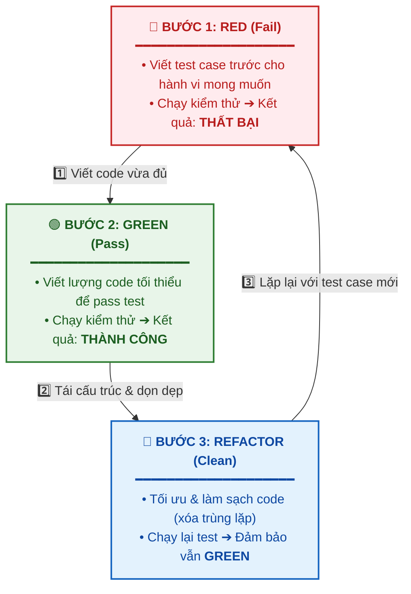
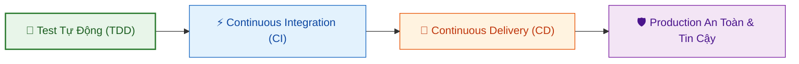

# Phát Triển Hướng Thử Nghiệm (Test-Driven Development - TDD)

Tài liệu này tóm tắt bài học **Test-Driven Development (TDD)** trong **Module 4: DevOps and CI-CD** thuộc khóa học **Cloud Native, Microservices, Containers, DevOps, and Agile** của IBM.

---

## 1. TDD là gì? (What is Test-Driven Development?)

> **Khẩu quyết cốt lõi**: *"If it's worth building, it's worth testing. If it's not worth testing, why are you wasting your time working on it?"*

* **Test-Driven Development (TDD)**: Là phương pháp phát triển trong đó **test case dẫn dắt toàn bộ việc thiết kế và viết mã nguồn**.
* **Nguyên tắc**: Bạn không viết code rồi mới viết test. Bạn **viết test case trước cho đoạn code mà bạn mong muốn có**, sau đó mới viết mã nguồn để làm cho test case đó vượt qua (pass).
* **Bản chất**: Test case chính là tài liệu mô tả chính xác **hành vi (behavior)** và **mục đích** mà hàm/chức năng đó phải thực hiện trước khi bắt tay vào lập trình.

---

## 2. Cách TDD Tạo Ra Mã Chất Lượng Cao Hơn (How TDD Produces Higher-Quality Code)

TDD nâng cao chất lượng mã nguồn nhờ các yếu tố sau:

1. **Đứng dưới góc nhìn của người gọi (*The Caller’s Perspective*)**:
   * Khi viết test trước, bạn đóng vai trò là client sử dụng API/hàm đó.
   * Giúp bạn tự hỏi: *"Là người gọi hàm, tôi có sẵn những dữ liệu gì để truyền vào và tôi mong đợi kết quả trả về là gì?"*
   * Tránh tình trạng thiết kế các API phức tạp, đòi hỏi những tham số mà thực tế người dùng không thể cung cấp.
2. **Luôn bám sát mục đích và phạm vi của tính năng**:
   * Chỉ viết đúng những gì cần thiết để thỏa mãn test case, tránh việc viết code thừa thãi (*over-engineering*).
3. **Tạo ra nền tảng bảo vệ vững chắc (*Safety Net / Baseline*)**:
   * Khi cập nhật thư viện, vá lỗi bảo mật (ví dụ lỗ hổng bảo mật Apache Struts như sự cố Equifax) hoặc tái cấu trúc (*refactor*), bộ test tự động giúp xác nhận mã nguồn vẫn an toàn và tương thích.
4. **Tiết kiệm thời gian gỡ lỗi (*Debugging Time*)**:
   * Bỏ ra vài phút viết test case ban đầu giúp tiết kiệm hàng giờ truy tìm bug trong tương lai.

---

## 3. Quy Trình Làm Việc: Red, Green, Refactor (The TDD Workflow)

Quy trình TDD diễn ra theo một vòng lặp liên tục gồm 3 giai đoạn:

| Giai đoạn | Mô tả chi tiết |
| :--- | :--- |
| **🔴 Red (Thất bại)** | Viết một test case cho đoạn code bạn mong muốn. Chạy test và nhận kết quả **Fail** (màu đỏ) để xác nhận test đang kiểm tra đúng trường hợp chưa được cài đặt. |
| **🟢 Green (Thành công)** | Viết vừa đủ lượng mã cần thiết để test case chuyển sang **Pass** (màu xanh lá). Không cần tối ưu ngay ở bước này. |
| **🔵 Refactor (Tái cấu trúc)** | Cải thiện chất lượng, loại bỏ code trùng lặp, tối ưu thiết kế nhưng vẫn đảm bảo toàn bộ test case giữ nguyên trạng thái **Green**. |

---

## 4. Tầm Quan Trọng của TDD Đối Với DevOps và CI/CD

* **Tự tin phát triển & tăng tốc độ**: Lập trình viên tự tin thêm mới hoặc sửa đổi mã nguồn vì nếu có lỗi, test case sẽ phát hiện ngay lập tức.
* **Không thể có CI/CD nếu thiếu Test tự động**:
  * Mục tiêu của CI/CD là phân phối nhanh chóng và liên tục.
  * Nếu tự động hóa CI/CD mà **không tự động hóa kiểm thử**, bạn chỉ đang **"đẩy lỗi lên môi trường Production nhanh hơn"** (*push bugs to production faster*).
* **Nền tảng cho DevOps**: TDD cung cấp bộ kiểm thử tự động toàn diện, làm đầu vào điều kiện bắt buộc để chạy các pipeline CI/CD một cách an toàn.

---

## 5. Những Lời Ngụy Biện Phổ Biến của Lập Trình Viên

| Lời ngụy biện | Sự thật |
| :--- | :--- |
| *"Tôi biết code của tôi chạy đúng rồi!"* | "Bạn trong tương lai" hoặc đồng đội sẽ không biết họ có làm hỏng gì không khi sửa code nếu không có test case. |
| *"Tôi không viết code lỗi!"* | Môi trường, dependency và thư viện bên dưới liên tục thay đổi/nâng cấp bảo mật; test case giúp đảm bảo ứng dụng không gãy khi cập nhật. |
| *"Tôi không có thời gian viết test!"* | Viết test giúp tiết kiệm hàng giờ debug sau này. Đây là khoản đầu tư tiết kiệm thời gian nhất. |
