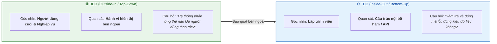
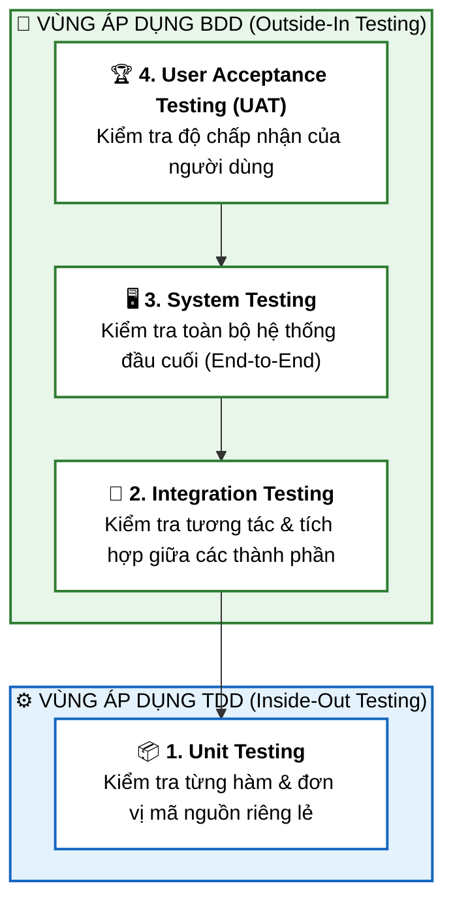

# Phát Triển Hướng Hành Vi (Behavior-Driven Development - BDD)

Tài liệu này tóm tắt bài học **Behavior Driven Development (BDD)** trong **Module 4: DevOps and CI-CD** thuộc khóa học **Cloud Native, Microservices, Containers, DevOps, and Agile** của IBM.

---

## 1. BDD là gì? (What is Behavior-Driven Development?)

* **Behavior-Driven Development (BDD)**: Là phương pháp phát triển tập trung vào **hành vi của hệ thống được quan sát từ ngoài vào trong (*Outside-In*)**.
* **Đặc trưng chính**:
  * Không quan tâm đến cấu trúc mã nguồn hay hoạt động nội bộ bên trong hàm (*Internal Workings*).
  * Đóng vai trò là **người dùng thực tế** để quan sát xem hệ thống phản hồi và hành xử như thế nào.
  * Hướng trực tiếp vào việc hiện thực hóa các hành vi đóng góp vào **kết quả kinh doanh (*business outcomes*)**.
* **Ngôn ngữ chung (*Ubiquitous/Single Syntax*)**:
  * BDD mô tả các kịch bản kiểm thử bằng cú pháp ngôn ngữ tự nhiên (dạng Given-When-Then) mà tất cả các bên liên quan gồm: **Chuyên gia nghiệp vụ (Domain Experts), Tester, Developer và Khách hàng** đều có thể dễ dàng hiểu được.
  * Cải thiện rõ rệt khả năng giao tiếp và giảm thiểu hiểu lầm trong toàn đội ngũ.

---

## 2. So sánh giữa TDD và BDD (TDD vs BDD)

Cả **TDD** và **BDD** đều là phương pháp **Test-First** (viết kiểm thử trước khi viết code), nhưng khác nhau về góc nhìn và phạm vi:

| Tiêu chí | Test-Driven Development (TDD) | Behavior-Driven Development (BDD) |
| :--- | :--- | :--- |
| **Hướng tiếp cận** | **Inside-Out** (Từ trong ra ngoài / Bottom-Up) | **Outside-In** (Từ ngoài vào trong / Top-Down) |
| **Đối tượng quan tâm** | Hoạt động nội bộ của hàm, đúng return code, đúng format dữ liệu | Hành vi người dùng trải nghiệm thực tế |
| **Góc nhìn (Perspective)** | Kỹ thuật của Lập trình viên | Người dùng / Khách hàng / Nghiệp vụ |
| **Cấp độ kiểm thử** | **Unit Testing** (Kiểm thử đơn vị) | **Integration, System & Acceptance Testing** |
| **Ví dụ giỏ hàng** | Kiểm tra hàm `addToCart(itemId, qty)` trả về HTTP 200 và JSON hợp lệ | Khi ấn nút *"Thêm vào giỏ"*, sản phẩm xuất hiện trong giao diện giỏ hàng |

---

## 3. Vị Trí của BDD trong Kim Tự Tháp Kiểm Thử Phần Mềm

BDD phù hợp nhất ở các tầng kiểm thử cấp cao, nơi hệ thống đã tích hợp đủ thành phần để đánh giá hành vi:

### Chi tiết 4 cấp độ kiểm thử:
1. **Unit Testing (Kiểm thử đơn vị)**: Kiểm tra từng thành phần/hàm riêng lẻ xem có chạy đúng thiết kế không $\rightarrow$ **Vùng của TDD**.
2. **Integration Testing (Kiểm thử tích hợp)**: Ghép nối các unit lại với nhau để tìm lỗi trong giao tiếp/tương tác giữa chúng $\rightarrow$ **Bắt đầu áp dụng BDD**.
3. **System Testing (Kiểm thử hệ thống)**: Kiểm tra toàn bộ hệ thống đầu cuối (*End-to-End*) để đối chiếu với yêu cầu kỹ thuật cấp cao $\rightarrow$ **Áp dụng BDD**.
4. **User Acceptance Testing - UAT (Kiểm thử chấp nhận người dùng)**: Người dùng hoặc đại diện khách hàng kiểm tra xem hệ thống có đáp ứng kỳ vọng kinh doanh không $\rightarrow$ **Trọng tâm của BDD**.

---

## 4. Tóm Tắt Ghi Nhớ (Key Takeaways)

* **BDD kiểm thử từ ngoài vào trong (*Outside-In*)**, tập trung hoàn toàn vào trải nghiệm và hành vi quan sát được của hệ thống, không bận tâm chi tiết mã nguồn bên dưới.
* BDD tạo ra **tiếng nói chung** giữa đội ngũ Business, QA, Developer và Khách hàng.
* Trong quy trình kiểm thử phần mềm, BDD được thực hiện hiệu quả nhất ở 3 tầng: **Integration Testing, System Testing, và Acceptance Testing (UAT)**.
