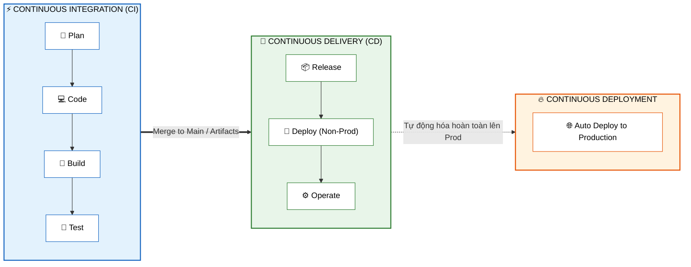
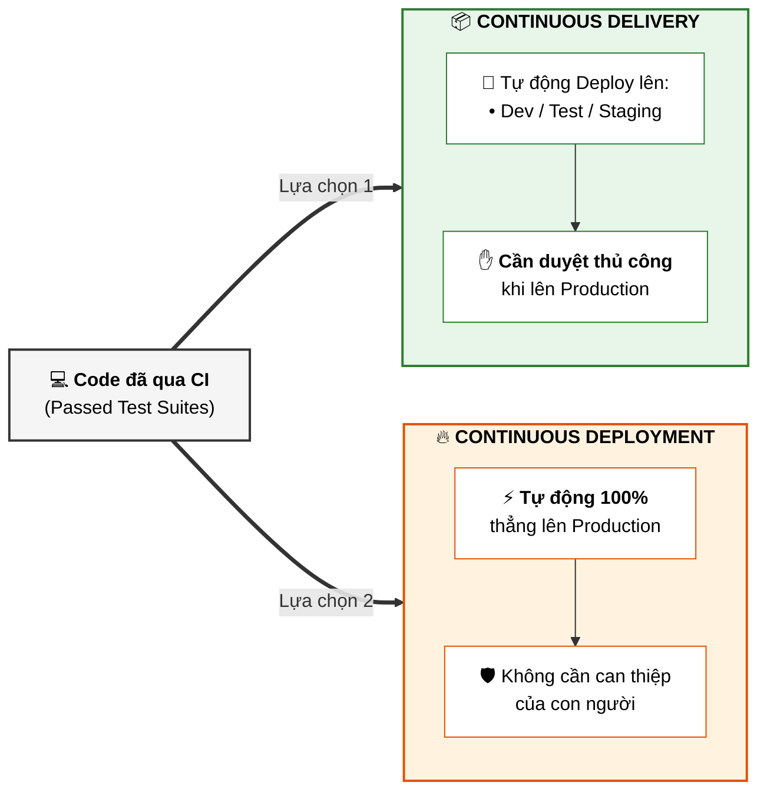
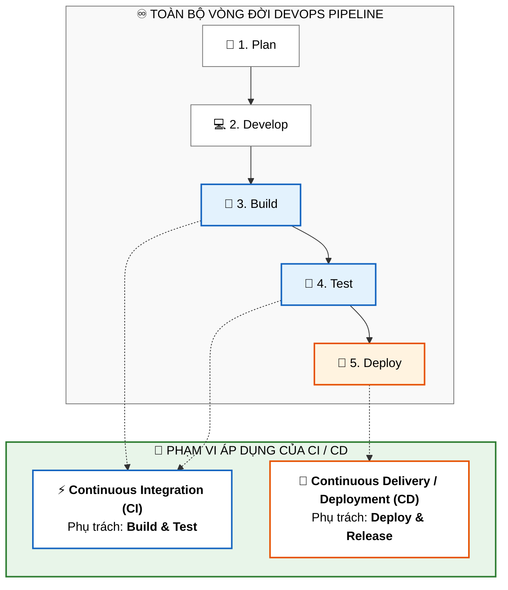

# Tổng Quan về CI/CD (What Is CI/CD?)

Tài liệu này tóm tắt bài học **What Is CI/CD?** trong **Module 4: DevOps and CI-CD** thuộc khóa học **Cloud Native, Microservices, Containers, DevOps, and Agile** của IBM.

---

## 1. Bản Chất của CI/CD: Hai Quy Trình Riêng Biệt

Nhiều người thường nhắc đến "CI/CD" như một quy trình duy nhất, nhưng thực tế đây là **hai quy trình riêng biệt, độc lập và diễn ra tuần tự**:

---

## 2. Định Nghĩa Chi Tiết Từng Khái Niệm

### 1. Continuous Integration (CI - Tích hợp liên tục)
* **Khái niệm**: Là quy trình tự động hóa cho phép các lập trình viên tích hợp mã nguồn của mình vào nhánh chính (**Main / Master / Trunk**) thường xuyên và liên tục.
* **Mục tiêu**: Đảm bảo nhánh code của từng cá nhân không bị phân kỳ (*diverge*) quá xa so với codebase chung, từ đó phát hiện lỗi và xung đột ngay lập tức.
* **Các giai đoạn của CI**:
  1. 📝 **Plan (Lập kế hoạch)**
  2. 💻 **Code (Lập trình)**
  3. 🔨 **Build (Đóng gói / Biên dịch)**
  4. 🧪 **Test (Kiểm thử tự động)**

---

### 2. Phân biệt: Continuous Delivery vs. Continuous Deployment

Hai thuật ngữ này cùng viết tắt là **CD** nhưng có sự khác biệt rất quan trọng về đích đến:

| Khái niệm | Môi trường triển khai | Can thiệp thủ công lên Prod? |
| :--- | :--- | :---: |
| **Continuous Delivery** | Tự động deploy lên **Dev, Test, Staging, Pre-prod** | **Có** (Cần nút bấm duyệt phát hành) |
| **Continuous Deployment** | Tự động đẩy trực tiếp lên **Production** | **Không** (100% Tự động qua pipeline) |

* **Các giai đoạn của CD**:
  1. 📦 **Release (Phát hành)**
  2. 🚢 **Deploy (Triển khai nhị phân vào môi trường)**
  3. ⚙️ **Operate (Vận hành & giám sát trực tiếp)**

---

## 3. Vị Trí của CI/CD trong DevOps Pipeline

Trong toàn bộ vòng đời DevOps (*Plan $\rightarrow$ Develop $\rightarrow$ Build $\rightarrow$ Test $\rightarrow$ Deploy*), CI/CD đóng vai trò trung tâm tại các pha **Build, Test và Deploy**:

---

## 4. 5 Lợi Ích Cốt Lõi của CI/CD (Key Benefits)

1. ⚡ **Phản ứng nhanh với các thay đổi mã nguồn (*Faster Reaction Times*)**:
   * Không còn phải chờ đợi hàng tuần để thấy kết quả. Mã nguồn được build, test và deploy tự động ngay khi đẩy lên.
2. 🛡️ **Giảm thiểu rủi ro tích hợp mã (*Reduced Code Integration Risk*)**:
   * Tích hợp càng thường xuyên với các mẩu code nhỏ (*small chunks*), nguy cơ xung đột và lỗi gãy hệ thống càng thấp.
3. 💎 **Nâng cao chất lượng mã nguồn (*Higher Code Quality*)**:
   * Mọi Pull Request (PR) đều được review và chạy kiểm thử tự động liên tục trước khi merge.
4. ✅ **Nhánh chính luôn ở trạng thái sẵn sàng triển khai (*Deployable Main Branch*)**:
   * Đảm bảo mã nguồn trên nhánh `main`/`master` luôn trong trạng thái ổn định và có thể release bất cứ lúc nào.
5. ⏱️ **Rút ngắn thời gian triển khai (*Less Deployment Time & High Repeatability*)**:
   * Triển khai tự động giúp tiết kiệm thời gian, loại bỏ thao tác thủ công dễ sai sót và có tính lặp lại chuẩn xác.

---

## 5. Tóm Tắt Ghi Nhớ (Key Takeaways)

* **CI và CD không phải là một**, mà là hai quy trình kế tiếp nhau.
* **CI = Plan $\rightarrow$ Code $\rightarrow$ Build $\rightarrow$ Test** (Tích hợp code vào nhánh chính).
* **CD = Release $\rightarrow$ Deploy $\rightarrow$ Operate** (Triển khai code ra các môi trường).
* **Delivery** là đưa lên môi trường thử nghiệm/staging (sẵn sàng release); **Deployment** là tự động đẩy thẳng lên Production.
