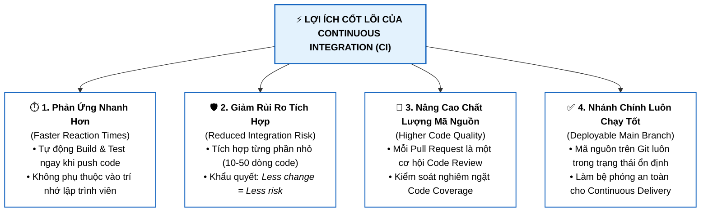
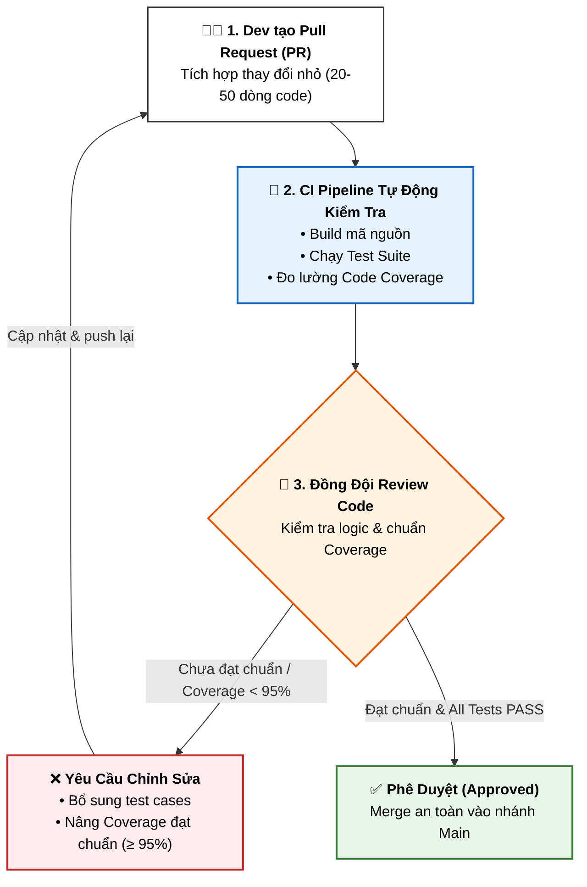

# Lợi Ích của Tích Hợp Liên Tục (Benefits of Continuous Integration - CI)

Tài liệu này tóm tắt bài học **Benefits of CI** trong **Module 4: DevOps and CI-CD** thuộc khóa học **Cloud Native, Microservices, Containers, DevOps, and Agile** của IBM.

---

## 1. Bốn Lợi Ích Cốt Lõi của CI (Core Benefits)

---

## 2. Chi Tiết Từng Lợi Ích

### 1. Phản ứng nhanh hơn với các thay đổi (*Faster Reaction Times*)
* Mỗi khi push code lên nhánh từ xa (*remote branch*), công cụ CI sẽ tự động kích hoạt quá trình chạy Test và Build.
* **Lưới an toàn tự động**: Dù lập trình viên có quên chạy test hay kiểm tra build ở máy local thì hệ thống CI vẫn tự động kiểm tra và báo lỗi ngay tức thì.
* Giúp nhanh chóng đưa giải pháp hoàn chỉnh, ổn định tới tay khách hàng.

---

### 2. Giảm thiểu rủi ro tích hợp mã (*Reduced Code Integration Risk*)
* Thời kỳ gộp hàng trăm ngàn dòng code (*100,000 lines*) cùng lúc vào codebase đã qua.
* Với CI, lập trình viên chỉ tích hợp từng đoạn thay đổi nhỏ: **10, 20, 30 hay 50 dòng code**.
* **Nguyên lý vàng**: 
  > *"Smaller changes means less risk of something going wrong. Less change = Less risk."*

---

### 3. Nâng cao chất lượng mã nguồn & Thực hành Pull Request (PR)
* **Code Review liên tục**: Không cần lên lịch họp review code cồng kềnh. Mỗi **Pull Request (PR)** là một cơ hội vàng để đồng đội kiểm tra chéo mã nguồn (*a second set of eyes*).
* Dễ dàng review kỹ lưỡng 20 dòng code hơn rất nhiều so với 20,000 dòng code.

* **Kiểm soát độ bao phủ kiểm thử (*Code Coverage*)**:
  * Ví dụ: Tiêu chuẩn của team là **95% code coverage**. Nếu PR chỉ đạt **91%**, reviewer có quyền từ chối và yêu cầu bổ sung test case trước khi merge.

---

### 4. Đảm bảo mã nguồn trong Hệ thống Quản lý Phiên bản luôn hoạt động (*Code in Git Works*)
* Làm thế nào để bạn tự tin thực hiện **Continuous Delivery**?
* Nếu bạn deploy ứng dụng trực tiếp từ Git lên các môi trường, bạn phải chắc chắn code trên Git không bị lỗi.
* **CI chính là bằng chứng xác thực**: Mọi commit trên nhánh `main`/`master` đều đã vượt qua toàn bộ bộ test tự động và build thành công.

---

## 3. Tóm Tắt Ghi Nhớ (Key Takeaways)

1. **CI = Tự động hóa Build + Test liên tục** ngay khi có thay đổi code.
2. **Tích hợp theo lô nhỏ (*Small Batches*)** giúp hạn chế tối đa xung đột mã nguồn.
3. **Văn hóa giám sát lẫn nhau (*Peer Monitoring*)**: Đội ngũ phát triển cần thường xuyên review PR chéo cho nhau để cùng nâng cao chất lượng code.
4. **Nhánh Main luôn deployable**: Là điều kiện tiên quyết bắt buộc trước khi tiến hành Continuous Delivery/Deployment.
