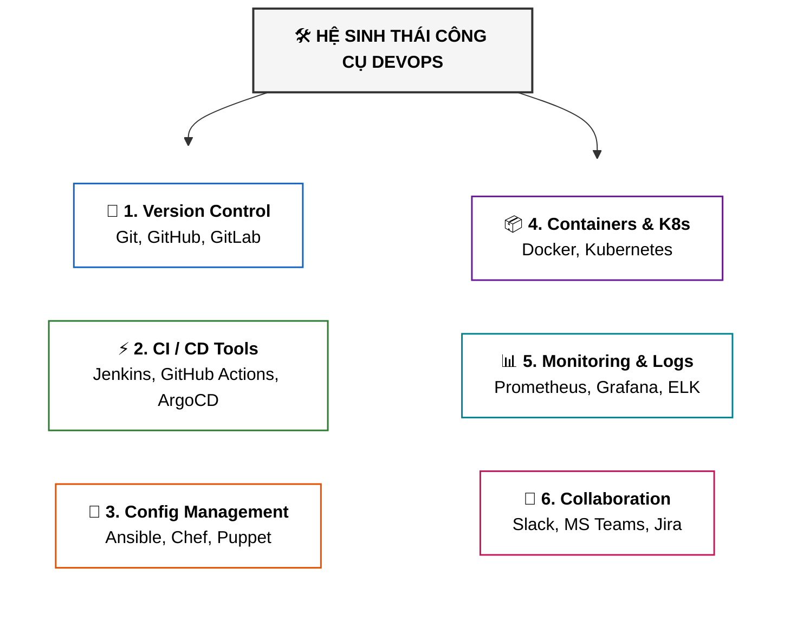
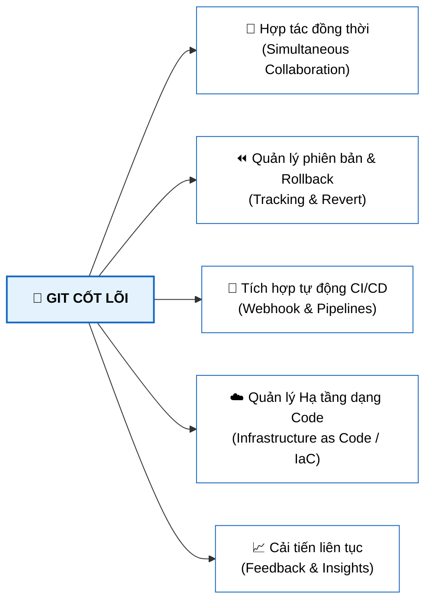

# Các Công Cụ Cho DevOps, CI và CD (Tools for DevOps, CI and CD)

Tài liệu này tóm tắt bài học **Tools for DevOps, CI and CD** trong **Module 4: DevOps and CI-CD** thuộc khóa học **Cloud Native, Microservices, Containers, DevOps, and Agile** của IBM.

---

## 1. Phân Loại Các Nhóm Công Cụ DevOps (DevOps Tool Categories)

---

## 2. Vai Trò Của Git Trong DevOps (Git in DevOps)

**Git** là tiêu chuẩn quản lý phiên bản mã nguồn (*Version Control*) phổ biến nhất hiện nay nhờ tốc độ, sự linh hoạt và độ tin cậy. Hai nền tảng lưu trữ lớn nhất xây dựng trên Git là **GitHub** và **GitLab**.

---

## 3. Bản Đồ Công Cụ CI / CD Phổ Biến (CI/CD Tools)

```mermaid
flowchart LR
    subgraph G_CI["⚡ <b>1. CHUYÊN CI (Tích hợp)</b>"]
        direction TB
        CI1["<b>Concourse CI</b><br/>• Container-first<br/>• Rất hợp Docker & VM"]
        CI2["<b>CircleCI</b><br/>• SaaS trên Cloud<br/>• Mạnh về Python & Test"]
        CI3["<b>Travis CI</b><br/>• Dễ tiếp cận, đa ngôn ngữ"]
        CI1 ~~~ CI2 ~~~ CI3
    end

    subgraph G_CD["🚀 <b>2. CHUYÊN CD (Triển khai)</b>"]
        direction TB
        CD1["<b>Spinnaker</b><br/>• Đa đám mây (Cloud-agnostic)<br/>• Quản lý Scale & Rollback"]
        CD2["<b>Go CD</b><br/>• Hỗ trợ K8s & Value Stream"]
        CD3["<b>Argo CD</b><br/>• Chuẩn GitOps cho Kubernetes"]
        CD1 ~~~ CD2 ~~~ CD3
    end

    subgraph G_ALL["♾️ <b>3. TRỌN GÓI (Cả CI & CD)</b>"]
        direction TB
        ALL1["<b>Jenkins</b><br/>• Mã nguồn mở, kho Plugin đồ sộ"]
        ALL2["<b>Tekton</b><br/>• Pipeline linh hoạt, Cloud Native"]
        ALL3["<b>GitLab CI/CD</b><br/>• Tích hợp trực tiếp GitLab"]
        ALL4["<b>GitHub Actions</b><br/>• Marketplace phong phú, dễ dùng"]
        ALL1 ~~~ ALL2 ~~~ ALL3 ~~~ ALL4
    end

    style G_CI fill:#e3f2fd,stroke:#1565c0,stroke-width:2px,color:#000000
    style G_CD fill:#fff3e0,stroke:#e65100,stroke-width:2px,color:#000000
    style G_ALL fill:#e8f5e9,stroke:#2e7d32,stroke-width:2px,color:#000000

    style CI1 fill:#ffffff,stroke:#1565c0,color:#000000
    style CI2 fill:#ffffff,stroke:#1565c0,color:#000000
    style CI3 fill:#ffffff,stroke:#1565c0,color:#000000

    style CD1 fill:#ffffff,stroke:#e65100,color:#000000
    style CD2 fill:#ffffff,stroke:#e65100,color:#000000
    style CD3 fill:#ffffff,stroke:#e65100,color:#000000

    style ALL1 fill:#ffffff,stroke:#2e7d32,color:#000000
    style ALL2 fill:#ffffff,stroke:#2e7d32,color:#000000
    style ALL3 fill:#ffffff,stroke:#2e7d32,color:#000000
    style ALL4 fill:#ffffff,stroke:#2e7d32,color:#000000
```

---

## 4. Các Nhóm Công Cụ Hỗ Trợ Khác trong DevOps

| Nhóm chức năng | Các công cụ tiêu biểu | Vai trò chính |
| :--- | :--- | :--- |
| 🔧 **Configuration Management** | Ansible, Chef, Puppet, SaltStack | Tự động hóa cài đặt và cấu hình máy chủ/hạ tầng nhất quán. |
| 📦 **Containerization & Orchestration** | Docker, Kubernetes (K8s) | Đóng gói ứng dụng nhẹ và điều phối tự động mở rộng cụm container. |
| 📊 **Monitoring & Logging** | Prometheus, Grafana, ELK Stack, New Relic, Mesmo | Giám sát hiệu năng hệ thống, cảnh báo sự cố và phân tích log tập trung. |
| 💬 **Collaboration & Tracking** | Slack, Microsoft Teams, Jira, Trello, Asana | Kết nối giao tiếp đội ngũ, quản lý task và tiến độ dự án. |

---

## 5. Tóm Tắt Ghi Nhớ (Key Takeaways)

* **Git** là nền tảng quản lý phiên bản cho cả Source Code lẫn Infrastructure as Code (IaC).
* **Công cụ CI**: Concourse CI, CircleCI, Travis CI (tập trung Build & Test).
* **Công cụ CD**: Spinnaker, Go CD, Argo CD (tập trung Release & Deploy, đặc biệt Argo CD cho GitOps/K8s).
* **Công cụ CI/CD toàn diện**: Jenkins (plugin phong phú), Tekton (portable), GitLab CI/CD và GitHub Actions (tích hợp nền tảng sẵn có).
