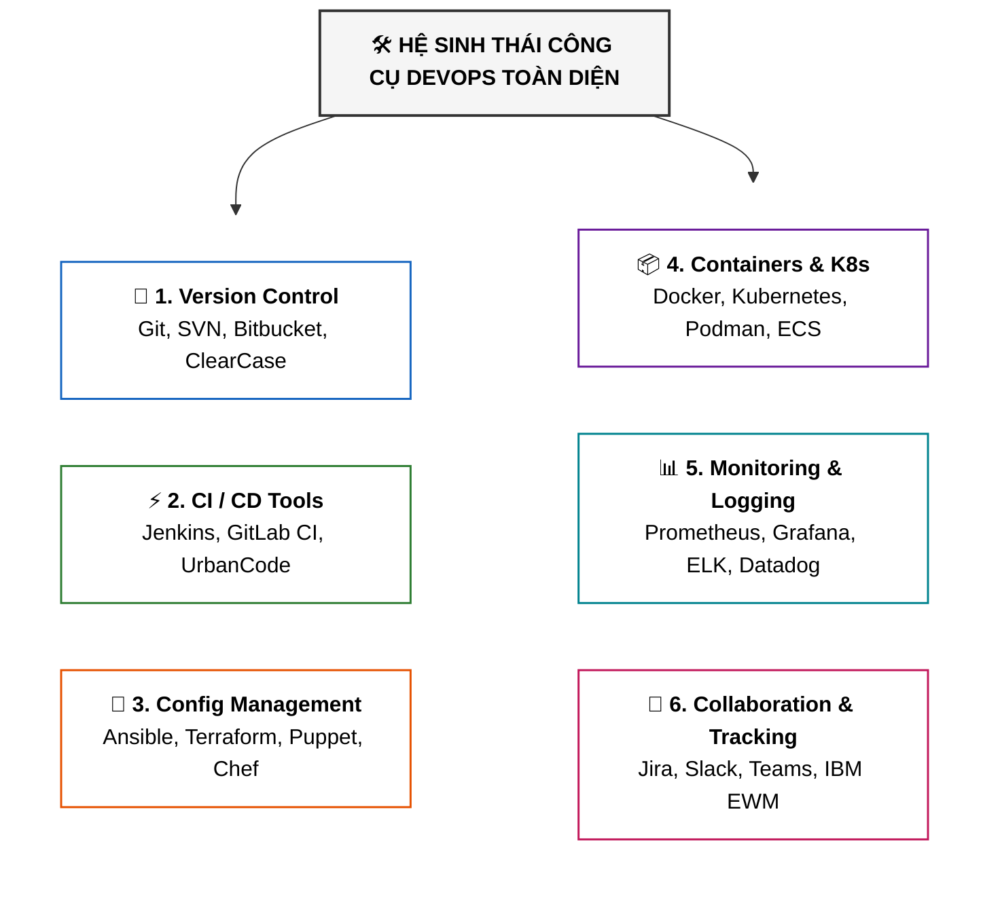

# Phân Loại Chi Tiết Các Nhóm Công Cụ DevOps (DevOps Tools Categories and Available Tools)

Tài liệu này tóm tắt bài đọc **DevOps Tools Categories and Their Available Tools** trong **Module 4: DevOps and CI-CD** thuộc khóa học **Cloud Native, Microservices, Containers, DevOps, and Agile** của IBM.

---

## 1. Bản Đồ Tổng Quan 6 Nhóm Công Cụ DevOps

---

## 2. Chi Tiết Từng Nhóm Công Cụ & Danh Sách Đại Diện

### 1. 📂 Version Control Tools (Quản lý phiên bản)
Quản lý và theo dõi sự thay đổi của mã nguồn, tạo điều kiện cho nhiều lập trình viên làm việc song song mà không xung đột:

| Công cụ | Mô tả & Điểm nổi bật |
| :--- | :--- |
| **Git** | Hệ thống phân tán mã nguồn mở chuẩn công nghiệp; hỗ trợ branching/merging mạnh mẽ (GitHub, GitLab). |
| **Subversion (SVN)** | Hệ thống quản lý tập trung (*centralized*), đơn giản và dễ sử dụng. |
| **Mercurial** | Hệ thống phân tán, giao diện trực quan, xử lý codebase dung lượng lớn mượt mà. |
| **Perforce** | Hệ thống tập trung rất mạnh trong việc quản lý các file nhị phân dung lượng khổng lồ (*game development*). |
| **Bitbucket** | Nền tảng lưu trữ Git và Mercurial trên web của Atlassian, tích hợp sẵn issue tracking. |
| **IBM Rational Team Concert** | Nền tảng hợp tác quản lý phiên bản, theo dõi task và tự động hóa build. |
| **IBM Rational ClearCase** | Hệ thống tập trung cấp doanh nghiệp giúp theo dõi mã nguồn và tài nguyên số. |

---

### 2. ⚡ CI/CD Tools (Tích hợp và Phân phối liên tục)
Tự động hóa chu trình build, test, release và deploy để phần mềm luôn ở trạng thái sẵn sàng phát hành (*releasable state*):

| Công cụ | Mô tả & Điểm nổi bật |
| :--- | :--- |
| **Jenkins** | Automation server mã nguồn mở phổ biến nhất với kho plugin khổng lồ. |
| **Travis CI** | Nền tảng CI/CD trên Cloud tối ưu cho các dự án GitHub. |
| **CircleCI** | Nền tảng Cloud SaaS cấu hình bằng YAML, mạnh về quản lý dependency và test. |
| **GitLab CI/CD** | Giải pháp All-in-one tích hợp Container Registry và Kubernetes. |
| **TeamCity** | Công cụ CI/CD mạnh mẽ của JetBrains, tích hợp sâu với các IDE JetBrains. |
| **Bamboo** | Máy chủ CI/CD của Atlassian, liên kết chặt chẽ với Jira và Bitbucket. |
| **IBM UrbanCode Build** | Công cụ chuyên tự động hóa quy trình build và chạy test liên tục. |
| **IBM UrbanCode Deploy** | Tự động hóa việc phân phối và release ứng dụng qua nhiều môi trường. |

---

### 3. 🔧 Configuration Management & IaC (Quản lý cấu hình & Hạ tầng dạng mã)
Tự động hóa việc cấp phát hạ tầng và cấu hình phần mềm, đảm bảo tính nhất quán giữa các môi trường:

| Công cụ | Mô tả & Điểm nổi bật |
| :--- | :--- |
| **Ansible** | Tự động hóa mạnh mẽ, không cần agent (*agentless*), dùng ngôn ngữ khai báo YAML. |
| **Puppet** | Quản lý cấu hình mã nguồn mở theo mô hình định hướng (*model-driven*). |
| **Chef** | Framework tự động hóa hạ tầng sử dụng ngôn ngữ đặc tả riêng (DSL/Ruby). |
| **SaltStack** | Tự động hóa hạ tầng có kiến trúc đơn giản, tốc độ thực thi nhanh và mở rộng cao. |
| **Terraform** | Tiêu chuẩn hàng đầu về Infrastructure as Code (IaC), cấp phát hạ tầng đa đám mây (*Multi-cloud*). |
| **CFEngine** | Hệ thống quản lý cấu hình siêu nhẹ tập trung vào việc duy trì trạng thái mong muốn (*desired state*). |
| **IBM UrbanCode Deploy** | Cung cấp thêm tính năng kiểm soát và quản lý cấu hình ứng dụng nhất quán. |

---

### 4. 📦 Containerization & Container Orchestration (Đóng gói & Điều phối Container)
Đóng gói ứng dụng kèm môi trường phụ thuộc thành các container nhẹ và điều phối mở rộng trên diện rộng:

| Công cụ | Mô tả & Điểm nổi bật |
| :--- | :--- |
| **Docker** | Nền tảng tiêu chuẩn xây dựng, đóng gói và chạy ứng dụng container. |
| **Kubernetes (K8s)** | Nền tảng điều phối cụm container mã nguồn mở hàng đầu (deploy, scaling, self-healing). |
| **Podman** | Container engine nhẹ không cần daemon (*daemonless*), chạy quyền rootless an toàn, tương thích lệnh Docker. |
| **Amazon ECS** | Dịch vụ điều phối container được AWS quản lý toàn diện trên hệ sinh thái AWS. |
| **HashiCorp Nomad** | Nền tảng điều phối linh hoạt hỗ trợ cả container lẫn các ứng dụng truyền thống (non-containerized). |
| **IBM Cloud Kubernetes Service** | Dịch vụ Kubernetes được quản lý hoàn toàn trên nền tảng IBM Cloud. |
| **IBM Cloud Private** | Nền tảng container triển khai và vận hành ứng dụng trên các môi trường Hybrid Cloud. |

---

### 5. 📊 Monitoring & Logging Tools (Giám sát & Quản lý Log)
Theo dõi hiệu năng hệ thống, thời gian khả dụng (uptime), thu thập và phân tích log tập trung để giải quyết sự cố:

| Công cụ | Mô tả & Điểm nổi bật |
| :--- | :--- |
| **Prometheus** | Thu thập chỉ số (*metrics time-series*), hỗ trợ truy vấn mạnh mẽ bằng PromQL và cảnh báo. |
| **Grafana** | Nền tảng trực quan hóa số liệu và thiết kế dashboard thời gian thực hàng đầu. |
| **ELK Stack** | Bộ ba **Elasticsearch** (Search/DB) + **Logstash** (Xử lý log) + **Kibana** (Trực quan hóa log). |
| **New Relic** | Nền tảng Observability toàn diện trên Cloud từ hạ tầng đến trải nghiệm người dùng (*APM*). |
| **Datadog** | Giám sát hiệu năng ứng dụng, hạ tầng và Cloud realtime dạng SaaS. |
| **Splunk** | Công cụ quản lý và phân tích log/dữ liệu máy cấp doanh nghiệp cực mạnh. |
| **IBM Cloud Monitoring with Sysdig** | Giám sát sâu tầng nhân (kernel), phân tích và xử lý sự cố nhanh chóng. |
| **IBM Cloud Log Analysis with LogDNA** | Thu thập, tìm kiếm và phân tích log tập trung linh hoạt. |

---

### 6. 💬 Collaboration & Communication Tools (Giao tiếp & Quản trị dự án)
Thúc đẩy sự cộng tác, chia sẻ tri thức và theo dõi tiến độ xuyên suốt giữa đội Dev và Ops:

| Công cụ | Mô tả & Điểm nổi bật |
| :--- | :--- |
| **Jira** | Công cụ quản lý dự án Agile, theo dõi issue và sprint phổ biến nhất. |
| **Slack** | Nền tảng nhắn tin nhóm hỗ trợ tích hợp bot và webhook DevOps mạnh mẽ. |
| **Microsoft Teams** | Nền tảng chat, họp video tích hợp chặt chẽ trong hệ sinh thái Microsoft 365. |
| **Mattermost** | Nền tảng nhắn tin mã nguồn mở, self-hosted, bảo mật cao và tích hợp tốt DevOps. |
| **Trello** | Quản lý công việc trực quan theo bảng Kanban đơn giản và linh hoạt. |
| **Asana** | Quản lý quy trình làm việc, theo dõi tiến độ và giao việc trực quan. |
| **IBM Engineering Workflow Management** | Quản lý luồng công việc kỹ thuật, work item tracking và build automation. |
| **IBM Rational DOORS Next Generation** | Quản lý và theo dõi toàn bộ yêu cầu dự án (*requirements management*) trong suốt SDLC. |

---

## 3. Tóm Tắt Ghi Nhớ (Key Takeaways)

1. Không có một công cụ duy nhất giải quyết được toàn bộ chu trình DevOps; doanh nghiệp phải **kết hợp linh hoạt các công cụ từ 6 nhóm trên**.
2. Việc lựa chọn công cụ phụ thuộc vào: **yêu cầu dự án, trình độ đội ngũ, hạ tầng mục tiêu (Cloud/On-premise)** và **khả năng tích hợp liền mạch giữa các công cụ**.
