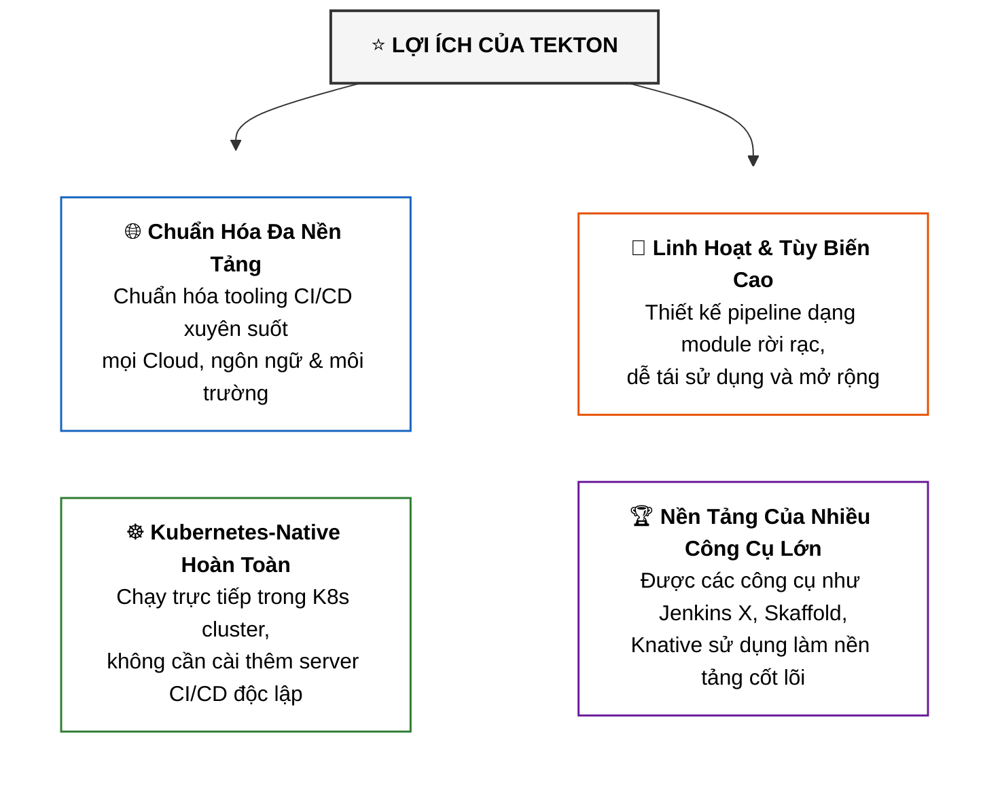
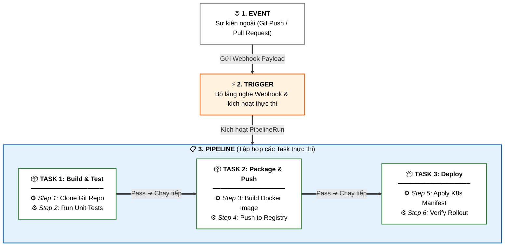

# Giới Thiệu Về Tekton và Pipelines (Introduction to Tekton & Pipelines)

Tài liệu này tóm tắt bài đọc **Introduction to Tekton and Pipelines** trong **Module 4: DevOps and CI-CD** thuộc khóa học **Cloud Native, Microservices, Containers, DevOps, and Agile** của IBM.

---

## 1. Tekton là gì? (What is Tekton?)

* **Định nghĩa**: **Tekton** là một framework mã nguồn mở (*open-source*), linh hoạt được dùng để xây dựng các pipeline **Tích hợp liên tục và Phân phối liên tục (CI/CD)**.
* **Đặc tính cốt lõi (Kubernetes-Native)**:
  * Tekton được xây dựng hoàn toàn dựa trên nền tảng **Kubernetes** dưới dạng các **Custom Resource Definitions (CRDs)**.
  * Bất cứ nơi nào chạy được cụm Kubernetes (dù là **Public Cloud** như IBM Cloud, AWS, GCP, Azure hay hệ thống **On-premises**), bạn đều có thể chạy Tekton.

---

## 2. Các Lợi Ích Chính Của Tekton (Benefits of Tekton)

---

## 3. Các Khối Xây Dựng Khái Niệm (Conceptual Building Blocks)

Tekton tổ chức quy trình CI/CD theo kiến trúc phân tầng từ sự kiện bên ngoài đến từng câu lệnh thực thi:

| Thành phần | Ý nghĩa & Bản chất |
| :--- | :--- |
| **Event** | Sự kiện bên ngoài từ hệ thống quản lý mã nguồn (ví dụ: tạo Pull Request hoặc Push commit lên Git). |
| **Trigger** | Bộ lắng nghe và phản hồi khi nhận Event, kích hoạt `PipelineRun` để thực thi Pipeline. |
| **Pipeline** | Tập hợp các **Tasks** được tổ chức theo quy trình (có thể chạy **tuần tự - serial** hoặc **song song - parallel**). Không giới hạn số lượng Task. |
| **Task** | Một đơn vị công việc hoàn chỉnh (*unit of work*), bao gồm một hoặc nhiều **Steps**. Định nghĩa các tham số (*parameters*) và vùng nhớ tạm (*workspaces*) để lưu trữ artifacts. |
| **Step** | Là câu lệnh thực tế (*actual executable command/script*) chạy bên trong một container để build, test hoặc deploy ứng dụng. |

---

## 4. Các File Cấu Hình YAML trong Tekton

Tekton được cấu hình bằng ngôn ngữ YAML thông qua 2 file mẫu chính:

```mermaid
flowchart LR
    subgraph P_YAML["📄 <b>pipeline.yaml</b> (Toàn cục)"]
        direction TB
        PY1["• Định nghĩa toàn bộ workflow CI/CD"]
        PY2["• Kết nối các Task theo thứ tự thực thi"]
        PY3["• Cấu hình tham số đầu vào chung"]
    end

    subgraph T_YAML["📄 <b>tasks.yaml</b> (Chi tiết công việc)"]
        direction TB
        TY1["• Đặc tả chi tiết từng Task cụ thể"]
        TY2["• Chứa các Steps và Container Image tương ứng"]
        TY3["• Khai báo Workspaces & Parameter"]
    end

    P_YAML <==> T_YAML

    style P_YAML fill:#e3f2fd,stroke:#1565c0,stroke-width:2px,color:#000000
    style T_YAML fill:#e8f5e9,stroke:#2e7d32,stroke-width:2px,color:#000000
    style PY1 fill:#ffffff,stroke:#1565c0,color:#000000
    style PY2 fill:#ffffff,stroke:#1565c0,color:#000000
    style PY3 fill:#ffffff,stroke:#1565c0,color:#000000
    style TY1 fill:#ffffff,stroke:#2e7d32,color:#000000
    style TY2 fill:#ffffff,stroke:#2e7d32,color:#000000
    style TY3 fill:#ffffff,stroke:#2e7d32,color:#000000
```

---

## 5. Khối Xây Dựng Vật Lý: Kubernetes CRDs (Custom Resource Definitions)

Dưới tầng vật lý của Kubernetes, mọi thực thể trong Tekton đều là các **CRD**:

* 👂 **EventListener**: Pod mở port đón nhận các webhook payload từ Git/hệ thống ngoài.
* 🔗 **TriggerBinding**: Trích xuất các trường dữ liệu từ webhook payload (như URL repo, git branch, commit hash).
* 📝 **TriggerTemplate**: Mẫu tạo tài nguyên thực thi khi trigger được kích hoạt.
* 🚀 **PipelineRun / TaskRun**: Tài nguyên khởi tạo phiên chạy thực tế của một Pipeline hoặc một Task trong cluster.

---

## 6. Tóm Tắt Ghi Nhớ (Key Takeaways)

> **"Everything about Tekton is Kubernetes native, and everything is running in your Kubernetes cluster."**

* **Tekton** biến cụm Kubernetes thành một hệ thống CI/CD mạnh mẽ mà không cần phụ thuộc vào máy chủ CI chuyên dụng bên ngoài.
* **Cấu trúc phân cấp**: `Event` $\rightarrow$ `Trigger` $\rightarrow$ `Pipeline` $\rightarrow$ `Task` $\rightarrow$ `Step`.
* Pipeline được khai báo hoàn toàn dưới dạng mã nguồn (**YAML / CRD**) hỗ trợ tuyệt vời cho mô hình GitOps và Cloud-Native.
