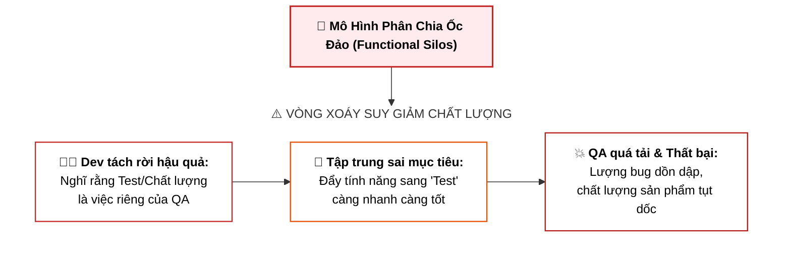
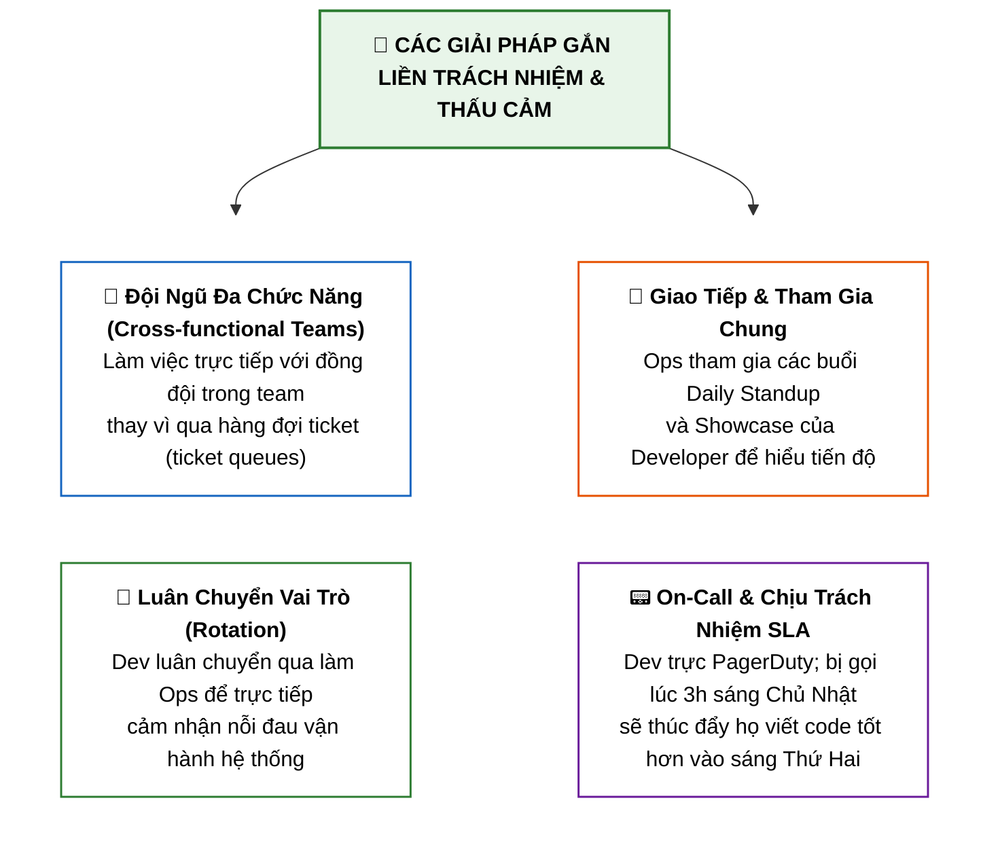
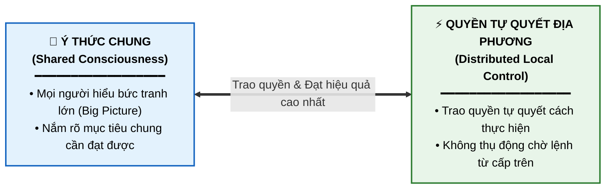

# Mọi Người Đều Có Trách Nhiệm Với Thành Công (Everyone is Responsible for Success)

Tài liệu này tóm tắt bài học **Everyone is Responsible for Success** trong **Module 4: DevOps and CI-CD** thuộc khóa học **Cloud Native, Microservices, Containers, DevOps, and Agile** của IBM.

---

## 1. Bản Chất của Vấn Đề: Rào Cản "Silo" Dẫn Đến Sự Thờ Ơ (Apathy)

> **Trích dẫn từ Jez Humble** *(tác giả sách Continuous Delivery)*:  
> *"Bad behavior arises when you abstract people away from the consequences of their actions."*  
> *(Hành vi tồi tệ nảy sinh khi bạn tách rời con người khỏi hậu quả do chính hành động của họ gây ra.)*

### Bài học thực tế từ đội QA riêng biệt:
* Một công ty gặp vấn đề chất lượng phần mềm $\rightarrow$ quyết định thuê riêng một đội QA để giải quyết.
* **Hậu quả bất ngờ**: Chất lượng phần mềm **thậm chí còn giảm sút nghiêm trọng hơn**.
* **Nguyên nhân**: Lập trình viên cho rằng họ không còn phải chịu trách nhiệm kiểm thử nữa. Họ chuyển từ tập trung vào *"viết code chất lượng"* sang *"đẩy code sang đội QA nhanh nhất có thể"*.

---

## 2. Giải Pháp Xóa Bỏ Silo & Gắn Liền Trách Nhiệm với Hậu Quả

Để loại bỏ sự thờ ơ và thúc đẩy sự thấu cảm (*empathy*) giữa các bộ phận, doanh nghiệp cần thực hiện các hành động sau:

---

## 3. Mục Tiêu Tổ Chức DevOps: Shared Consciousness & Local Control

Mục tiêu cao nhất của một tổ chức DevOps là xây dựng:

---

## 4. Tóm Tắt Ghi Nhớ (Key Takeaways)

> **"You build it, you run it!"** — *Werner Vogels (CTO của Amazon)*

1. **Hành động không đi kèm hậu quả sẽ sinh ra sự thờ ơ (*Apathy*)**: Tách rời Dev khỏi việc test/ops làm giảm chất lượng sản phẩm.
2. **Không có ranh giới giữa Dev và Ops**: Tất cả mọi người cùng chịu trách nhiệm trực tiếp trong việc phân phối giá trị cho khách hàng.
3. **Thấu cảm từ trải nghiệm thực tế (*Empathy*)**: Đưa Dev vào trực On-call (PagerDuty) và nắm giữ cam kết chất lượng dịch vụ (SLA) là phương pháp tốt nhất để nâng cao chất lượng code.
4. **Mục tiêu DevOps cốt lõi**: Định hình tư duy chung (*Shared Consciousness*) và trao quyền chủ động thực thi (*Local Control*).
