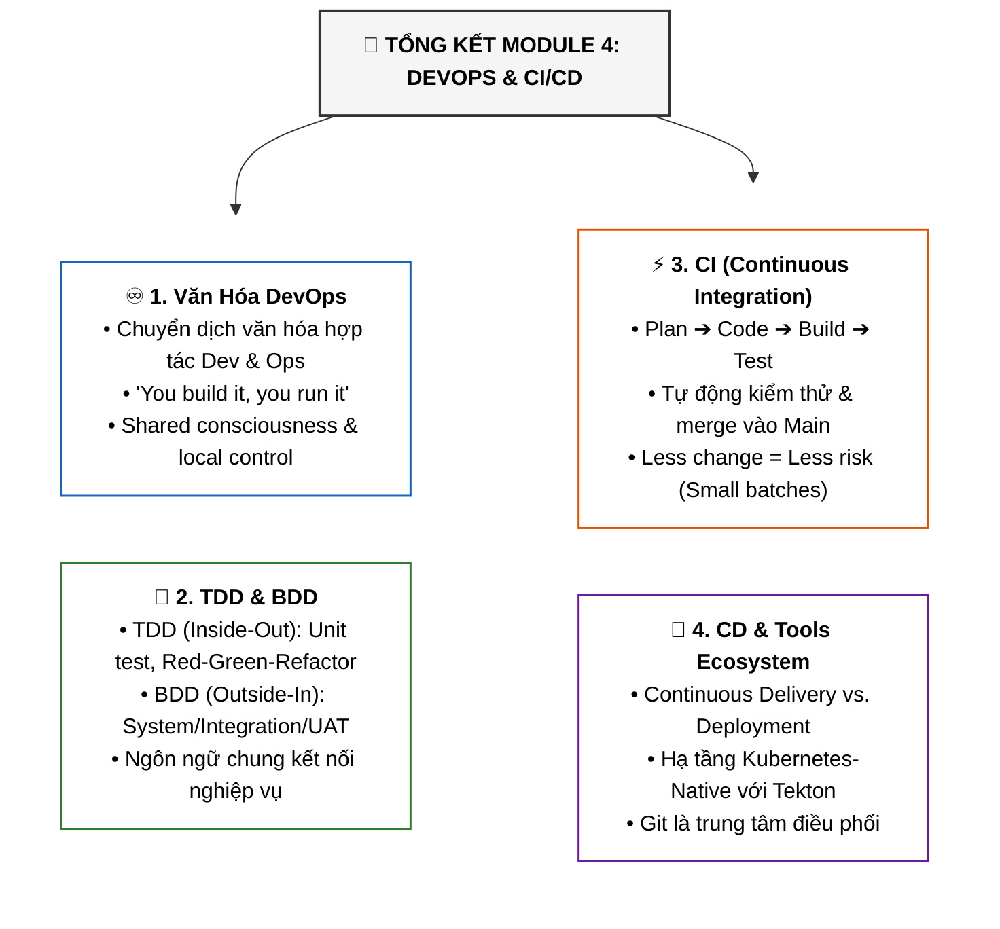

# Tóm Tắt Toàn Bộ Module 4: DevOps & CI/CD (Module 4 Summary)

Tài liệu này tổng hợp toàn bộ kiến thức cốt lõi của **Module 4: DevOps and CI-CD** thuộc khóa học **Cloud Native, Microservices, Containers, DevOps, and Agile** của IBM.

---

## 1. Bản Đồ Tư Duy Tổng Quan Module 4

---

## 2. Các Trụ Cột Kiến Thức Trọng Tâm

### 1. ♾️ Bản Chất của DevOps (DevOps Culture)
* **Chuyển dịch văn hóa**: DevOps là sự hợp tác chặt chẽ giữa các kỹ sư phát triển (*Development*) và vận hành (*Operations*) xuyên suốt toàn bộ vòng đời phát triển phần mềm (SDLC).
* **Xóa bỏ Silo & Gắn liền Trách nhiệm**:
  * Mô hình ốc đảo (*Silos*) làm mất đi tính trách nhiệm và sinh ra sự thờ ơ (*Apathy*).
  * Khẩu quyết: *"You build it, you run it!"* — mọi người cùng chịu trách nhiệm về thành công của sản phẩm.

---

### 2. 🧪 Phương Pháp Kiểm Thử TDD & BDD (Test-First Approach)

```mermaid
flowchart LR
    subgraph TDD_BOX["⚙️ <b>TDD (Inside-Out)</b>"]
        direction TB
        T1["• Dẫn dắt thiết kế logic & code"]
        T2["• Chu trình: Red ➔ Green ➔ Refactor"]
        T3["• Trọng tâm: <b>Unit Testing</b>"]
    end

    subgraph BDD_BOX["🌐 <b>BDD (Outside-In)</b>"]
        direction TB
        B1["• Kiểm tra hành vi từ góc nhìn người dùng"]
        B2["• Đảm bảo hệ thống chạy đúng kỳ vọng nghiệp vụ"]
        B3["• Trọng tâm: <b>Integration, System, UAT</b>"]
    end

    TDD_BOX <===>|Bổ trợ toàn diện| BDD_BOX

    style TDD_BOX fill:#e3f2fd,stroke:#1565c0,stroke-width:2px,color:#000000
    style BDD_BOX fill:#e8f5e9,stroke:#2e7d32,stroke-width:2px,color:#000000
    style T1 fill:#ffffff,stroke:#1565c0,color:#000000
    style T2 fill:#ffffff,stroke:#1565c0,color:#000000
    style T3 fill:#ffffff,stroke:#1565c0,color:#000000
    style B1 fill:#ffffff,stroke:#2e7d32,color:#000000
    style B2 fill:#ffffff,stroke:#2e7d32,color:#000000
    style B3 fill:#ffffff,stroke:#2e7d32,color:#000000
```

---

### 3. ⚡ Tích Hợp Liên Tục (Continuous Integration - CI)
* **Quy trình**: Tự động hóa việc **Build, Test và tích hợp** từng thay đổi mã nguồn vào nhánh chính (`main`/`master`) ngay khi vượt qua toàn bộ các bài test.
* **Nguyên lý lô nhỏ (*Small Batches*)**: Tích hợp các mẩu code nhỏ (10-50 dòng) thường xuyên $\rightarrow$ giảm thiểu tối đa rủi ro xung đột mã (*Reduced Integration Risk*).
* **Lưới an toàn**: Đảm bảo nhánh chính trên Git luôn trong trạng thái sẵn sàng triển khai (*Deployable Main Branch*).

---

### 4. 🚀 Phân Phối & Triển Khai Liên Tục (Continuous Delivery vs Deployment)
* **Continuous Delivery (CD)**: Tự động triển khai mọi thay đổi lên các môi trường tiền sản xuất (*staging, test, pre-prod*), đảm bảo ứng dụng có thể phát hành lên **Production** an toàn, nhanh chóng bất cứ lúc nào (có nút phê duyệt thủ công).
* **Continuous Deployment**: Tự động hóa 100% đẩy thẳng lên Production mà không cần con người can thiệp.

---

## 3. Lợi Ích Cốt Lõi Toàn Diện của CI/CD

| Lợi ích | Giá trị mang lại |
| :--- | :--- |
| ⚡ **Phản ứng nhanh (*Faster Reaction Times*)** | Rút ngắn thời gian đưa tính năng và bản sửa lỗi tới tay người dùng. |
| 🛡️ **Giảm rủi ro tích hợp (*Reduced Risk*)** | Tích hợp liên tục các thay đổi nhỏ giúp phát hiện và cô lập lỗi ngay lập tức. |
| 💎 **Chất lượng code vượt trội (*Higher Quality*)** | Mã nguồn được kiểm thử và rà soát (*Code Review*) liên tục qua từng Pull Request. |
| ✅ **Độ tin cậy cao (*Verified Version Control*)** | Xác nhận tuyệt đối rằng mọi mã nguồn lưu trên hệ thống quản lý phiên bản đều đang chạy tốt. |
| ☸️ **Hệ sinh thái hiện đại (*Modern Tooling*)** | Tận dụng sức mạnh của Git, Docker, Kubernetes và các framework Cloud-Native như **Tekton**. |
