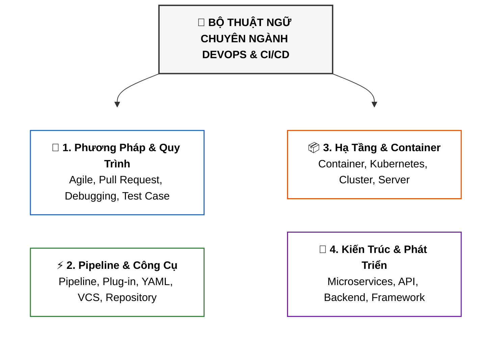

# Thuật Ngữ Chuyên Ngành: DevOps & CI/CD (Glossary)

Tài liệu này tổng hợp bảng thuật ngữ chuyên ngành chuẩn công nghiệp (**Glossary**) trong **Module 4: DevOps and CI-CD** thuộc khóa học **Cloud Native, Microservices, Containers, DevOps, and Agile** của IBM.

---

## 1. Bản Đồ Phân Loại Thuật Ngữ Theo Nhóm

---

## 2. Bảng Tra Cứu Thuật Ngữ Chi Tiết (Alphabetical Glossary)

| Thuật ngữ (Term) | Định nghĩa chi tiết (Definition) | Giải thích & Ứng dụng thực tế |
| :--- | :--- | :--- |
| **Agile methodology** *(Phương pháp luận Agile)* | Tập hợp các kỹ thuật, giá trị và nguyên tắc hướng dẫn nhằm cải thiện cách các nhóm phát triển phần mềm cộng tác với nhau để phân phối sản phẩm và các bản cập nhật mới liên tục. | Giúp doanh nghiệp thích ứng nhanh với thay đổi thay vì đi theo mô hình thác nước (*Waterfall*) cứng nhắc. |
| **Agile principle** *(Nguyên tắc Agile)* | Các nguyên tắc chỉ đạo cốt lõi giúp các nhóm triển khai và thực thi công việc với tính linh hoạt cao. | 12 nguyên tắc trong Tuyên ngôn Agile (Agile Manifesto). |
| **API (Application Programming Interface)** | Tập hợp các quy tắc mô tả cách thức các máy tính, phần mềm hoặc ứng dụng giao tiếp và trao đổi dữ liệu với nhau. | Là cầu nối dữ liệu tiêu chuẩn (REST, GraphQL, gRPC) giữa Frontend - Backend hoặc giữa các Microservices. |
| **Automation** *(Tự động hóa)* | Kỹ thuật, phương pháp hoặc hệ thống vận hành/kiểm soát một quy trình bằng các phương tiện tự động (phần mềm, thiết bị) với sự can thiệp tối thiểu của con người. | Trọng tâm của DevOps: tự động hóa build, test, provision hạ tầng và deploy. |
| **Back-end developer** *(Lập trình viên Backend)* | Các chuyên gia xây dựng và duy trì các cơ chế xử lý dữ liệu, nghiệp vụ logic và thực hiện các tác vụ nền tảng của hệ thống/website. | Làm việc với CSDL, API, Microservices và logic xử lý máy chủ. |
| **Cluster** *(Cụm máy chủ)* | Tập hợp các server và tài nguyên phần cứng/mạng hoạt động cùng nhau nhằm cung cấp tính sẵn sàng cao (*High Availability*), cân bằng tải (*Load Balancing*) và xử lý song song. | Nền tảng vận hành các hệ thống phân tán như cụm Kubernetes Cluster. |
| **Container** | Một dạng đóng gói phần mềm bao gồm mã nguồn và toàn bộ các thành phần phụ thuộc (dependencies), giúp ứng dụng chạy đồng nhất và di chuyển nhanh chóng giữa các môi trường tính toán khác nhau. | Đóng gói bằng Docker / Podman, nhẹ hơn máy ảo (VM) vì dùng chung kernel hệ điều hành. |
| **Database** *(Cơ sở dữ liệu)* | Tập hợp dữ liệu/thông tin có cấu trúc được lưu trữ điện tử trong hệ thống máy tính và được quản lý bởi Hệ quản trị cơ sở dữ liệu (DBMS). | RDBMS (PostgreSQL, MySQL) hoặc NoSQL (MongoDB, Redis). |
| **Debugging** *(Gỡ lỗi)* | Quy trình xác định vị trí, phân tích và sửa chữa các lỗi (bugs) trong mã nguồn hoặc phần cứng máy tính. | Thực hiện bằng công cụ debugger, log analysis và test suites. |
| **Framework** | Cấu trúc phân tầng xác định loại chương trình mà lập trình viên có thể/nên xây dựng và cách chúng tương tác với nhau; thường đi kèm các thư viện, API chuẩn và công cụ lập trình. | Ví dụ: Spring Boot, Express.js, ASP.NET Core, React, Tekton. |
| **Integration testing** *(Kiểm thử tích hợp)* | Giai đoạn kiểm thử trong đó các module phần mềm riêng lẻ được kết hợp lại và kiểm thử cùng nhau như một nhóm. | Nhằm phát hiện các lỗi phát sinh trong quá trình giao tiếp giữa các đơn vị mã nguồn. |
| **Kubernetes (K8s)** | Phần mềm mã nguồn mở chuyên điều phối, tự động hóa việc triển khai (*deploy*), mở rộng quy mô (*scaling*) và quản lý các ứng dụng container hóa ở mọi nơi. | Tiêu chuẩn công nghiệp số 1 về Container Orchestration. |
| **Microservices** *(Kiến trúc vi dịch vụ)* | Phong cách kiến trúc chia nhỏ một ứng dụng lớn thành một tập hợp các dịch vụ nhỏ, độc lập. Mỗi dịch vụ tự vận hành và giao tiếp với nhau qua giao thức nhẹ (HTTP/REST hoặc Message Queue). | Thay thế kiến trúc khối nguyên khối (*Monolith*), giúp dễ dàng scale và deploy độc lập. |
| **Open-source software** *(Phần mềm mã nguồn mở)* | Phần mềm được phân phối dưới giấy phép cho phép người dùng tự do sử dụng, nghiên cứu, sửa đổi và phân phối mã nguồn cho bất kỳ ai và vì bất kỳ mục đích nào. | Ví dụ: Linux, Git, Kubernetes, Jenkins, Python. |
| **Parameter** *(Tham số)* | Biến số được đặt tên truyền vào một hàm (function). Hàm sử dụng biến tham số này để nhận các giá trị đối số (*arguments*) từ bên ngoài. | Dùng trong lập trình và cấu hình pipeline. |
| **Pipeline** | Tập hợp các phần tử xử lý dữ liệu được kết nối tuần tự theo chuỗi, trong đó đầu ra (output) của phần tử này là đầu vào (input) của phần tử kế tiếp. | Ví dụ: CI/CD Pipeline (Build $\rightarrow$ Test $\rightarrow$ Deploy). |
| **Plug-in** *(Tiện ích mở rộng)* | Một phần mềm phụ trợ được cài đặt thêm vào để mở rộng tính năng và nâng cao năng lực cho chương trình chính. | Ví dụ: Các plugin trong Jenkins, VS Code extensions. |
| **Pull request (PR)** | Phương thức để lập trình viên thông báo cho đồng đội biết rằng một tính năng đã hoàn thành. Khi PR được mở, team có thể thảo luận, review code và commit bổ sung trước khi merge vào nhánh chính. | Công cụ cốt lõi để thực hiện Code Review và kiểm soát chất lượng mã nguồn. |
| **Repository (Repo)** | Hệ thống lưu trữ kỹ thuật số tập trung mà các lập trình viên sử dụng để lưu, quản lý và theo dõi các thay đổi đối với mã nguồn ứng dụng. | Kho lưu trữ trên Git, GitHub, GitLab, Bitbucket. |
| **Server** *(Máy chủ)* | Một chương trình hoặc thiết bị cung cấp dịch vụ cho một chương trình khác và người dùng/client của nó; cũng dùng để chỉ máy tính vật lý trong trung tâm dữ liệu. | Web server, App server, Database server. |
| **Syntax** *(Cú pháp)* | Các quy tắc chi phối cấu trúc ký hiệu, dấu câu và từ ngữ của một ngôn ngữ lập trình. | Giúp trình biên dịch/thông dịch hiểu đúng ngữ nghĩa của đoạn mã. |
| **Test case** *(Trường hợp kiểm thử)* | Tài liệu đặc tả các dữ liệu đầu vào, quy trình kiểm thử, điều kiện thực thi và kết quả kỳ vọng nhằm xác minh một mục tiêu kiểm thử cụ thể của phần mềm. | Nền tảng cốt lõi trong quy trình TDD và kiểm thử tự động. |
| **Version control systems (VCS)** | Các công cụ phần mềm giúp nhóm phát triển quản lý, theo dõi và lưu trữ lịch sử thay đổi của mã nguồn theo thời gian. | Điển hình là Git (phân tán) hoặc SVN (tập trung). |
| **YAML file** | Định dạng ngôn ngữ tuần tự hóa dữ liệu mà con người có thể dễ dàng đọc và viết được (*human-readable*), thường được sử dụng để viết các file cấu hình. | Ngôn ngữ cấu hình chuẩn trong Kubernetes, Docker Compose, GitHub Actions, Tekton. |
