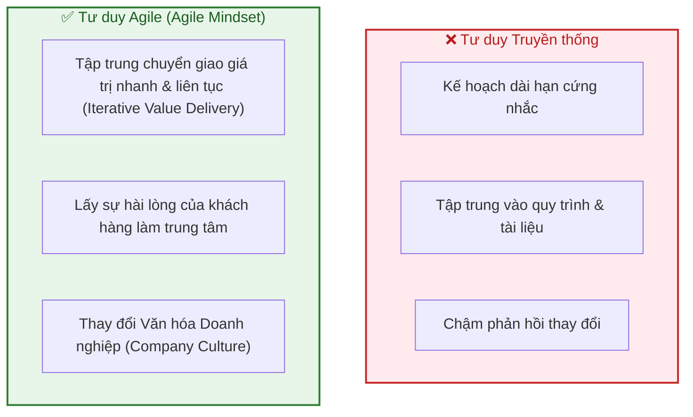
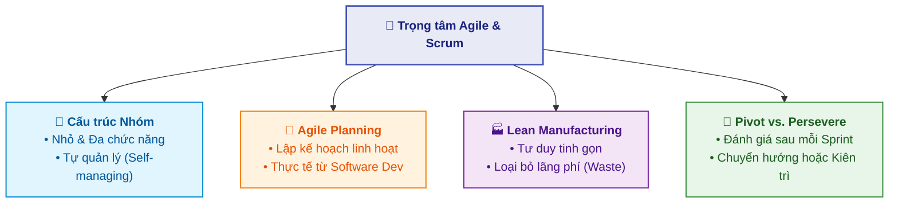

# Giới thiệu về Phát triển Linh hoạt và Scrum (Introduction to Agile Development and Scrum)

Tài liệu này tóm tắt nội dung bài học **Introduction to Agile Development and Scrum** trong **Module 5: Agile & Scrum** thuộc khóa học **Cloud Native, Microservices, Containers, DevOps, and Agile** do IBM cung cấp.

> **Giảng viên**: John Rofrano (IBM / NYU Courant Institute)

---

## 1. Bối cảnh & Số liệu Thực tế (Industry Statistics & Context)

Phương pháp Agile và khung làm việc Scrum đã trở thành tiêu chuẩn thực tế trong phát triển phần mềm và nhiều ngành công nghiệp:

* **Mức độ phổ biến**:
  * **> 70%** tổ chức đã tích hợp các phương pháp tiếp cận Agile (*theo Project Management Institute - PMI*).
  * **77%** các công ty lựa chọn áp dụng **Scrum**.
  * **> 25%** doanh nghiệp sản xuất (*manufacturing firms*) áp dụng Agile độc quyền.
* **Lợi ích**:
  * Dự án Agile có tỷ lệ thành công cao hơn **28%** so với các dự án quản lý truyền thống (*theo PwC*).
* **Nghịch lý & Thách thức**:
  * **47%** các cuộc chuyển đổi Agile (*Agile transformations*) thất bại (*theo Forbes*).
  * **Nguyên nhân cốt lõi**: Thiếu kinh nghiệm trong việc triển khai và tích hợp phương pháp luận Agile vào thực tế (*theo nghiên cứu của VersionOne*).

---

## 2. Bản chất của Agile: Mindset vs. Process

Agile **không đơn thuần là một quy trình kỹ thuật để làm theo**, mà là **một tư duy cần chuyển hóa** và **một triết lý quản trị**:

* **Chuyển dịch vai trò lãnh đạo (Executive Leadership)**: Ban lãnh đạo cần từ bỏ thói quen lập kế hoạch cứng nhắc dài hạn, chuyển sang ưu tiên chuyển giao giá trị nhanh chóng, lặp đi lặp lại (*iteratively*) để đáp ứng nhu cầu khách hàng.
* **Thay đổi văn hóa (Culture Shift)**: Chuyển đổi Agile thành công đòi hỏi sự thay đổi từ sâu bên trong văn hóa tổ chức, trao quyền và chấp nhận học hỏi qua từng vòng lặp.

---

## 3. Ẩn dụ về Học lái xe (The Driving Analogy)

Agile **không thể chỉ học qua sách vở lý thuyết**:
* Không ai trao cho bạn chìa khóa và cuốn cẩm nang sử dụng xe rồi bảo bạn tự biết lái.
* Bạn cần ngồi lên xe cùng một người có kinh nghiệm hướng dẫn: chỉ ra những điểm mù cần chú ý, điều chỉnh lực đạp ga/phanh, và rèn luyện phản xạ qua thực hành.
* Trong Agile cũng vậy: Cần hiểu cả **Patterns** (cách làm đúng) lẫn **Anti-patterns** (mô hình phản mẫu/những sai lầm thường gặp) để kịp thời nhận biết và điều chỉnh khi có dấu hiệu chệch hướng.

---

## 4. Các Trọng tâm Nội dung trong Module Agile & Scrum

1. **Cấu trúc nhóm linh hoạt (Team Empowerment)**:
   * Tổ chức thành các nhóm nhỏ, đa chức năng (*cross-functional*).
   * Trao quyền tự quản (*self-managing*) để đưa ra quyết định độc lập và nhanh chóng hơn.
2. **Kỹ năng lập kế hoạch Agile (Agile Planning)**:
   * Thực hành phân rã công việc, quản lý backlog, và lập kế hoạch linh hoạt theo từng chu kỳ.
3. **Kế thừa triết lý Lean**:
   * Tích hợp các nguyên lý từ sản xuất tinh gọn (*Lean Manufacturing*) vào quy trình phát triển.
4. **Quyết định sau mỗi chu kỳ: Pivot hay Persevere?**:
   * Cuối mỗi vòng lặp (*Iteration*), nhóm luôn phải tự đánh giá:
     * **Pivot**: Đổi hướng tiếp cận, thử nghiệm phương pháp hoặc tính năng mới.
     * **Persevere**: Tiếp tục kiên trì thực hiện theo kế hoạch hiện tại.

---

## 5. Tóm lược & Lời khuyên học tập

* Nắm vững tư duy (*Mindset*) trước khi áp dụng công cụ.
* Càng thực hành nhiều (*Hands-on*), kỹ năng lập kế hoạch và vận hành Agile càng hoàn thiện.
* Tích cực tham gia các bài kiểm tra thực hành (*Hands-on Final Assessment*) để củng cố kỹ năng thực tế.
