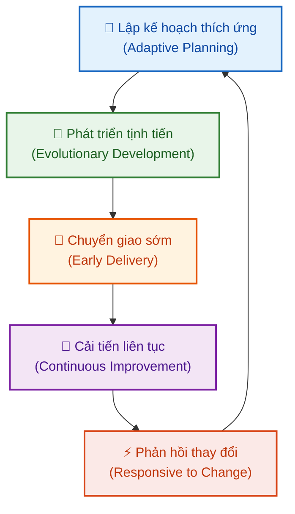

# Các Nguyên tắc Agile (Agile Principles)

Tài liệu này tóm tắt nội dung bài học **Agile Principles** trong **Module 5: Agile & Scrum** thuộc khóa học **Cloud Native, Microservices, Containers, DevOps, and Agile** do IBM cung cấp.

> **Giảng viên**: John Rofrano (IBM / NYU Courant Institute)

---

## 1. Định nghĩa Agile (What is Agile?)

**Agile** là một phương pháp tiếp cận theo chu kỳ lặp đi lặp lại (**Iterative approach**) trong quản lý dự án, giúp các nhóm phát triển phản hồi nhanh nhạy (*responsive*) và chuyển giao giá trị (*deliver value*) tới khách hàng một cách nhanh chóng.

* **Khác biệt với phương pháp truyền thống**: Thay vì lên kế hoạch chi tiết cho cả một năm, Agile chia nhỏ thành các bước tăng trưởng ngắn (**small increments**), liên tục nhận phản hồi từ khách hàng và điều chỉnh trong suốt quá trình.

---

## 2. Các Đặc trưng Cốt lõi của Agile (Characteristics of Agile)

1. **Lập kế hoạch thích ứng (Adaptive Planning)**:
   * Không lập kế hoạch cứng nhắc dài hạn, chỉ lập kế hoạch cho từng vòng lặp ngắn (*iteration*) để kiểm chứng giá trị.
2. **Phát triển tịnh tiến/tiến hóa (Evolutionary Development)**:
   * Không cố xây dựng toàn bộ sản phẩm hoàn chỉnh cùng một lúc; sản phẩm được bồi đắp và tiến hóa dần qua từng đợt tăng trưởng nhỏ (*increments*).
3. **Chuyển giao sớm (Early Delivery - Yếu tố sống còn)**:
   * Nếu phát triển lặp lại mà không chuyển giao sản phẩm sớm đến tay người dùng thì chưa thực sự là Agile.
   * Chuyển giao sớm giúp đưa sản phẩm vào tay khách hàng, thu nhận phản hồi thực tế để quyết định: **Pivot** (chuyển hướng) hay **Persevere** (tiếp tục).
4. **Cải tiến liên tục (Continuous Improvement)**:
   * Liên tục hoàn thiện quy trình làm việc của nhóm và nâng cao chất lượng sản phẩm nhờ phản hồi từ khách hàng.
5. **Phản ứng linh hoạt với thay đổi (Responsive to Change)**:
   * Yêu cầu của khách hàng luôn luôn thay đổi. Vì không lập kế hoạch quá xa, nhóm có thể tái lập kế hoạch (*re-plan*) cực kỳ nhanh chóng để đáp ứng đúng nhu cầu mới.

---

## 3. Tuyên ngôn Agile (The Agile Manifesto)

Tuyên ngôn Agile bao gồm **4 Giá trị cốt lõi**:

| Vế Trái (Ưu tiên cao hơn ⭐) | Vế Phải (Vẫn có giá trị nhưng ưu tiên sau) |
| :--- | :--- |
| **Cá nhân và sự tương tác** (*Individuals and interactions*) | Quy trình và công cụ (*Processes and tools*) |
| **Phần mềm chạy tốt** (*Working software*) | Tài liệu đầy đủ, toàn diện (*Comprehensive documentation*) |
| **Hợp tác với khách hàng** (*Customer collaboration*) | Đàm phán hợp đồng (*Contract negotiation*) |
| **Phản hồi với sự thay đổi** (*Responding to change*) | Tuân theo kế hoạch (*Following a plan*) |

> 📌 **Nguyên tắc hiểu đúng về Tuyên ngôn Agile**:  
> *"Dù các mục bên phải vẫn có giá trị, chúng tôi coi trọng các mục bên trái hơn."*
> - Vẫn cần quy trình & công cụ, nhưng **tương tác giữa người với người** quan trọng hơn.
> - Vẫn cần tài liệu hướng dẫn, nhưng **không thể xuất xưởng tài liệu thay cho phần mềm** — giá trị cốt lõi nằm ở **phần mềm chạy tốt**.
> - Vẫn cần hợp đồng, nhưng **sự đồng hành hợp tác cùng khách hàng** mang lại thành công lâu dài.
> - Vẫn cần kế hoạch, nhưng **khả năng thích ứng khi có biến đổi** quan trọng hơn việc bám chặt vào kế hoạch cũ.

---

## 4. Văn hóa & Tổ chức Đội ngũ trong Agile

* **Tính minh bạch cao (High Transparency)**: Mọi thành viên đều thấy rõ công việc của nhau; toàn đội cùng chia sẻ trách nhiệm mang lại giá trị cho khách hàng.
* **Mô hình đội ngũ tiêu chuẩn**:
  * **Nhỏ (Small)**
  * **Cùng địa điểm/Gắn kết (Co-located)**
  * **Đa chức năng (Cross-functional)**
  * **Tự tổ chức & Tự quản lý (Self-organizing & Self-managing)**

---

## 5. Thông điệp cốt lõi (Key Takeaway)

> 💡 **"Build what is needed, not what was planned."**  
> *(Hãy xây dựng những gì khách hàng thực sự cần, chứ không phải mù quáng bám vào những gì đã từng lên kế hoạch).*

Nếu xây dựng đúng 100% theo kế hoạch ban đầu nhưng khách hàng không cần hoặc không hài lòng thì việc xây dựng đó trở nên vô nghĩa. Khi nhu cầu thay đổi, nhóm Agile sẵn sàng lập kế hoạch lại (*re-plan*) để chuyển giao đúng giá trị.
