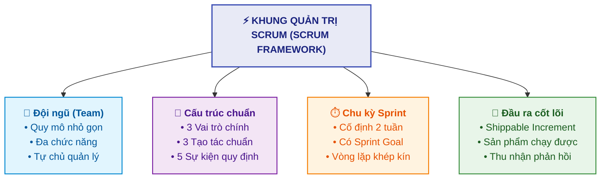
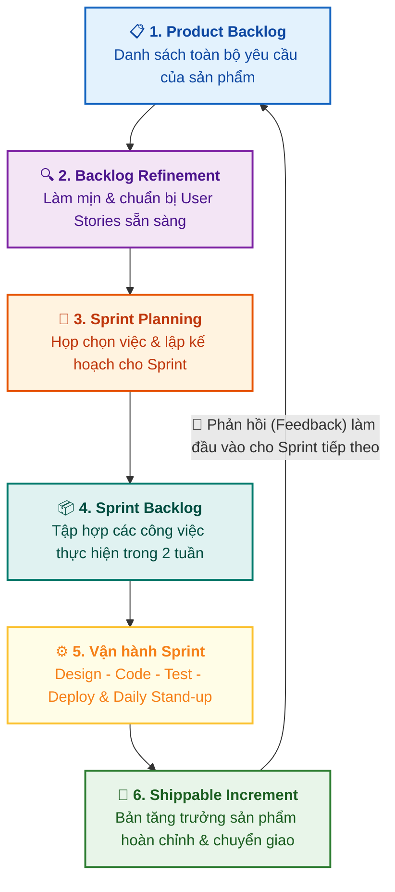

# Tổng quan về Scrum (Scrum Overview)

Tài liệu này tóm tắt nội dung bài học **Scrum Overview** trong **Module 5: Agile & Scrum** thuộc khóa học **Cloud Native, Microservices, Containers, DevOps, and Agile** do IBM cung cấp.

> **Giảng viên**: John Rofrano (IBM / NYU Courant Institute)

---

## 1. Phân biệt Agile và Scrum (Agile vs. Scrum)

Nhiều người thường dùng lẫn lộn hai khái niệm này, nhưng trên thực tế chúng có ranh giới rõ ràng:

| Đặc điểm | Agile | Scrum |
| :--- | :--- | :--- |
| **Bản chất** | **Triết lý / Tư duy (Philosophy)** | **Phương pháp luận / Khung quản lý (Methodology / Framework)** |
| **Tính quy chuẩn** | **Không áp đặt (Non-prescriptive)**: Đưa ra định hướng, giá trị và nguyên tắc chung. | **Có tính quy chuẩn (Prescriptive)**: Quy định cụ thể các vai trò (*roles*), quy tắc (*rules*), sự kiện (*events*) và tài liệu/tạo tác (*artifacts*). |
| **Mục đích** | Kim chỉ nam tư duy về cách làm việc linh hoạt. | Cách thức cụ thể để đưa tư duy Agile vào vận hành thực tế. |

---

## 2. Bản chất của Khung Quản lý Scrum (What is Scrum?)

Scrum là một **khung quản trị (Management Framework)** để phát triển sản phẩm theo từng phần tăng trưởng (*incremental product development*).

* **Đặc tính "Dễ hiểu nhưng khó thành thạo" (*Easy to understand, difficult to master*)**:
  * Scrum không có quá nhiều quy tắc phức tạp, nhưng việc thực thi kỷ luật lại vô cùng khó (tương tự như môn múa ba-lê — nhìn thì nhẹ nhàng nhưng đòi hỏi nhiều năm rèn luyện phản xạ và cơ bắp).
  * **Lời khuyên**: Nếu nhóm chưa từng làm Scrum, nên tuyển dụng hoặc có một người hướng dẫn (*mentor/Scrum Master giàu kinh nghiệm*) để dẫn dắt.

---

## 3. Khái niệm về Sprint (The Sprint)

* **Định nghĩa**: Một **Sprint** là một vòng lặp nhỏ (*mini-iteration*) đi qua toàn bộ vòng đời phát triển phần mềm:
  $$\text{Design (Thiết kế)} \longrightarrow \text{Code (Lập trình)} \longrightarrow \text{Test (Kiểm thử)} \longrightarrow \text{Deploy (Triển khai)}$$
* **Mục tiêu Sprint (Sprint Goal)**: Mỗi sprint bắt buộc phải có một mục tiêu rõ ràng để toàn đội hiểu được mình đang xây dựng phần giá trị nào.
* **Thời lượng lý tưởng của Sprint**:
  * **2 tuần (Khuyến nghị)**: Đủ ngắn để phản ứng nhanh với thay đổi và duy trì kích thước công việc nhỏ (*small batches*).
  * *4 tuần*: Quá dài, nhiều yêu cầu có thể thay đổi giữa chừng.
  * *1 tuần*: Thường quá gấp gáp đối với phần lớn các nhóm phát triển.
* **Tầm quan trọng của bước Deploy**: Phải đưa được sản phẩm ra môi trường thực tế để người dùng trải nghiệm và thu thập phản hồi (*feedback*).

---

## 4. Quy trình Vận hành Scrum (The Scrum Process)

### Các bước chi tiết:

1. **Product Backlog**:
   * Danh sách tổng hợp toàn bộ các *User Stories* và yêu cầu từ trước đến nay cho sản phẩm (danh sách việc cần làm tổng thể).
2. **Backlog Refinement (Grooming)**:
   * Buổi làm mịn danh sách: Làm rõ yêu cầu, ước lượng và đảm bảo các user stories đạt trạng thái sẵn sàng (*sprint-ready*) trước khi đưa vào lập kế hoạch.
3. **Sprint Planning**:
   * Cuộc họp đầu Sprint: Nhóm lựa chọn các stories ưu tiên từ Product Backlog chuyển sang **Sprint Backlog**.
4. **Sprint Backlog**:
   * Tập hợp các công việc nhóm cam kết hoàn thành trong phạm vi Sprint (2 tuần) sắp tới.
5. **Vận hành Sprint & Daily Scrum (Họp đứng hằng ngày)**:
   * Diễn ra ngắn gọn mỗi ngày, mỗi thành viên trả lời **3 câu hỏi trọng tâm**:
     1. *Hôm qua tôi đã làm được gì? (What did you do yesterday?)*
     2. *Hôm nay tôi sẽ làm gì? (What will you do today?)*
     3. *Có khó khăn hay trở ngại nào đang cản trở tôi không? (Are there any blockers or impediments?)*
6. **Shippable Increment & Thu nhận phản hồi**:
   * Cuối sprint tạo ra một bản tăng trưởng sản phẩm hoàn chỉnh, có thể chạy và chuyển giao được (*potentially shippable increment*).
   * Phản hồi của khách hàng sau khi nhận bản giao này sẽ trở thành dữ liệu đầu vào (*input*) cho việc lập kế hoạch cho chu kỳ tiếp theo.

---

## 5. Tóm lược nội dung cốt lõi

* **Agile** là triết lý hướng dẫn chung; **Scrum** là phương pháp cụ thể triển khai triết lý đó.
* Scrum quản lý công việc thông qua các **vai trò**, **sự kiện**, **quy tắc** và **tạo tác** rõ ràng.
* Hoạt động theo các chu kỳ cố định gọi là **Sprint (thường là 2 tuần)**, mỗi chu kỳ đều khép kín qua chu trình *Design - Code - Test - Deploy*.
* Đầu ra của mỗi Sprint luôn hướng tới một **Potentially Shippable Product Increment**.
