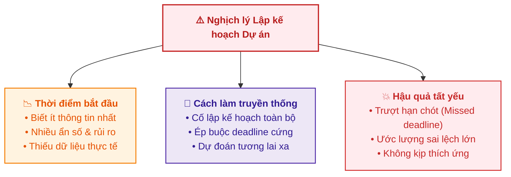
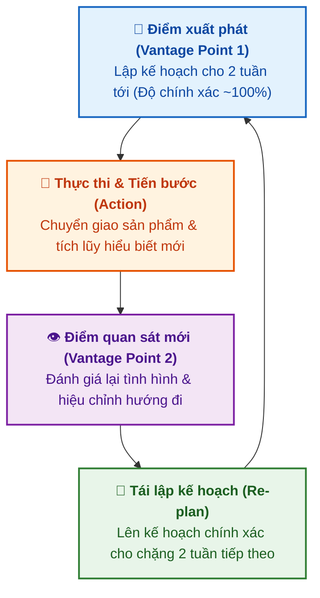

# Điều hướng Miền Bất định (Destination Unknown)

Tài liệu này tóm tắt nội dung bài học **Destination Unknown** trong **Module 5: Agile & Scrum** thuộc khóa học **Cloud Native, Microservices, Containers, DevOps, and Agile** do IBM cung cấp.

> **Giảng viên**: John Rofrano (IBM / NYU Courant Institute)

---

## 1. Nghịch lý của Kế hoạch Cố định Ban đầu (The Upfront Planning Pitfall)

Nhà văn Douglas Adams từng có câu nói châm biếm nổi tiếng:
> *"Tôi yêu các hạn chót (deadlines). Tôi thích âm thanh 'vút' một cái khi chúng bay vụt qua trước mắt."*

Trong quản lý dự án truyền thống, việc đặt ra các mốc hạn chót cố định từ đầu và liên tục bị trễ hạn (*missed deadlines*) là tình trạng xảy ra phổ biến.

* **Nguyên nhân cốt lõi**: Chúng ta thường đưa ra toàn bộ quyết định và cam kết quan trọng nhất vào **thời điểm ta có ít thông tin nhất về dự án** (*at the point you know the least*).

---

## 2. Ẩn dụ về Bầy chim cánh cụt (Navigating the Penguin Field)

Giảng viên đưa ra một hình ảnh ẩn dụ sống động:
* **Tình huống**: Bạn cần băng qua một cánh đồng đầy chim cánh cụt đang liên tục di chuyển.
* **Thực tế**: Bạn không thể đứng từ điểm xuất phát mà vẽ trước toàn bộ lộ trình từng bước sang tận bờ bên kia, bởi vì **những con chim cánh cụt không đứng yên**.
* **Liên hệ với Phát triển Phần mềm**:
  * Công nghệ và môi trường luôn biến động: Hệ điều hành cập nhật bản vá (*OS patches*), thư viện bên thứ ba nâng cấp (*packages update*), nhu cầu khách hàng liên tục thay đổi.
  * Khi bạn bước những bước đầu tiên và tiến vào giữa bầy, bạn đạt được một **điểm quan sát mới (*new vantage point*)**. Từ điểm nhìn mới này, bạn có nhiều thông tin hơn để vạch tiếp vài bước kế tiếp.

---

## 3. Bản chất của Lập kế hoạch Lặp lại (Iterative Planning)

Thay vì cố gắng "toàn năng" (*omnipotent*) để dự đoán toàn bộ tương lai, Agile áp dụng nguyên lý **Lập kế hoạch thích ứng theo từng chặng**:

### So sánh Độ chính xác của Ước lượng (Estimation Accuracy)

| Khung Thời gian Dự đoán | Mức độ Hiểu biết | Độ chính xác Ước lượng |
| :--- | :--- | :--- |
| **3 - 6 tháng tới** | Rất nhiều biến số chưa biết (*High uncertainty*) | Chỉ đạt khoảng **~50%** |
| **2 tuần tới (1 Sprint)** | Phạm vi rõ ràng, rủi ro trong tầm kiểm soát | Đạt gần **~100%** |

---

## 4. Nguyên tắc Vàng & Tóm lược cốt lõi

> 💡 **"Don't decide everything at the point you know the least."**  
> *(Đừng quyết định tất cả mọi thứ vào thời điểm bạn có ít thông tin nhất).*

* **Ngừng lập kế hoạch áp đặt từ đầu (Stop upfront planning)**: Chỉ lên kế hoạch chi tiết cho những gì đã biết rõ trong ngắn hạn (Sprint 2 tuần).
* **Vừa đi vừa học (*Plan as you go and learn*)**: Càng tiến xa trong dự án, nhóm càng có nhiều dữ liệu và điểm nhìn rõ ràng hơn để điều chỉnh đường đi (*course corrections*) và đưa ra các ước lượng chính xác hơn.
