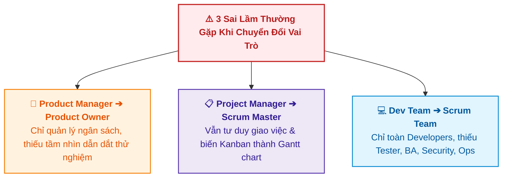
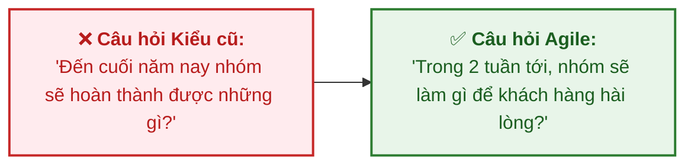

# Các Vai trò Agile và Tầm quan trọng của Đào tạo (Agile Roles and the Need for Training)

Tài liệu này tóm tắt nội dung bài học **Agile Roles and the Need for Training** trong **Module 5: Agile & Scrum** thuộc khóa học **Cloud Native, Microservices, Containers, DevOps, and Agile** do IBM cung cấp.

> **Giảng viên**: John Rofrano (IBM / NYU Courant Institute)

---

## 1. Sai lầm Phổ biến: Gán Vai trò Mới nhưng Thiếu Đào tạo

Một trong những nguyên nhân hàng đầu khiến các tổ chức chuyển đổi Agile thất bại là **đưa nhân sự cũ vào vai trò Agile/Scrum mới mà không qua đào tạo chuyển đổi tư duy**:

---

## 2. So sánh Chi tiết các Vai trò Cũ vs. Mới

### 2.1. Product Manager (Chức danh) vs. Product Owner (Vai trò Scrum)

| Tiêu chí | Product Manager (Quản lý Sản phẩm) | Product Owner (Chủ sở hữu Sản phẩm) |
| :--- | :--- | :--- |
| **Bản chất** | **Chức danh công việc (Job Title)** trong tổ chức. | **Vai trò (Role)** được định nghĩa trong khung Scrum. |
| **Trọng tâm chính** | Khía cạnh vận hành kinh doanh, chi phí và quản lý ngân sách (*budget*). | Định hình tầm nhìn (*visionary*), dẫn dắt nhóm qua các chuỗi thử nghiệm để đạt Sprint Goal. |
| **Nhiệm vụ cốt lõi** | Quản trị vận hành sản phẩm vĩ mô. | Là cầu nối dịch chuyển yêu cầu nghiệp vụ (*business requirements*) thành mục tiêu kỹ thuật (*technical goals*). |

---

### 2.2. Project Manager (Quản lý Dự án) vs. Scrum Master (Người điều phối Scrum)

```mermaid
flowchart TD
    subgraph PM_BOX ["📋 Quản lý Dự án Truyền thống (Project Manager)"]
        direction TB
        PM1["• Quản lý tác vụ & ép tiến độ theo kế hoạch"]
        PM2["• Phân bổ / Gán việc cho từng cá nhân"]
        PM3["• Ghi chép rủi ro vào bảng tính khi có khó khăn"]
        PM4["• Hỏi thành viên: 'Bạn tự làm gì để gỡ tắc?'"]
    end

    subgraph SM_BOX ["🛡️ Người điều phối Scrum (Scrum Master)"]
        direction TB
        SM1["• Huấn luyện viên (Coach) duy trì sự tự quản của nhóm"]
        SM2["• KHÔNG gán việc — Đội ngũ tự nhận việc"]
        SM3["• Trực tiếp dọn sạch trở ngại (Eliminates impediments)"]
        SM4["• Nói với nhóm: 'Để tôi xử lý, bạn cứ tập trung làm'"]
    end

    style PM_BOX fill:#fff3e0,stroke:#f57c00,stroke-width:1.5px
    style SM_BOX fill:#e8f5e9,stroke:#2e7d32,stroke-width:1.5px
```

* **Nguy cơ khi không đào tạo**: Một Project Manager quen với biểu đồ Gantt sẽ cố gắng biến bảng **Kanban** thành biểu đồ **Gantt**, triệt tiêu tính linh hoạt của Agile.

---

### 2.3. Development Team vs. Scrum Team

* **Development Team truyền thống**: Thường chỉ quy tụ các kỹ sư phần mềm (*Software Engineers/Developers*).
* **Scrum Team chuẩn mực**: Phải là **Đội ngũ Đa chức năng (Cross-functional Team)** gồm tất cả các năng lực cần thiết để hoàn thành một bản tăng trưởng sản phẩm (*increment*):
  * Lập trình viên (*Developers*)
  * Kiểm thử viên (*Testers / QA*)
  * Chuyên viên phân tích nghiệp vụ (*Business Analysts*)
  * Kỹ sư bảo mật (*Security Engineers*)
  * Kỹ sư vận hành hệ thống (*DevOps / Ops*)

---

## 3. Thay đổi Tư duy từ Cấp Quản lý Cao cấp (Leadership Shift)

> 💬 *"Cho đến khi các nhà lãnh đạo doanh nghiệp chấp nhận rằng họ không còn quản lý dự án với các chức năng, khung thời gian và chi phí cố định như mô hình Waterfall nữa, họ sẽ còn chật vật trong việc áp dụng Agile theo đúng bản chất của nó."*  
> — **Bill Cantor**

### Chuyển đổi câu hỏi của Ban Lãnh đạo:

---

## 4. Tóm lược Bài học

1. Đổi tên vị trí không đồng nghĩa với chuyển đổi Agile thành công — **Bắt buộc phải đào tạo tư duy và kỹ năng mới**.
2. **Product Owner** tập trung vào Tầm nhìn & Thử nghiệm giá trị (không chỉ quản lý ngân sách).
3. **Scrum Master** là Người bảo vệ & Dọn dẹp rào cản cho nhóm tự quản (không phải người quản lý gán việc).
4. **Scrum Team** phải thực sự **Đa chức năng (Cross-functional)** bao gồm đầy đủ Dev, Test, Ops, BA, Security.
