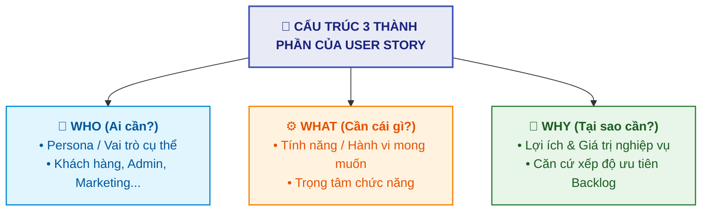
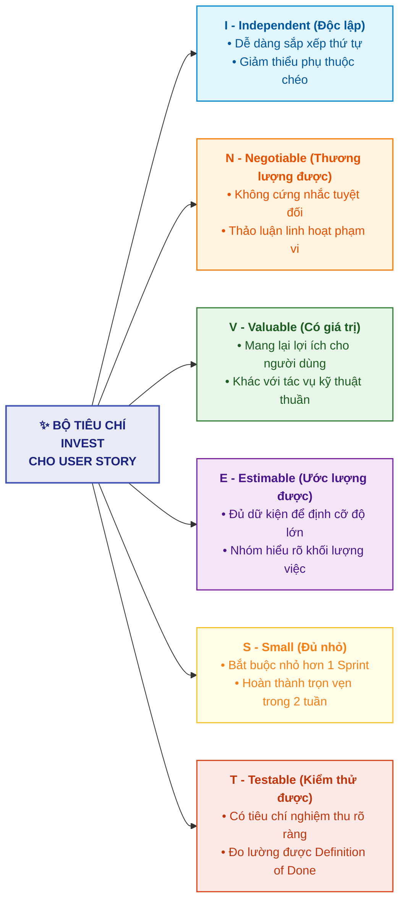

# Tạo Câu chuyện Người dùng Hiệu quả (Creating Good User Stories)

Tài liệu này tóm tắt nội dung bài học **Creating Good User Stories** trong **Module 5: Agile & Scrum** thuộc khóa học **Cloud Native, Microservices, Containers, DevOps, and Agile** do IBM cung cấp.

> **Giảng viên**: John Rofrano (IBM / NYU Courant Institute)

---

## 1. Bản chất của User Story (What is a User Story?)

**User Story** là bản mô tả một phần **giá trị kinh doanh (Business Value)** mà nhóm phát triển có thể chuyển giao trọn vẹn trong một bản tăng trưởng hoàn thành (*done increment*).

* **Khác biệt với Yêu cầu truyền thống (Requirements)**:
  * Yêu cầu kiểu cũ thường khô cứng: *"Tôi cần chức năng A, chức năng B"*.
  * User Story nêu bật **Lý do & Giá trị (*Why*)**, giúp Product Owner dễ dàng so sánh và xếp thứ tự ưu tiên trong Product Backlog.

---

## 2. Cấu trúc Chuẩn của một User Story Hoàn chỉnh

Một User Story chất lượng gồm **3 phần chính**:

### 2.1. Bản mô tả chuẩn (Standard Syntax)
$$\textbf{As a } \langle \text{Role / Persona} \rangle, \textbf{ I need } \langle \text{Functionality} \rangle, \textbf{ so that } \langle \text{Business Value} \rangle.$$

* **As a** *(Với vai trò là)*: Xác định rõ đối tượng hưởng lợi (Ví dụ: Marketing Manager, Sysadmin, Customer).
* **I need** *(Tôi cần)*: Chức năng/tính năng cụ thể cần xây dựng.
* **So that** *(Để)*: Giá trị hoặc lợi ích nghiệp vụ đạt được.

### 2.2. Giả định & Chi tiết kỹ thuật (Assumptions & Details)
* Ghi chép các giả định hoặc ràng buộc kỹ thuật đã thống nhất khi thảo luận (Ví dụ: *Dùng cơ sở dữ liệu quan hệ, cần khách hàng đồng ý nhận tin nhắn trước...*).
* Giúp lập trình viên hiểu đúng ý định thiết kế, tránh đi sai hướng hoặc tốn công tìm kiếm giải pháp không phù hợp.

### 2.3. Tiêu chí Chấp thuận (Acceptance Criteria / Definition of Done)
* Sử dụng cú pháp chuẩn **Gherkin**:
  * **Given** *(Bối cảnh / Điều kiện tiên quyết)*: Thiết lập trạng thái ban đầu của hệ thống.
  * **When** *(Hành động kích hoạt)*: Thao tác do người dùng hoặc hệ thống thực hiện.
  * **Then** *(Kết quả kiểm thử được)*: Đầu ra cụ thể, có thể đo lường và kiểm chứng rõ ràng.

---

## 3. Ví dụ Minh họa Thực tế (Sample User Story)

| Thành phần | Nội dung ví dụ |
| :--- | :--- |
| **Mô tả Story** | **As a** Marketing Manager, **I need** a list of customer names and emails, **so that** I can notify them of marketing promotions. |
| **Giả định (Assumptions)** | 1. Hệ thống đã lưu trữ sẵn email của khách hàng trong cơ sở dữ liệu. 2. Khách hàng đã chủ động đăng ký nhận email (*opted in to promotions*). |
| **Tiêu chí chấp thuận (Gherkin)** | **Given** có 100 khách hàng trong database và 90 người đã opt-in, **When** tôi yêu cầu xuất danh sách email khách hàng, **Then** tôi phải nhận được danh sách đúng 90 email (không phải 100). |

> 📌 **Lợi ích**: Cả bên nghiệp vụ (Marketing Manager) và kỹ sư phát triển (*Developer*) đều hiểu chung một hành vi chuẩn xác, không còn tranh cãi liệu Story đã hoàn thành (*Done*) hay chưa.

---

## 4. Bộ Tiêu chí INVEST (Bill Wake)

Một User Story được thiết kế tốt phải đáp ứng đủ 6 tiêu chí **INVEST**:

---

## 5. Khái niệm Epic (Big Ideas)

* **Định nghĩa Epic**: Là một ý tưởng lớn hoặc một khối chức năng lớn **vượt quá dung lượng của một Sprint đơn lẻ**.
* **Mối quan hệ thứ bậc**:
  $$\text{Epic (Ý tưởng lớn)} \;\Longrightarrow\; \text{Phân rã thành nhiều User Stories nhỏ (Sprint-ready)}$$
* **Khi nào sử dụng Epic?**:
  1. Khi một tính năng mới quá lớn, không thể làm xong trong vòng 2 tuần.
  2. Các sáng kiến sản phẩm ban đầu trong Product Backlog thường xuất phát dưới dạng Epic.
  3. Trong các buổi **Backlog Refinement**, nhóm sẽ phân rã (*break down*) Epic thành các User Stories nhỏ đáp ứng tiêu chí INVEST để đưa vào Sprint Planning.
