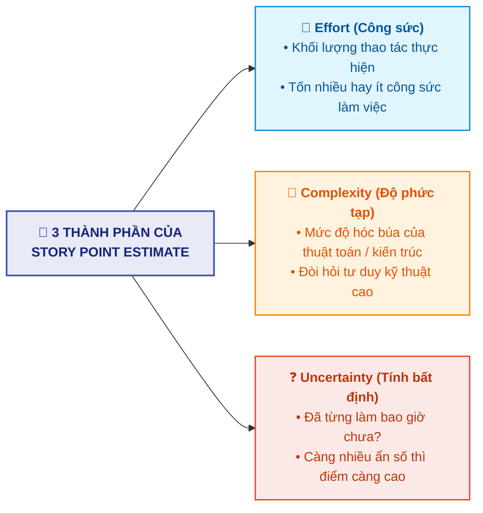
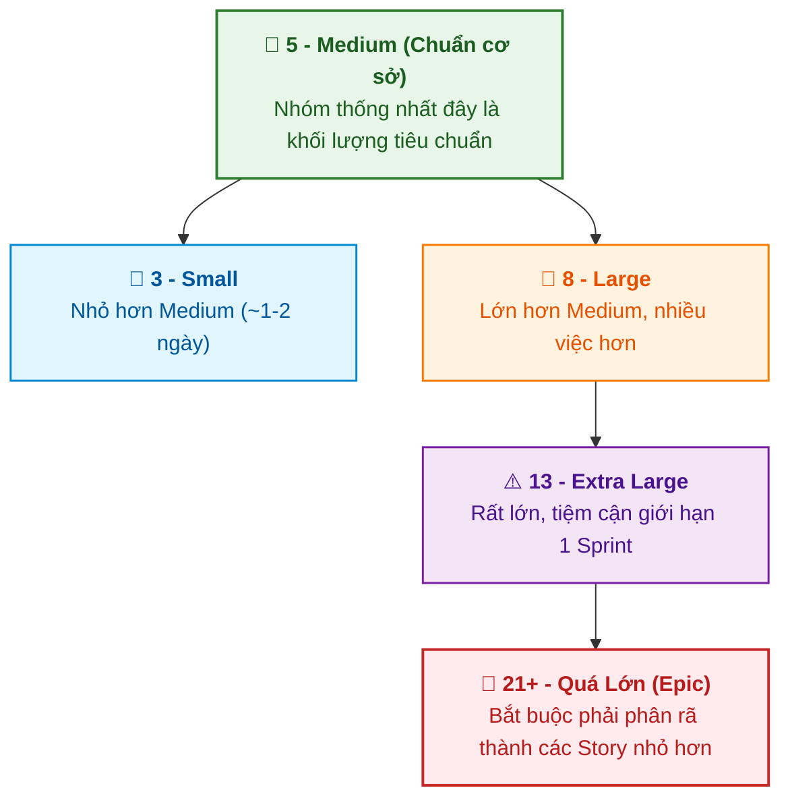
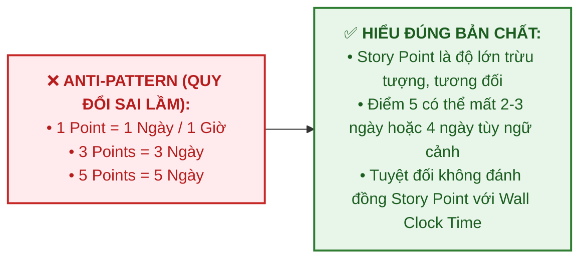

# Sử dụng Story Points Hiệu quả (Effectively using Story Points)

Tài liệu này tóm tắt nội dung bài học **Effectively using Story Points** trong **Module 5: Agile & Scrum** thuộc khóa học **Cloud Native, Microservices, Containers, DevOps, and Agile** do IBM cung cấp.

> **Giảng viên**: John Rofrano (IBM / NYU Courant Institute)

---

## 1. Bản chất của Story Points (What are Story Points?)

**Story Points** là một đơn vị đo lường **trừu tượng (abstract measure)** dùng để ước tính độ khó tổng thể và khối lượng cần thiết để hoàn thành một User Story.

---

## 2. Tại sao Không Dùng Thời gian Đồng hồ (Wall Clock Time)?

* **Con người ước lượng thời gian thực rất tệ**: Chúng ta thường cam kết hạn chót theo giờ/ngày nhưng hầu như đều trượt hạn (*"Thứ duy nhất chỉ tốn 30 phút là chính 30 phút, mọi thứ khác luôn kéo dài hơn"*).
* **Giải pháp**: Sử dụng **Ước lượng Tương đối (Relative Estimation)** giống như kích cỡ áo phông (*T-shirt sizes*: S, M, L, XL) thay vì dự đoán giờ/ngày cụ thể.

---

## 3. Thang đo Fibonacci và Ẩn dụ Chiều cao Tòa nhà

Vì không thể cộng trừ kích cỡ $S, M, L$ để tính toán vận tốc chuyển giao (*Velocity* - tổng điểm nhóm làm được trong 1 Sprint), Agile sử dụng **Dãy số Fibonacci** để số hóa độ lớn:

### Ẩn dụ về Chiều cao Tòa nhà (The Building Analogy):
* Thay vì ngồi đếm từng tầng rồi nhân số mét (dễ sai lệch), bạn chỉ cần gán:
  * Tòa nhà mẫu ở giữa là **5 (Medium)**.
  * Tòa thấp hơn bên trái là **3 (Small)**.
  * Tòa cao hơn bên phải là **8 (Large)**.
  * Tòa chọc trời cao nhất là **13 (Extra Large)**.
* **Nguyên tắc**: Mọi ước lượng đều dựa trên **so sánh tương quan tương đối** với một Story mẫu mà nhóm đã hiểu rõ.

---

## 4. Kích thước Lý tưởng của một User Story

* Một User Story lý tưởng phải **đủ nhỏ để hoàn thành trong vài ngày (*a couple of days*)**.
* Tránh tạo ra những Story kéo dài lê thê qua nhiều tuần.
* Bất kỳ Story nào được đánh giá từ **21 điểm trở lên** đều không phù hợp cho 1 Sprint và phải phân rã (*break down*) thành nhiều Story nhỏ hơn hoặc đưa vào Epic.

---

## 5. Sai lầm Chống mẫu Nghiêm trọng (The Ultimate Anti-Pattern)

> ⚠️ **Cảnh báo từ Giảng viên**:  
> Những Scrum Master xuất thân từ Project Manager quen dùng Gantt Chart thường có xu hướng ép nhóm quy đổi *1 điểm = 1 ngày, 5 điểm = 5 ngày*. **Đây là sai lầm tai hại nhất trong Agile**. Hãy giữ Story Points là một thước đo tương đối và trừu tượng.

---

## 6. Tóm lược Nội dung Cốt lõi

1. **Story Points** đo lường độ khó thực thi dựa trên 3 yếu tố: **Công sức (Effort) + Độ phức tạp (Complexity) + Tính bất định (Uncertainty)**.
2. Bản chất của Story Points là **ước lượng tương đối** (như cỡ áo $S, M, L, XL$).
3. Toàn đội cần thống nhất một Story chuẩn làm mốc **Medium (5 điểm)**, từ đó so sánh các Story khác lớn hơn hay nhỏ hơn.
4. **Tuyệt đối không bao giờ quy đổi Story Points sang ngày hay giờ thực tế (*Wall clock time*)**.
