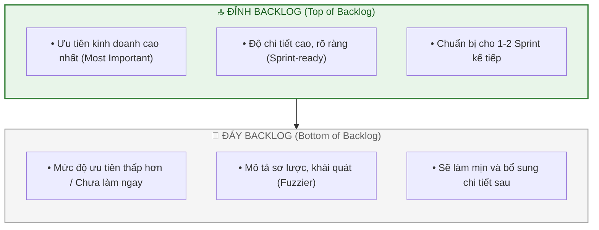
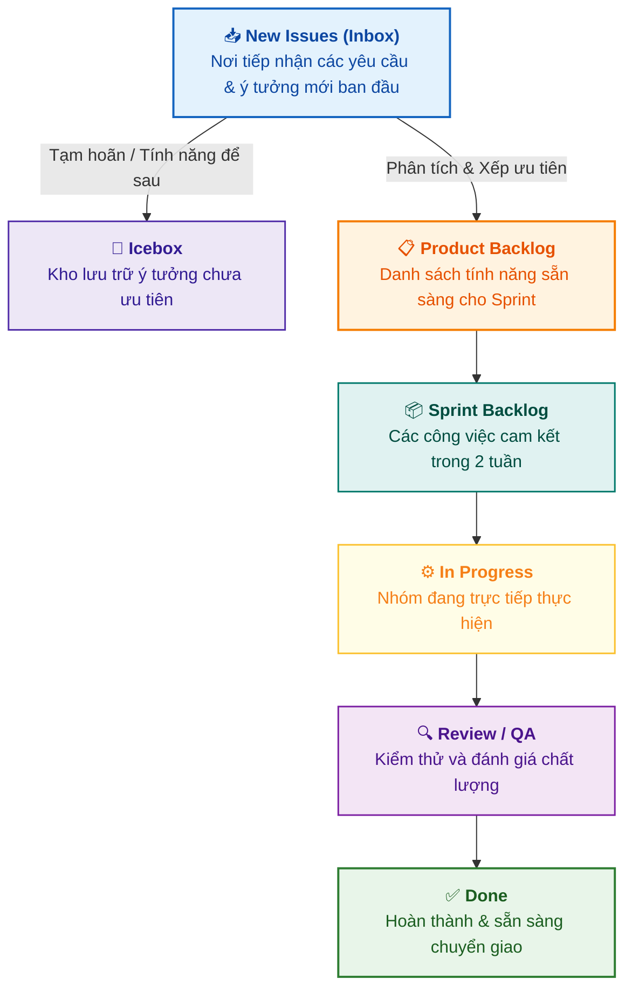
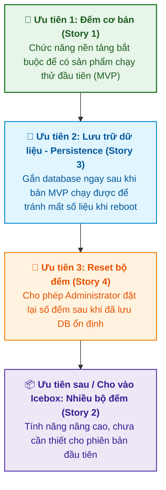

# Xây dựng Product Backlog (Building the Product Backlog)

Tài liệu này tóm tắt nội dung bài học **Building the Product Backlog** trong **Module 5: Agile & Scrum** thuộc khóa học **Cloud Native, Microservices, Containers, DevOps, and Agile** do IBM cung cấp.

> **Giảng viên**: John Rofrano (IBM / NYU Courant Institute)

---

## 1. Định nghĩa Product Backlog (What is a Product Backlog?)

**Product Backlog** là danh sách được sắp xếp theo thứ tự ưu tiên (**ranked list**) của toàn bộ các User Stories chưa được thực hiện (*unimplemented stories*) — tức là những công việc chưa được đưa vào bất kỳ Sprint nào và đang chờ tới lượt xử lý.

---

## 2. Các Cột Trạng thái trong Bảng Kanban (ZenHub Pipelines)

Trong các công cụ quản lý dự án Agile (như ZenHub, Jira, Trello), công việc di chuyển qua các cột luồng (*pipelines*):

---

## 3. Thực hành Chuyển đổi Yêu cầu Thô thành User Story (Case Study: Hit Counter Service)

* **Bài toán ví dụ**: Xây dựng một dịch vụ đếm số (*Hit Counter Service*) để đếm số lượt xem trang hoặc số lần thực hiện một hành động.

| Yêu cầu ban đầu của Khách hàng | Chuyển đổi sang User Story chuẩn | Vai trò & Giá trị mang lại |
| :--- | :--- | :--- |
| **Yêu cầu 1**: *Cần dịch vụ đếm.* | **As a** user, **I need** a service that has a counter, **so that** I can keep track of how many times something has been done. | • **Role**: End User • **Giá trị**: Theo dõi số lần thực hiện một sự kiện. |
| **Yêu cầu 2**: *Phải hỗ trợ nhiều bộ đếm cùng lúc.* | **As a** user, **I need** to have multiple counters, **so that** I can keep track of several counts at once. | • **Role**: End User • **Giá trị**: Quản lý nhiều chỉ số độc lập cùng lúc. |
| **Yêu cầu 3**: *Dữ liệu đếm không bị mất khi restart.* | **As a** service provider, **I need** a service to persist the last known count, **so that** users don't lose track of their counts after restart. | • **Role**: Service Provider • **Giá trị**: Đảm bảo độ tin cậy, không làm mất dữ liệu của khách. |
| **Yêu cầu 4**: *Bộ đếm có thể đặt lại về 0.* | **As a** system administrator, **I need** the ability to reset the counter, **so that** I can redo counting from the start. | • **Role**: SysAdmin (bảo mật/quyền hạn) • **Giá trị**: Khởi tạo lại chu kỳ đếm mới khi cần. |

---

## 4. Quy trình Sắp xếp Độ ưu tiên (Backlog Prioritization)

Sau khi đưa các Story vào **New Issues (Inbox)**, nhóm sẽ quyết định đưa vào **Product Backlog** theo thứ tự ưu tiên thực thi cho sản phẩm khả dụng tối thiểu (**MVP - Minimum Viable Product**):

---

## 5. Tóm lược Nội dung Cốt lõi

1. **Product Backlog** là danh sách toàn bộ các yêu cầu chưa làm, được sắp xếp theo **giá trị kinh doanh**.
2. **Nguyên tắc "Đỉnh chi tiết, đáy khái quát"**: Chỉ cần làm mịn và chi tiết hóa các Story ở phía trên đỉnh cho 1–2 Sprint tới; các Story ở phía dưới sẽ được bổ sung chi tiết sau.
3. Luôn sử dụng cấu trúc `As a ..., I need ..., so that ...` để biến các yêu cầu thô 1 dòng thành những User Story rõ người hưởng lợi và rõ giá trị kinh doanh.
