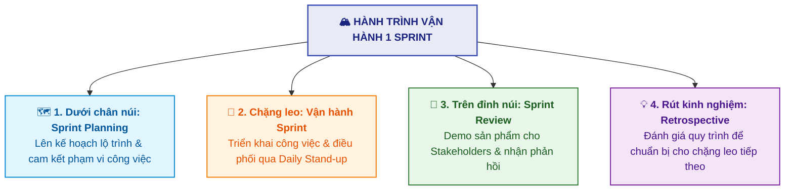
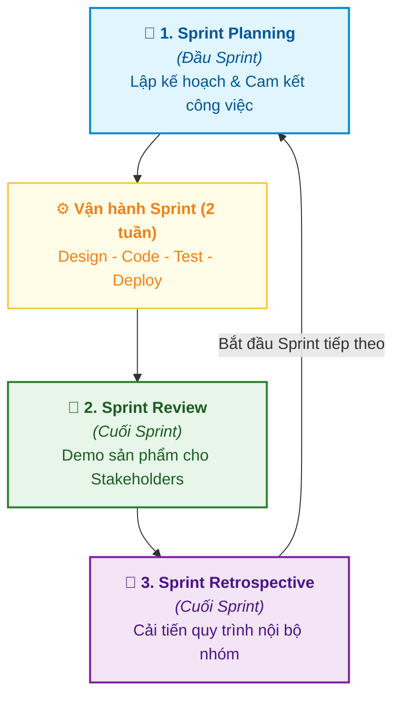
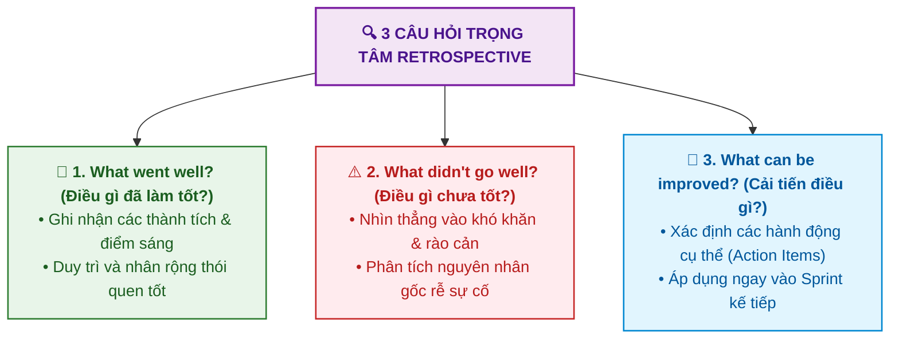

# Cách Vận hành một Sprint (How to Sprint)

Tài liệu này tóm tắt nội dung bài học **How to Sprint** trong **Module 5: Agile & Scrum** thuộc khóa học **Cloud Native, Microservices, Containers, DevOps, and Agile** do IBM cung cấp.

---

## 1. Ẩn dụ về Sprint: Chuyến Leo núi (The Mountain Hiking Analogy)

Một **Sprint** tương tự như hành trình leo một ngọn núi:

---

## 2. Ba Nghi thức Scrum Trọng tâm trong Sprint (The 3 Key Ceremonies)

---

## 3. Chi tiết Từng Nghi thức Scrum

### 3.1. Họp Lập kế hoạch Sprint (Sprint Planning)
* **Thời điểm**: Diễn ra vào ngày đầu tiên của Sprint.
* **Mục đích**: Toàn đội thống nhất mục tiêu và lập kế hoạch chi tiết cho các công việc sẽ hoàn thành.
* **Phân công trách nhiệm**:
  * **Product Owner**: Xác định mục tiêu kinh doanh (*Sprint Goal*) và thứ tự ưu tiên các câu chuyện.
  * **Scrum Master**: Điều phối buổi họp, đảm bảo tiến trình suôn sẻ và đúng thời lượng.
  * **Development Team**: Đánh giá năng lực thực tế (*Capacity Planning*), phân rã công việc (*Task Breakdown*) và tự cam kết khối lượng khả thi.
* **Các hoạt động chính**:
  1. Thiết lập **Sprint Goal** rõ ràng.
  2. Chọn các User Stories phù hợp từ Product Backlog.
  3. Phân rã story thành các nhiệm vụ kỹ thuật cụ thể.
  4. Thống nhất tiêu chuẩn hoàn thành (**Definition of Done - DoD**).
* **Đầu ra**: **Sprint Backlog** (danh sách công việc ưu tiên của Sprint).

---

### 3.2. Họp Đánh giá Sprint (Sprint Review)
* **Thời điểm**: Diễn ra vào cuối Sprint.
* **Mục đích**: Trình diễn (*Demo*) các tính năng đã hoàn thành và thu thập phản hồi từ các bên liên quan (*Stakeholders*).
* **Quy trình thực hiện**:
  1. **Demo tính năng**: Đội ngũ phát triển trực tiếp biểu diễn sản phẩm chạy thực tế cho Stakeholders xem.
  2. **Thảo luận kết quả**: Nêu rõ những gì đã hoàn thành, thách thức gặp phải và giải pháp xử lý.
  3. **Thu nhận phản hồi**: Stakeholders đưa ra nhận xét, đóng góp ý kiến để hoàn thiện sản phẩm.
  4. **Cập nhật Backlog**: Đưa các phản hồi mới vào Product Backlog để tái xếp hạng cho các Sprint tới.

---

### 3.3. Họp Cải tiến Quy trình (Sprint Retrospective)
* **Thời điểm**: Diễn ra sau Sprint Review, là sự kiện khép lại Sprint.
* **Mục đích**: Toàn đội nhìn nhận lại quy trình làm việc, tương tác và công cụ để tìm ra các hành động cải tiến cụ thể (*Continuous Improvement*).
* **3 Câu hỏi trọng tâm trong Retrospective**:

---

## 4. Tóm lược So sánh 3 Nghi thức Scrum

| Nghi thức | Thời điểm | Trọng tâm chính | Đầu ra quan trọng |
| :--- | :--- | :--- | :--- |
| **Sprint Planning** | Đầu Sprint | **Lập kế hoạch & Cam kết**: Làm cái gì và làm như thế nào? | **Sprint Backlog & Sprint Goal** |
| **Sprint Review** | Cuối Sprint | **Sản phẩm & Khách hàng**: Demo tính năng và lấy ý kiến Stakeholders. | **Phản hồi & Cập nhật Product Backlog** |
| **Sprint Retrospective** | Cuối Sprint | **Con người & Quy trình**: Đội ngũ tự nhìn nhận để làm việc tốt hơn. | **Danh sách Hành động Cải tiến (Action Items)** |
