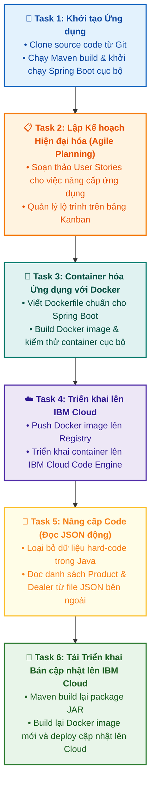

# Tổng quan Đồ án Tốt nghiệp (Final Project Overview)

Tài liệu này tóm tắt bài giới thiệu **Final Project Overview** trong **Module 6: Guided Project, Final Assessment, and Course Wrap-Up** thuộc khóa học **Cloud Native, Microservices, Containers, DevOps, and Agile** do IBM cung cấp.

> **Tác giả**: Muhammad Yahya  
> **Dự án**: Hiện đại hóa ứng dụng Đánh giá Đại lý (**Dealer Evaluation Application Modernization**)  
> **Thời lượng ước tính**: ~60 phút (gồm 6 nhiệm vụ chính)

---

## 1. Giới thiệu Dự án (About the Project)

Đồ án cuối khóa yêu cầu bạn tổng hợp toàn bộ kiến thức và kỹ năng đã học trong 5 module trước (Cloud Native, Microservices, Containers/Docker, CI/CD và Agile/Scrum) để giải quyết một bài toán thực tế:

* **Ứng dụng mẫu**: **Dealer Evaluation** — Một ứng dụng web Java xây dựng trên nền tảng **Spring Boot**, sử dụng **Maven** để quản lý thư viện và đóng gói build.
* **Chức năng**: Cho phép người dùng kiểm tra và so sánh giá cả sản phẩm giữa các đại lý khác nhau.
* **Mục tiêu**: Hiện đại hóa (*modernize*) ứng dụng từ dạng nguyên khối/chạy cục bộ thành ứng dụng **Cloud Native container hóa** triển khai trên **IBM Cloud** và nâng cấp mã nguồn linh hoạt.

---

## 2. Mục tiêu Học tập (Learning Objectives)

Sau khi hoàn thành đồ án này, bạn sẽ có khả năng:
1. Clone mã nguồn ứng dụng từ GitHub về môi trường phát triển.
2. Thực thi lệnh build với **Maven** và chạy ứng dụng web **Spring Boot**.
3. Viết các **User Stories** chuẩn để lập kế hoạch hiện đại hóa ứng dụng theo phương pháp Agile.
4. Container hóa ứng dụng Java bằng **Docker** (tận dụng tính linh động, tính nhất quán, khả năng mở rộng quy mô và triển khai nhanh chóng).
5. Triển khai Docker Container lên nền tảng **IBM Cloud**.
6. Tái cấu trúc mã nguồn (*Enhance code*): Loại bỏ dữ liệu cứng (*hard-coded inline data*), chuyển sang đọc dữ liệu động từ file **JSON**.
7. Tái đóng gói và triển khai bản cập nhật mới lên **IBM Cloud**.

---

## 3. Lộ trình 6 Nhiệm vụ Chi tiết (The 6 Project Tasks)

---

## 4. Tóm lược Công nghệ & Kỹ năng Sử dụng

| Lĩnh vực | Công nghệ / Kỹ năng áp dụng | Mục đích trong dự án |
| :--- | :--- | :--- |
| **Lập trình Backend** | Java, Spring Boot, Maven | Chạy và nâng cấp ứng dụng web Dealer Evaluation. |
| **Quản lý Kế hoạch** | Agile, User Stories, Kanban | Lập kế hoạch hiện đại hóa theo từng User Story rõ ràng. |
| **Đóng gói Ứng dụng** | Docker, Dockerfile, Containerization | Đóng gói toàn bộ runtime Java và ứng dụng vào 1 Container chuẩn. |
| **Điện toán Đám mây** | IBM Cloud (Container Registry, Code Engine) | Triển khai và quản trị ứng dụng chạy thực tế trên Cloud. |
| **Tái cấu trúc Code** | JSON Data Parsing | Chuyển đổi dữ liệu tĩnh sang nạp động từ file JSON. |
