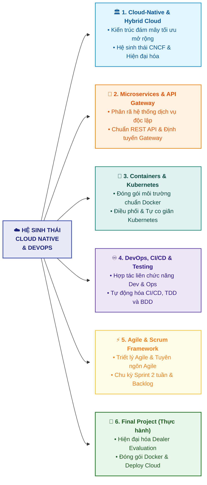

# Tổng kết Toàn bộ Khóa học (Course Wrap-Up)

Tài liệu này tóm tắt bài học **Course Wrap-Up** trong **Module 6: Guided Project, Final Assessment, and Course Wrap-Up** thuộc khóa học **Cloud Native, Microservices, Containers, DevOps, and Agile** do IBM cung cấp.

---

## 1. Bản đồ Tổng hợp Kiến thức Toàn bộ Khóa học

Khóa học đã trang bị cho bạn hệ thống kiến thức toàn diện từ kiến trúc phần mềm, đóng gói triển khai đến quy trình vận hành và tư duy quản lý dự án hiện đại:

---

## 2. Bảng Tổng kết Các Trụ cột Công nghệ Trọng tâm

| Trụ cột (Pillar) | Khái niệm & Công nghệ cốt lõi | Vai trò & Giá trị mang lại |
| :--- | :--- | :--- |
| **Cloud Native & Hybrid Cloud** | Cloud Native, CNCF, Hybrid Cloud, Application Modernization | Xây dựng các ứng dụng có khả năng co giãn linh hoạt (*elasticity*), tận dụng hạ tầng đa đám mây và hiện đại hóa hệ thống cũ (*legacy systems*). |
| **Microservices & APIs** | Microservices Architecture, RESTful API, API Gateway | Chia nhỏ ứng dụng thành các dịch vụ độc lập; sử dụng API Gateway để bảo mật, quản lý lưu lượng và định tuyến các yêu cầu. |
| **Containers & Orchestration** | Docker, Containers, Kubernetes (K8s) | Đóng gói ứng dụng nhẹ (*lightweight*), chạy nhất quán trên mọi môi trường và tự động hóa điều phối (*load balancing, self-healing, auto-scaling*). |
| **DevOps & Tự động hóa** | CI/CD Pipelines, TDD, BDD | Loại bỏ rào cản giữa Phát triển và Vận hành; tự động hóa tích hợp/kiểm thử/triển khai giúp phát hành phần mềm nhanh chóng và an toàn. |
| **Agile & Scrum** | Agile Manifesto, Scrum Framework, Sprints, User Stories, INVEST | Phương pháp luận quản lý dự án lặp đi lặp lại (*iterative*), tập trung vào con người, thích ứng thay đổi và tối đa hóa giá trị cho khách hàng. |

---

## 3. Lời khuyên & Định hướng Phát triển Tiếp theo

1. **Rà soát kiến thức cốt lõi**:
   * Xem lại tài liệu tóm tắt (**Summary**) và bảng thuật ngữ (**Glossary**) của cả 6 Modules để củng cố các định nghĩa và khái niệm nền tảng.
2. **Thực hành trên Dự án Thực tế**:
   * Tự xây dựng các dự án cá nhân áp dụng đầy đủ chu trình: Viết User Story $\rightarrow$ Code Microservices $\rightarrow$ Viết Unit/BDD Test $\rightarrow$ Đóng gói Docker $\rightarrow$ Thiết lập CI/CD Pipeline $\rightarrow$ Deploy lên Cloud.
3. **Mở rộng lộ trình học tập chuyên sâu**:
   * Tiếp tục tham gia các khóa học chuyên sâu tiếp theo của IBM trong chương trình chứng chỉ kiến trúc sư hệ thống và kỹ sư đám mây (*Cloud Solutions Architect / DevOps Engineer Professional Certificates*).
