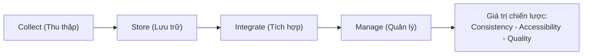
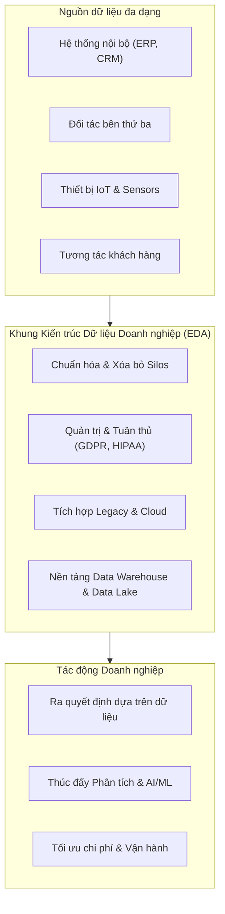
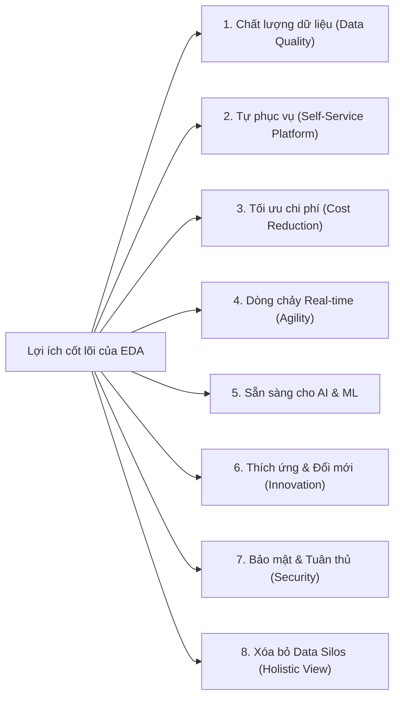

# Giới thiệu Kiến trúc Dữ liệu Doanh nghiệp (Enterprise Data Architecture - EDA)

Tài liệu tổng hợp chi tiết và toàn diện nội dung bài học **Introduction to Enterprise Data Architecture**.

---

## 1. Khái niệm EDA là gì?

**Enterprise Data Architecture (EDA)** là một khung làm việc nền tảng (*foundational framework*) quy định toàn bộ cách thức tổ chức: **Thu thập (Collect) $\rightarrow$ Lưu trữ (Store) $\rightarrow$ Tích hợp (Integrate) $\rightarrow$ Quản lý (Manage)** dữ liệu trong toàn bộ hệ thống.

*   **Bản thiết kế chiến lược**: EDA cung cấp một lộ trình rõ ràng để quản lý dữ liệu xuyên suốt các ứng dụng, nền tảng và môi trường khác nhau.
*   **3 Tiêu chuẩn cốt lõi**:
    *   **Consistency (Tính nhất quán)**: Dữ liệu đồng nhất trên mọi hệ thống, không bị xung đột định dạng hay giá trị.
    *   **Accessibility (Tính sẵn sàng)**: Người dùng và hệ thống được phân quyền có thể truy cập dữ liệu dễ dàng, đúng lúc.
    *   **Quality (Chất lượng dữ liệu)**: Dữ liệu chính xác, đầy đủ, sạch và đáng tin cậy.

---

## 2. Tầm quan trọng của EDA đối với Doanh nghiệp

Trong kỷ nguyên số, dữ liệu đến từ vô số nguồn đa dạng (hệ thống nội bộ, đối tác thứ ba, thiết bị IoT, tương tác khách hàng). Không có EDA, doanh nghiệp sẽ gặp phải tình trạng hỗn loạn dữ liệu.

### Chi tiết các vai trò trọng yếu của EDA:
1.  **Chuẩn hóa dữ liệu & Xóa bỏ Data Silos**:
    *   Ngăn chặn tình trạng các phòng ban hoạt động độc lập tạo ra "ốc đảo dữ liệu" (*data silos*), gây trùng lặp và mâu thuẫn số liệu.
    *   Thiết lập quy chuẩn dữ liệu chung cho toàn bộ tổ chức.
2.  **Quản trị và Tuân thủ Pháp lý (Governance & Compliance)**:
    *   Hỗ trợ tuân thủ các luật bảo vệ quyền riêng tư khắt khe (**GDPR, HIPAA, CCPA**).
    *   Xác định rõ ràng: *Dữ liệu nằm ở đâu? Luân chuyển như thế nào? Ai có quyền truy cập?* nhằm hạn chế tối đa rủi ro pháp lý và phạt tài chính.
3.  **Tích hợp hệ thống liền mạch (Seamless Integration)**:
    *   Kết nối trơn tru giữa các hệ thống cũ (*legacy systems*) và nền tảng điện toán đám mây (*cloud platforms*).
    *   Đảm bảo luồng chia sẻ thông tin liên tục và thông suốt giữa các ứng dụng nghiệp vụ.
4.  **Làm nền móng cho Ra quyết định Chiến lược & AI/ML**:
    *   Cung cấp cấu trúc nền tảng để xây dựng **Data Warehouse**, **Data Lake** và các công cụ BI hiện đại.
    *   Cung cấp dữ liệu chuẩn hóa, chất lượng cao để huấn luyện các mô hình Trí tuệ nhân tạo (AI) và Học máy (Machine Learning).
5.  **Tối ưu hóa hiệu suất vận hành (Operational Efficiency)**:
    *   Loại bỏ thời gian lãng phí vào việc dọn dẹp dữ liệu thủ công (*data wrangling*), xử lý lỗi và nghẽn hệ thống.
    *   Giúp đội ngũ tập trung vào việc tạo ra giá trị kinh doanh từ dữ liệu thay vì sửa lỗi kỹ thuật.
6.  **Khả năng mở rộng bền vững (Scalability & Agility)**:
    *   Đáp ứng linh hoạt khi quy mô dữ liệu và độ phức tạp tăng nhanh mà không làm suy giảm hiệu năng.
    *   Dễ dàng tiếp nhận và tích hợp công nghệ mới vào hệ sinh thái có sẵn.

---

## 3. Lợi ích cốt lõi của một EDA chuẩn mực

Một kiến trúc dữ liệu doanh nghiệp được thiết kế tốt mang lại 8 lợi ích chiến lược:

| STT | Lợi ích | Mô tả chi tiết |
| :--- | :--- | :--- |
| **1** | **Chất lượng dữ liệu (Data Quality)** | Thực thi chuẩn hóa từ khâu thu thập, lưu trữ đến kiểm tra hợp lệ; giảm thiểu sai sót và trùng lặp. |
| **2** | **Khả năng tiếp cận & Tự phục vụ (Self-Service)** | Thiết lập kho dữ liệu tập trung và công cụ tự phục vụ, giúp các phòng ban chủ động khai thác dữ liệu. |
| **3** | **Tối ưu hóa chi phí (Cost Reduction)** | Tinh gọn quy trình lưu trữ, giảm lãng phí tài nguyên và ngăn ngừa thiệt hại tài chính do quyết định sai lầm. |
| **4** | **Dòng chảy thời gian thực (Real-time Flow)** | Tăng tốc độ truy xuất và xử lý thông tin, giúp doanh nghiệp thích ứng ngay lập tức với biến động thị trường. |
| **5** | **Bệ phóng cho AI & ML (AI/ML Readiness)** | Dữ liệu sạch, có cấu trúc là điều kiện tiên quyết để triển khai phân tích dự đoán (*predictive analytics*) và phân tích đề xuất (*prescriptive analytics*). |
| **6** | **Khả năng thích ứng & Đổi mới (Agility & Innovation)** | Cấu trúc linh hoạt giúp triển khai nhanh các mô hình kinh doanh và công nghệ mới mà không bị trói buộc bởi hệ thống cũ. |
| **7** | **Bảo mật & Giảm thiểu rủi ro (Security & Compliance)** | Kiểm soát truy cập chặt chẽ, mã hóa đa lớp và giám sát liên tục để bảo vệ dữ liệu nhạy cảm. |
| **8** | **Xóa bỏ phân mảnh (Eliminate Data Silos)** | Tạo ra góc nhìn toàn diện (*holistic view*) về toàn bộ hoạt động của tổ chức, nâng cao khả năng cộng tác. |

---

## 4. Kết luận
**Enterprise Data Architecture (EDA)** không chỉ đơn thuần là một khái niệm kỹ thuật IT, mà là một **chiến lược kinh doanh sống còn**. EDA chuyển hóa dữ liệu từ các tệp thông tin rời rạc thành **tài sản chiến lược (strategic asset)**, tạo lợi thế cạnh tranh và thúc đẩy tăng trưởng bền vững cho tổ chức.
