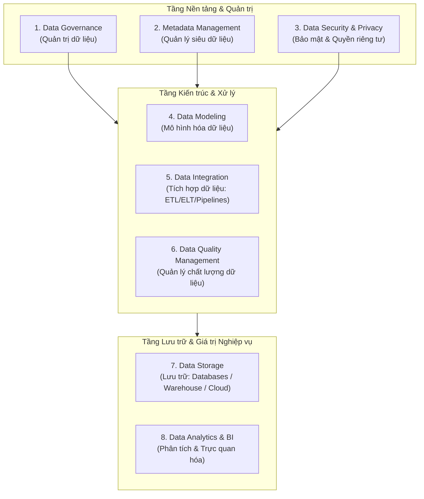
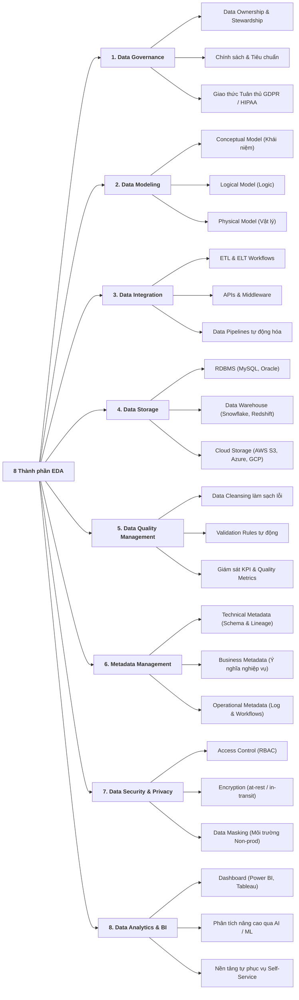

# Các Thành phần Cốt lõi của Kiến trúc Dữ liệu Doanh nghiệp (Core Components of EDA)

Tài liệu tổng hợp chi tiết nội dung bài học **Core Components of Enterprise Data Architecture**.

---

## 1. Tổng quan về Hệ sinh thái EDA

**Enterprise Data Architecture (EDA)** cung cấp phương pháp tiếp cận có cấu trúc để tổ chức, tích hợp và quản trị các tài sản dữ liệu trong toàn doanh nghiệp. Một khung kiến trúc EDA toàn diện được xây dựng từ **8 thành phần cốt lõi** liên kết chặt chẽ với nhau:

---

## 2. Chi tiết 8 Thành phần Cốt lõi & Các Yếu tố Trọng yếu (Key Elements)

### 1. Data Governance (Quản trị Dữ liệu) - *Nền móng của EDA*
*   **Mục đích**: Thiết lập quy trình, chính sách và tiêu chuẩn quản lý dữ liệu xuyên suốt tổ chức; đảm bảo dữ liệu chính xác, an toàn và tuân thủ quy định.
*   **Các yếu tố chính (Key Elements)**:
    *   **Data Ownership & Stewardship**: Phân công trách nhiệm rõ ràng cho từng cá nhân/bộ phận về chất lượng, quyền sử dụng và bảo trì dữ liệu.
    *   **Policies & Standards**: Bộ hướng dẫn chuẩn về quyền truy cập, thời gian lưu giữ (*retention*) và quản lý vòng đời dữ liệu (*lifecycle management*).
    *   **Compliance & Security Protocols**: Giao thức tuân thủ các luật bảo vệ quyền riêng tư nghiêm ngặt (**GDPR, HIPAA, CCPA**).

---

### 2. Data Modeling (Mô hình hóa Dữ liệu)
*   **Mục đích**: Trực quan hóa cấu trúc dữ liệu, mối quan hệ thực thể và luồng luân chuyển thông tin trong tổ chức.
*   **Các yếu tố chính (Key Elements)**:
    *   **Conceptual Model (Mô hình Khái niệm)**: Bức tranh tổng quan mức cao về các thực thể nghiệp vụ (*business entities*) và mối liên kết giữa chúng.
    *   **Logical Model (Mô hình Logic)**: Mô tả chi tiết hơn về các phần tử dữ liệu, trường thông tin, thuộc tính (*attributes*) và quy tắc ràng buộc logic.
    *   **Physical Model (Mô hình Vật lý)**: Thiết kế kỹ thuật chi tiết để triển khai thực tế trên hệ quản trị CSDL hoặc Data Warehouse (kiểu dữ liệu, khóa chính/ngoại, chỉ mục, phân vùng).

---

### 3. Data Integration (Tích hợp Dữ liệu)
*   **Mục đích**: Kết hợp dữ liệu từ nhiều nguồn phân tán (*On-premises, Cloud, Third-party vendors*) thành một góc nhìn thống nhất (*unified view*).
*   **Các yếu tố chính (Key Elements)**:
    *   **ETL & ELT Workflows**: Quy trình trích xuất, chuyển đổi và nạp dữ liệu được thiết kế để làm sạch, chuẩn hóa và hợp nhất dữ liệu.
    *   **APIs & Middleware**: Công cụ kết nối và trung gian truyền thông điệp, hỗ trợ giao tiếp giữa các hệ thống không đồng nhất.
    *   **Data Pipelines**: Các luồng công việc tự động hóa (*automated workflows*) hỗ trợ việc di chuyển và xử lý luồng dữ liệu liên tục.

---

### 4. Data Storage (Lưu trữ Dữ liệu)
*   **Mục đích**: Cung cấp nền tảng và hệ thống lưu trữ dữ liệu an toàn, bền bỉ và dễ dàng truy xuất khi cần.
*   **Các yếu tố chính (Key Elements)**:
    *   **Databases (Cơ sở dữ liệu)**: Lưu trữ có cấu trúc, tối ưu cho xử lý giao dịch trực tuyến (OLTP). *Ví dụ: MySQL, PostgreSQL, Oracle.*
    *   **Data Warehouses (Kho dữ liệu)**: Kho lưu trữ tập trung, tối ưu hóa cho truy vấn phân tích tổng hợp (OLAP) và báo cáo. *Ví dụ: Snowflake, Amazon Redshift, Google BigQuery.*
    *   **Cloud Storage**: Lưu trữ đối tượng linh hoạt, khả năng mở rộng vô hạn trên nền tảng đám mây. *Ví dụ: AWS S3, Azure Blob Storage, Google Cloud Storage.*

---

### 5. Data Quality Management (Quản lý Chất lượng Dữ liệu)
*   **Mục đích**: Duy trì các tiêu chuẩn nghiêm ngặt về độ chính xác (*accuracy*), đầy đủ (*completeness*), nhất quán (*consistency*) và kịp thời (*timeliness*).
*   **Các yếu tố chính (Key Elements)**:
    *   **Data Cleansing**: Phát hiện, xử lý và hiệu chỉnh các bản ghi dữ liệu lỗi, trùng lặp hoặc sai lệch.
    *   **Validation Rules**: Bộ quy tắc kiểm tra tự động được tích hợp vào pipeline để đảm bảo tính toàn vẹn dữ liệu.
    *   **Monitoring & Reporting**: Theo dõi liên tục các chỉ số chất lượng dữ liệu và KPI vận hành theo thời gian thực.

---

### 6. Metadata Management (Quản lý Siêu dữ liệu)
*   **Mục đích**: Thu thập, tổ chức và duy trì thông tin ngữ cảnh về tài sản dữ liệu (nguồn gốc, định dạng, quan hệ, lịch sử sử dụng), giúp dữ liệu dễ tìm kiếm và thấu hiểu.
*   **Các yếu tố chính (Key Elements)**:
    *   **Technical Metadata**: Chi tiết kỹ thuật về cấu trúc bảng, kiểu dữ liệu, schema và sơ đồ nguồn gốc dữ liệu (*Data Lineage*).
    *   **Business Metadata**: Định nghĩa nghiệp vụ, từ điển thuật ngữ (*Business Glossary*) và vai trò của dữ liệu đối với quy trình kinh doanh.
    *   **Operational Metadata**: Dữ liệu vận hành về lịch sử chạy job, tần suất truy cập, thời gian xử lý và hiệu năng hệ thống.

---

### 7. Data Security & Privacy (Bảo mật & Quyền riêng tư Dữ liệu)
*   **Mục đích**: Bảo vệ dữ liệu khỏi truy cập trái phép, rò rỉ, đánh cắp hoặc sử dụng sai mục đích; đảm bảo tuân thủ quyền riêng tư.
*   **Các yếu tố chính (Key Elements)**:
    *   **Access Controls**: Kiểm soát truy cập dựa trên vai trò (**RBAC - Role-Based Access Control**), chỉ cấp quyền tối thiểu cần thiết (*Principle of Least Privilege*).
    *   **Encryption**: Kỹ thuật mã hóa dữ liệu nhạy cảm ở cả hai trạng thái: khi lưu trữ (*at-rest*) và khi truyền tải (*in-transit*).
    *   **Data Masking**: Che giấu/làm mờ dữ liệu định danh cá nhân (PII) khi trích xuất sang môi trường kiểm thử hoặc phi sản xuất (*non-production*).

---

### 8. Data Analytics & Business Intelligence - BI (Phân tích Dữ liệu & BI)
*   **Mục đích**: Chuyển đổi dữ liệu thô đã được xử lý thành các hiểu biết sâu sắc có thể hành động (**Actionable Insights**).
*   **Các yếu tố chính (Key Elements)**:
    *   **Reporting & Dashboards Tools**: Công cụ trực quan hóa dữ liệu qua biểu đồ tương tác và báo cáo quản trị. *Ví dụ: Power BI, Tableau.*
    *   **Advanced Analytics (Phân tích nâng cao)**: Ứng dụng AI/Machine Learning để thực hiện phân tích dự đoán (*predictive analytics*) và phân tích đề xuất (*prescriptive analytics*).
    *   **Self-Service Platforms**: Nền tảng tự phục vụ trao quyền cho người dùng nghiệp vụ tự tạo báo cáo và phân tích độc lập mà không cần chờ đợi đội ngũ IT.

---

## 3. Bảng Tổng hợp 8 Thành phần Cốt lõi EDA

| STT | Thành phần (Core Component) | Trọng tâm chính | Các yếu tố / Công nghệ đại diện |
| :---: | :--- | :--- | :--- |
| **1** | **Data Governance** | Quyền hạn, chính sách, tiêu chuẩn & tuân thủ | Data Ownership, Policies, GDPR / HIPAA / CCPA |
| **2** | **Data Modeling** | Thiết kế cấu trúc & quan hệ dữ liệu | Conceptual $\rightarrow$ Logical $\rightarrow$ Physical Models |
| **3** | **Data Integration** | Kết hợp dữ liệu đa nguồn thành góc nhìn hợp nhất | ETL, ELT, APIs, Middleware, Data Pipelines |
| **4** | **Data Storage** | Lưu trữ dữ liệu an toàn & tối ưu hiệu năng | RDBMS (MySQL), Data Warehouse (Snowflake), Cloud Object Storage |
| **5** | **Data Quality Management** | Đảm bảo tính chính xác, đầy đủ & nhất quán | Data Cleansing, Automated Validation Rules, Quality KPIs |
| **6** | **Metadata Management** | Cung cấp ngữ cảnh & khả năng truy vết dữ liệu | Technical (Lineage), Business (Glossary), Operational Metadata |
| **7** | **Data Security & Privacy** | Bảo vệ dữ liệu & kiểm soát quyền truy cập | RBAC, Encryption (at-rest/in-transit), Data Masking |
| **8** | **Data Analytics & BI** | Trực quan hóa & tạo insight ra quyết định | Tableau, Power BI, AI/ML Advanced Analytics, Self-service |
