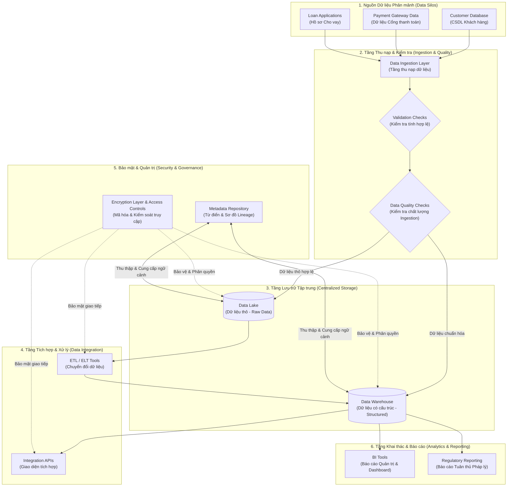

# Thực hành: Lập Sơ đồ Luồng Hợp nhất Hạ tầng Dữ liệu (Consolidation of Data Infrastructure)

Tài liệu hướng dẫn và tổng hợp chi tiết bài thực hành **Lab: Prepare a Flowchart for the Consolidation of Data Infrastructure**.

---

## 1. Tổng quan Tình huống (Scenario Overview - FinEdge Bank)

*   **Bối cảnh**: **FinEdge** là một ngân hàng công nghệ tài chính (*FinTech Bank*) tăng trưởng nhanh, cung cấp các dịch vụ: ngân hàng số (*Digital Banking*), cho vay (*Lending*) và tư vấn tài chính (*Financial Advisory*).
*   **Vấn đề / Thách thức**:
    *   Hạ tầng dữ liệu bị phân mảnh thành nhiều "ốc đảo" (*Data Silos*).
    *   Báo cáo thiếu nhất quán, dữ liệu trùng lặp và chi phí vận hành cao.
    *   Gặp khó khăn trong việc đáp ứng các quy định tuân thủ tài chính nghiêm ngặt.
*   **Mục tiêu giải pháp**: Hợp nhất toàn bộ hạ tầng dữ liệu phân tán lên nền tảng đám mây tập trung (*Centralized Cloud-based Platform*), chuẩn hóa công cụ BI và thiết lập khung quản trị dữ liệu chặt chẽ.

---

## 2. Sơ đồ Luồng Kiến trúc Tổng thể (Consolidation Architecture Flowchart)

---

## 3. Quy trình 9 Bước Thiết kế Sơ đồ Luồng Hợp nhất

### Bước 1: Nhận diện và Phân loại các Data Silos (Identify Data Silos)
*   **Mục tiêu**: Xác định các nguồn dữ liệu hiện có, định dạng và vị trí lưu trữ.
*   **Thực hiện**:
    *   Gom nhóm các hệ thống nguồn: *Customer Database*, *Payment Gateway Data*, *Loan Applications*.
    *   Định danh rõ đây là đầu vào (*Inputs*) cho toàn bộ luồng hợp nhất.

### Bước 2: Thiết lập Cơ chế Thu nạp Dữ liệu (Data Ingestion Mechanisms)
*   **Mục tiêu**: Định nghĩa cách thức trích xuất và nạp dữ liệu từ các hệ thống nguồn vào hạ tầng mới.
*   **Thực hiện**:
    *   Tạo thành phần **Data Ingestion Layer** làm cổng tiếp nhận.
    *   Gắn khối điều kiện **Validation Checks** để kiểm tra ngay tính đầy đủ, chính xác trước khi đưa vào kho lưu trữ.

### Bước 3: Thiết kế Kiến trúc Lưu trữ Tập trung (Data Storage Architecture)
*   **Mục tiêu**: Phân tách rõ ràng giữa lưu trữ dữ liệu thô và dữ liệu đã xử lý nhằm tối ưu chi phí và hiệu năng.
*   **Thực hiện**:
    *   **Data Lake (Raw Data)**: Lưu trữ dữ liệu gốc chưa qua xử lý với chi phí thấp và khả năng mở rộng cao.
    *   **Data Warehouse (Structured Data)**: Lưu trữ dữ liệu đã làm sạch, chuẩn hóa theo mô hình quan hệ để phục vụ truy vấn phân tích.

### Bước 4: Tích hợp & Chuyển đổi Dữ liệu (Data Integration)
*   **Mục tiêu**: Đảm bảo khả năng tương tác và luồng dữ liệu liền mạch giữa các hệ thống.
*   **Thực hiện**:
    *   Áp dụng các công cụ **ETL / ELT** để xử lý làm sạch, biến đổi từ Data Lake sang Data Warehouse.
    *   Thiết lập **Integration APIs** để các hệ thống nghiệp vụ và ứng dụng hạ nguồn dễ dàng truy xuất.

### Bước 5: Đảm bảo An toàn & Quyền riêng tư (Data Security & Privacy)
*   **Mục tiêu**: Bảo vệ dữ liệu tài chính nhạy cảm xuyên suốt mọi điểm chạm trong quy trình.
*   **Thực hiện**:
    *   Triển khai **Encryption Layer** (mã hóa đa lớp khi lưu trữ *at-rest* và truyền tải *in-transit*).
    *   Thiết lập **Access Controls (RBAC)** nhằm giới hạn quyền truy cập theo vai trò công việc.

### Bước 6: Xây dựng Hệ thống Quản lý Siêu dữ liệu (Metadata Management)
*   **Mục tiêu**: Định danh, lưu vết và tăng khả năng khám phá dữ liệu (*Data Discoverability*).
*   **Thực hiện**:
    *   Xây dựng **Metadata Repository** tập trung để quản lý: định nghĩa dữ liệu, cấu trúc schema, từ điển nghiệp vụ và nguồn gốc dữ liệu (*Data Lineage*).

### Bước 7: Kiểm soát Chất lượng Dữ liệu Đa tầng (Data Quality Management)
*   **Mục tiêu**: Đảm bảo dữ liệu đạt tiêu chuẩn toàn vẹn trước và sau khi lưu trữ.
*   **Thực hiện**:
    *   Đặt các trạm kiểm định **Data Quality Checks** ở cả 2 giai đoạn: ngay khi thu nạp (*Ingestion*) và định kỳ trong kho lưu trữ (*Post-storage*).

### Bước 8: Chuẩn bị cho Phân tích & Báo cáo (Reporting & Analytics)
*   **Mục tiêu**: Chuyển hóa dữ liệu hợp nhất thành giá trị ra quyết định và đáp ứng báo cáo bắt buộc.
*   **Thực hiện**:
    *   Kết nối **BI Tools** (Dashboard, Self-service Analytics) phục vụ ban lãnh đạo và các bộ phận nghiệp vụ.
    *   Xây dựng hệ thống **Regulatory Reporting** tự động hóa để lập báo cáo kiểm toán và tuân thủ pháp lý tài chính.

### Bước 9: Hoàn thiện, Đánh giá & Chuẩn hóa (Finalize & Validate)
*   **Mục tiêu**: Kiểm tra tính hoàn thiện và đảm bảo sự đồng thuận giữa các bên liên quan.
*   **Thực hiện**:
    *   Thực hiện review cùng Stakeholders, thu thập phản hồi.
    *   Bổ sung chú giải ký hiệu (*Legend*), ghi chú rõ ràng các luồng truyền thông điệp.

---

## 4. Bảng Tra cứu Các Thành phần Sơ đồ

| Thành phần | Loại hình | Vai trò trong hệ thống FinEdge |
| :--- | :--- | :--- |
| **Data Sources** | Nguồn dữ liệu | Customer DB, Payment Gateway, Loan Apps |
| **Ingestion Layer** | Xử lý | Thu thập và nạp dữ liệu từ các Silos |
| **Validation / Quality** | Kiểm soát | Kiểm tra tính hợp lệ, toàn vẹn dữ liệu đa tầng |
| **Data Lake** | Lưu trữ | Chứa dữ liệu thô phục vụ lưu trữ dài hạn & AI |
| **Data Warehouse** | Lưu trữ | Chứa dữ liệu có cấu trúc phục vụ báo cáo nhanh |
| **ETL / ELT & APIs** | Tích hợp | Biến đổi dữ liệu và cung cấp kết nối chuẩn hóa |
| **Security (Encryption/RBAC)**| Bảo mật | Bảo vệ an toàn dữ liệu và phân quyền chặt chẽ |
| **Metadata Repository** | Quản trị | Lưu vết nguồn gốc (lineage) & định nghĩa nghiệp vụ |
| **BI & Regulatory Reporting** | Khai thác | Trực quan hóa số liệu và báo cáo tuân thủ ngân hàng |
