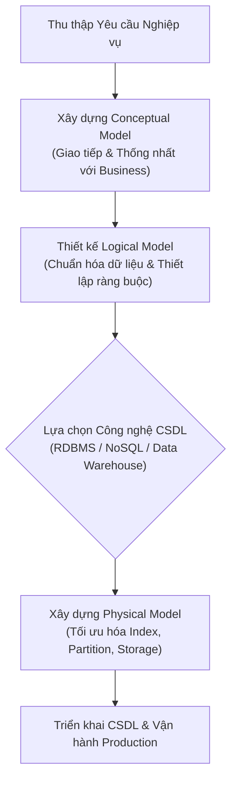

# Các Loại Mô hình Dữ liệu trong Doanh nghiệp (Types of Data Models)

Tài liệu tổng hợp chi tiết nội dung bài học **Types of Data Models** thuộc khóa học Enterprise Data Architecture and Operations.

---

## 1. Tổng quan về Mô hình hóa Dữ liệu trong EDA

Trong kiến trúc dữ liệu doanh nghiệp (**EDA**), **Data Modeling** đóng vai trò là bản thiết kế nền tảng (*blueprint*). Quá trình mô hình hóa dữ liệu được phân chia thành **3 cấp độ trừu tượng hóa (Levels of Abstraction)** tăng dần từ góc nhìn nghiệp vụ đến triển khai kỹ thuật:

---

## 2. Chi tiết 3 Cấp độ Mô hình Dữ liệu

### 1. Conceptual Data Model (Mô hình Dữ liệu Khái niệm)
*   **Mục đích**: Là biểu diễn trừu tượng nhất của dữ liệu, ghi nhận các **yêu cầu nghiệp vụ mức cao** (*high-level business requirements*) mà không đề cập đến chi tiết kỹ thuật.
*   **Đối tượng phục vụ**: Ban lãnh đạo, chuyên viên phân tích nghiệp vụ (BA) và các bên liên quan (*Business Stakeholders*).
*   **Đặc điểm chính**:
    *   Xác định các thực thể kinh doanh cốt lõi (*Core Business Entities*) như: `Customer`, `Product`, `Order`, `Payment`.
    *   Xác định mối quan hệ khái niệm giữa các thực thể (ví dụ: *Customer places Order*).
    *   Tập trung vào thuật ngữ và quy trình nghiệp vụ của tổ chức.
    *   **Hoàn toàn loại bỏ chi tiết kỹ thuật**: Không có kiểu dữ liệu, khóa chính/ngoại, schema hay công nghệ lưu trữ.
*   **Ý nghĩa trong EDA**: Đóng vai trò là chiếc cầu nối ngôn ngữ giữa đội ngũ kinh doanh (*Business*) và đội ngũ công nghệ (*Technology*), đảm bảo kiến trúc dữ liệu luôn bám sát mục tiêu chiến lược của tổ chức ngay từ giai đoạn khởi đầu dự án.

---

### 2. Logical Data Model (Mô hình Dữ liệu Logic)
*   **Mục đích**: Chuyển hóa mô hình khái niệm thành cấu trúc dữ liệu chi tiết, đóng vai trò trung gian giữa thiết kế nghiệp vụ và triển khai vật lý.
*   **Đối tượng phục vụ**: Data Architects, Data Modelers, Systems Analysts và Developers.
*   **Đặc điểm chính**:
    *   **Định nghĩa chi tiết phần tử dữ liệu**: Xác định đầy đủ thực thể (Entities), thuộc tính (Attributes), khóa chính (Primary Keys), khóa ngoại (Foreign Keys).
    *   **Chuẩn hóa dữ liệu (Data Normalization)**: Áp dụng các dạng chuẩn (1NF, 2NF, 3NF) để loại bỏ trùng lặp dữ liệu và nâng cao tính nhất quán.
    *   **Quy tắc & Ràng buộc nghiệp vụ (Business Rules)**: Thể hiện rõ các mối quan hệ định lượng (1-1, 1-N, N-N) và ràng buộc toàn vẹn.
    *   **Độc lập với công nghệ (Technology-Neutral)**: Không phụ thuộc vào bất kỳ hệ quản trị CSDL cụ thể nào (MySQL, Oracle hay PostgreSQL đều có thể dùng chung một Logical Model).
*   **Ý nghĩa trong EDA**: Đảm bảo tính toàn vẹn (*integrity*), tính nhất quán (*consistency*) và khả năng mở rộng (*scalability*); giúp đội ngũ phát triển phát hiện sớm các xung đột quan hệ dữ liệu trước khi tiến hành viết code hay tạo bảng.

---

### 3. Physical Data Model (Mô hình Dữ liệu Vật lý)
*   **Mục đích**: Là mô hình chi tiết và cụ thể nhất, mô tả chính xác cách thức dữ liệu được lưu trữ, truy xuất và quản lý trong một **hệ quản trị CSDL cụ thể** (*Database-specific*).
*   **Đối tượng phục vụ**: Database Administrators (DBAs), Data Engineers, Backend Engineers.
*   **Đặc điểm chính**:
    *   **Định nghĩa Schema chuẩn xác**: Xác định rõ tên bảng (*Tables*), tên cột (*Columns*), kiểu dữ liệu cụ thể (*Data Types* như `VARCHAR(255)`, `BIGINT`, `TIMESTAMP`), giá trị mặc định (`DEFAULT`), ràng buộc `NOT NULL`, `UNIQUE`.
    *   **Tối ưu hóa hiệu năng (Performance Optimization)**: Thiết kế chỉ mục (*Indexing Strategies* - B-Tree, Hash), phân vùng dữ liệu (*Partitioning/Sharding*), và phương thức truy xuất dữ liệu (*Access Methods*).
    *   **Bảo mật & Phân quyền**: Thiết lập quyền truy cập (*Permissions*), cấu hình mã hóa và ràng buộc bảo mật dữ liệu.
*   **Ý nghĩa trong EDA**: Chuyển đổi bản thiết kế logic thành CSDL vận hành thực tế; bảo đảm hệ thống vận hành đạt hiệu năng cao, chịu lỗi (*fault-tolerant*), sẵn sàng mở rộng (*scalable*) và tuân thủ các chính sách an toàn thông tin.

---

## 3. Bảng So sánh Tổng hợp 3 Loại Mô hình Dữ liệu

| Tiêu chí | Conceptual Model (Khái niệm) | Logical Model (Logic) | Physical Model (Vật lý) |
| :--- | :--- | :--- | :--- |
| **Mức độ trừu tượng** | Rất cao (High-level) | Trung bình (Detailed Structure) | Thấp / Cụ thể (Implementation) |
| **Đối tượng sử dụng** | Business Stakeholders, Executives | Architects, BAs, Developers | DBAs, Data Engineers, Developers |
| **Nội dung chính** | Thực thể kinh doanh & Mối liên kết | Thuộc tính, Khóa chính/ngoại, Ràng buộc, Chuẩn hóa | Tên bảng, Cột, Data Types, Index, Partition, Storage Engine |
| **Phụ thuộc Công nghệ** | Không (Technology-independent) | Không (Technology-neutral) | Có (Gắn liền với DBMS cụ thể: MySQL, Oracle, Postgres, Snowflake) |
| **Vai trò cốt lõi trong EDA**| Định hình phạm vi & mục tiêu kinh doanh | Cấu trúc hóa dữ liệu & phát hiện lỗi thiết kế | Hiện thực hóa CSDL & tối ưu hóa hiệu năng vận hành |

---

## 4. Quy trình Áp dụng trong Dự án Thực tế

