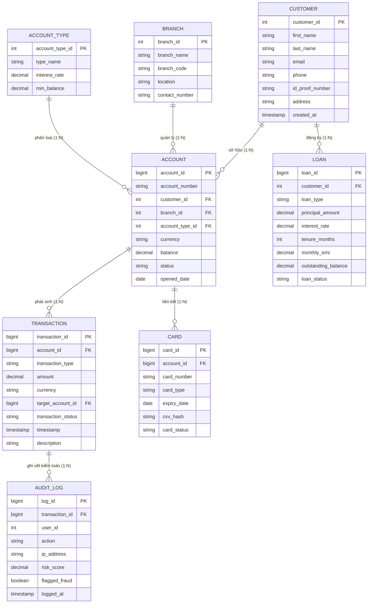

# Thực hành: Thiết kế Mô hình Dữ liệu cho Hệ thống Xử lý Giao dịch (Transaction Processing System)

Tài liệu hướng dẫn và giải pháp hoàn chỉnh cho bài thực hành **Lab: Prepare a Data Model for a Transaction Processing System** của một Ngân hàng Bán lẻ (Retail Bank).

---

## 1. Tổng quan Tình huống & Yêu cầu Nghiệp vụ (Scenario & Requirements)

### Bối cảnh
Một Ngân hàng Bán lẻ (*Retail Bank*) cần thiết kế mô hình dữ liệu chuẩn hóa cho **Hệ thống Xử lý Giao dịch (OLTP / Transaction Processing System)** để quản lý khối lượng lớn giao dịch tài chính hàng ngày với độ tin cậy tuyệt đối.

### Yêu cầu Nghiệp vụ & Kỹ thuật then chốt:
1.  **Nghiệp vụ cốt lõi**: Mở/đóng tài khoản, nạp tiền (*Deposit*), rút tiền (*Withdrawal*), chuyển khoản nội bộ/liên ngân hàng (*Transfer*), thanh toán khoản vay (*Loan Repayment*), và quản lý các loại tiền gửi (*Savings, Checking, Fixed Deposits - FD, Recurring Deposits - RD*).
2.  **Tuân thủ chuẩn ACID**: Đảm bảo mọi giao dịch tài chính diễn ra toàn vẹn (*Atomicity, Consistency, Isolation, Durability*).
3.  **Hỗ trợ đa tiền tệ (*Multicurrency*)**: Xử lý và quy đổi tỷ giá giữa các loại tiền tệ (VND, USD, EUR...).
4.  **Kiểm soát truy cập & Bảo mật (*Security & RBAC*)**: Phân quyền chặt chẽ giữa khách hàng, giao dịch viên và quản trị viên.
5.  **Truy vết kiểm toán & Phát hiện gian lận (*Audit Trail & Fraud Detection*)**: Lưu vết toàn bộ thay đổi với timestamp chính xác, hỗ trợ cảnh báo giao dịch bất thường theo thời gian thực.

---

## 2. Phân tích Thực thể & Thuộc tính (Entity-Attribute Specifications)

| Tên Thực thể (Entity) | Ý nghĩa nghiệp vụ | Thuộc tính chính (Attributes & Data Types) | Khóa (Keys) |
| :--- | :--- | :--- | :--- |
| **Customer** | Lưu trữ hồ sơ định danh khách hàng | `customer_id` (INT), `first_name` (VARCHAR), `last_name` (VARCHAR), `email` (VARCHAR), `phone` (VARCHAR), `id_proof_number` (VARCHAR), `address` (TEXT), `created_at` (TIMESTAMP) | **PK**: `customer_id` |
| **Branch** | Quản lý thông tin chi nhánh ngân hàng | `branch_id` (INT), `branch_name` (VARCHAR), `branch_code` (VARCHAR), `location` (VARCHAR), `contact_number` (VARCHAR) | **PK**: `branch_id` |
| **Account_Type** | Phân loại sản phẩm tài khoản | `account_type_id` (INT), `type_name` (VARCHAR - Savings/Checking/FD/RD), `interest_rate` (DECIMAL), `min_balance` (DECIMAL) | **PK**: `account_type_id` |
| **Account** | Thông tin tài khoản và số dư thực tế | `account_id` (BIGINT), `account_number` (VARCHAR), `customer_id` (INT), `branch_id` (INT), `account_type_id` (INT), `currency` (VARCHAR), `balance` (DECIMAL), `status` (VARCHAR - Active/Dormant/Closed), `opened_date` (DATE) | **PK**: `account_id` **FK**: `customer_id`, `branch_id`, `account_type_id` |
| **Transaction** | Nhật ký chi tiết từng giao dịch tài chính | `transaction_id` (BIGINT), `account_id` (BIGINT), `transaction_type` (VARCHAR - Deposit/Withdrawal/Transfer), `amount` (DECIMAL), `currency` (VARCHAR), `target_account_id` (BIGINT), `transaction_status` (VARCHAR - Success/Failed/Pending), `timestamp` (TIMESTAMP), `description` (TEXT) | **PK**: `transaction_id` **FK**: `account_id`, `target_account_id` |
| **Card** | Thẻ thanh toán liên kết với tài khoản | `card_id` (BIGINT), `account_id` (BIGINT), `card_number` (VARCHAR), `card_type` (VARCHAR - Debit/Credit), `expiry_date` (DATE), `cvv_hash` (VARCHAR), `card_status` (VARCHAR - Active/Blocked) | **PK**: `card_id` **FK**: `account_id` |
| **Loan** | Hồ sơ khoản vay và dư nợ của khách hàng | `loan_id` (BIGINT), `customer_id` (INT), `loan_type` (VARCHAR), `principal_amount` (DECIMAL), `interest_rate` (DECIMAL), `tenure_months` (INT), `monthly_emi` (DECIMAL), `outstanding_balance` (DECIMAL), `loan_status` (VARCHAR) | **PK**: `loan_id` **FK**: `customer_id` |
| **Audit_Log** | Bản ghi nhật ký an ninh & phát hiện gian lận | `log_id` (BIGINT), `transaction_id` (BIGINT), `user_id` (INT), `action` (VARCHAR), `ip_address` (VARCHAR), `risk_score` (DECIMAL), `flagged_fraud` (BOOLEAN), `logged_at` (TIMESTAMP) | **PK**: `log_id` **FK**: `transaction_id` |

---

## 3. Sơ đồ Quan hệ Thực thể (Entity Relationship Diagram - ERD)

---

## 4. Phân tích Ràng buộc Quan hệ & Tính Chuẩn hóa (Normalization)

1.  **Quan hệ Customer - Account (1:N)**:
    *   Một khách hàng có thể sở hữu nhiều tài khoản khác nhau (ví dụ: 1 tài khoản Vãng lai USD, 1 tài khoản Tiết kiệm VND).
    *   Mỗi tài khoản chỉ thuộc về một khách hàng định danh duy nhất.
2.  **Quan hệ Account - Transaction (1:N)**:
    *   Mỗi tài khoản có thể phát sinh hàng triệu giao dịch theo thời gian.
    *   Mỗi bản ghi giao dịch gắn liền với tài khoản nguồn (`account_id`) và tài khoản đích (`target_account_id` nếu là chuyển khoản).
3.  **Chuẩn hóa 3NF (Third Normal Form)**:
    *   Tách riêng thực thể `ACCOUNT_TYPE` và `BRANCH` ra khỏi bảng `ACCOUNT` để loại bỏ dư thừa dữ liệu (Data Redundancy) và ngăn ngừa lỗi cập nhật (Update Anomalies).
    *   Tách `AUDIT_LOG` để không làm phình bảng giao dịch chính, giúp tối ưu hiệu năng ghi của hệ thống OLTP.
4.  **Tuân thủ ACID**:
    *   Cặp giao dịch ghi nợ (*Debit*) và ghi có (*Credit*) được đóng gói trong một Database Transaction duy nhất (`BEGIN TRANSACTION ... COMMIT`).
