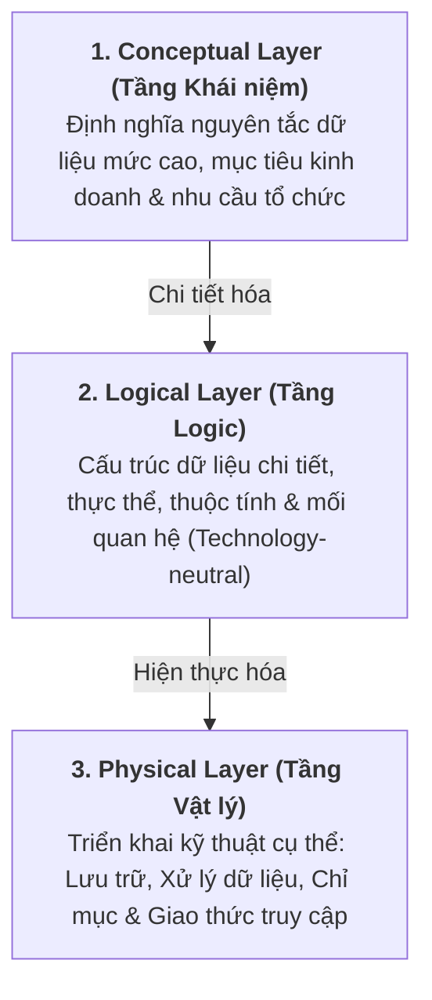
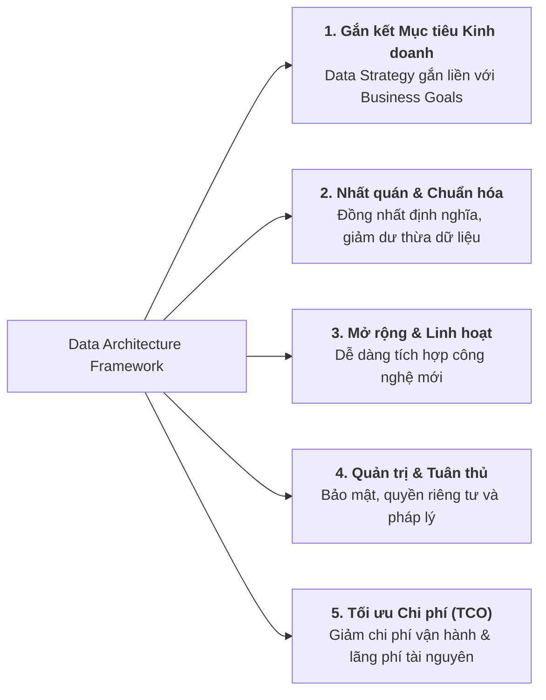
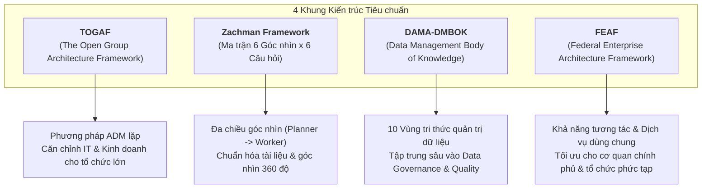

# Các Khung Kiến trúc Dữ liệu (Data Architecture Frameworks)

Tài liệu tổng hợp chi tiết nội dung bài học **Data Architecture Frameworks** thuộc khóa học Enterprise Data Architecture and Operations.

---

## 1. Khái niệm & 3 Tầng Kiến trúc Cốt lõi

**Data Architecture Framework** là phương pháp tiếp cận có cấu trúc nhằm định nghĩa nhu cầu dữ liệu, quy trình và công nghệ của tổ chức, giúp quản lý dữ liệu như một **tài sản chiến lược (strategic asset)**.

Khung kiến trúc bao gồm **3 tầng kết nối từ chiến lược đến thực thi**:

---

## 2. Vai trò & Tầm quan trọng của Data Architecture Framework

---

## 3. Khảo sát 4 Khung Kiến trúc Phổ biến (Popular Frameworks)

### 1. TOGAF (The Open Group Architecture Framework)
*   **Đặc điểm chính**:
    *   Là khung kiến trúc doanh nghiệp phổ biến hàng đầu thế giới.
    *   Sử dụng phương pháp phát triển lặp **ADM (Architecture Development Method)** để từng bước xây dựng và hoàn thiện kiến trúc.
    *   Bao quát toàn diện các khía cạnh: Quản trị dữ liệu, Tích hợp hệ thống và Quản lý vòng đời dữ liệu.
*   **Thế mạnh**: Rất phù hợp cho các **tập đoàn, doanh nghiệp quy mô lớn** có hệ sinh thái dữ liệu phức tạp; giúp đồng bộ hóa chặt chẽ giữa mục tiêu kinh doanh và lộ trình IT.

---

### 2. Zachman Framework
*   **Đặc điểm chính**:
    *   Là mô hình ma trận phân loại kiến trúc có cấu trúc rất chặt chẽ.
    *   Gồm **6 góc nhìn của các bên liên quan** (*Perspectives*): *Planner (Nhà hoạch định), Owner (Chủ sở hữu), Designer (Nhà thiết kế), Builder (Người xây dựng), Implementer (Người triển khai), Worker (Người vận hành)*.
    *   Phân tích qua **6 câu hỏi then chốt**: *What (Dữ liệu gì), How (Quy trình nào), Where (Vị trí ở đâu), Who (Ai chịu trách nhiệm), When (Thời điểm nào), Why (Mục đích kinh doanh là gì)*.
*   **Thế mạnh**: Đáp ứng toàn diện góc nhìn của mọi Stakeholder, chuẩn hóa tài liệu và cung cấp cái nhìn 360 độ về kiến trúc dữ liệu.

---

### 3. DAMA-DMBOK (Data Management Body of Knowledge)
*   **Đặc điểm chính**:
    *   Tập trung chuyên sâu vào các chuyên ngành **quản trị dữ liệu cốt lõi (Data Management Disciplines)**.
    *   Được cấu thành từ **10 lĩnh vực tri thức cốt lõi** (*Core Knowledge Areas*): Data Governance, Data Quality, Data Architecture, Data Modeling, Data Storage, Metadata Management, v.v.
    *   Cung cấp các hướng dẫn thực hành tốt nhất (*Best Practices*), công cụ và biểu mẫu (*templates*) thực tiễn.
*   **Thế mạnh**: Lựa chọn lý tưởng cho các tổ chức coi **Quản trị Dữ liệu (Data Governance)** và **Chất lượng Dữ liệu (Data Quality)** là ưu tiên hàng đầu.

---

### 4. FEAF (Federal Enterprise Architecture Framework)
*   **Đặc điểm chính**:
    *   Ban đầu được phát triển bởi chính phủ liên bang Hoa Kỳ, sau đó được ứng dụng rộng rãi cho các tổ chức và liên minh doanh nghiệp.
    *   Trọng tâm hướng vào việc đạt được **khả năng tương tác liên thông (Interoperability)** và tích hợp giữa các hệ thống đa dạng, phức tạp.
    *   Chuẩn hóa dữ liệu thông qua việc chia sẻ mô hình dữ liệu chung và bộ từ vựng chuẩn hóa.
*   **Thế mạnh**: Thích hợp cho các cơ quan nhà nước, tổ chức công, hoặc tập đoàn đa ngành có nhu cầu tích hợp liên phòng ban và chia sẻ **dịch vụ dữ liệu dùng chung (Shared Data Services)**.

---

## 4. Bảng So sánh Tổng hợp 4 Frameworks

| Tiêu chí | TOGAF | Zachman Framework | DAMA-DMBOK | FEAF |
| :--- | :--- | :--- | :--- | :--- |
| **Trọng tâm cốt lõi** | Quy trình phát triển kiến trúc lặp (ADM) | Ma trận phân loại góc nhìn đa chiều (6x6) | Quản trị dữ liệu & Chất lượng dữ liệu chuyên sâu | Tương tác liên thông & Dịch vụ dữ liệu dùng chung |
| **Cấu trúc tiếp cận** | Hướng quy trình (Process-driven) | Hướng cấu trúc / Ma trận (Taxonomy / Matrix) | Hướng tri thức & Thực hành (Knowledge / Best Practices) | Hướng tương tác & Tiêu chuẩn (Interoperability-driven) |
| **Phù hợp nhất với** | Doanh nghiệp lớn cần gắn kết chiến lược IT với Business | Tổ chức cần chuẩn hóa tài liệu và phục vụ đa dạng Stakeholders | Doanh nghiệp ưu tiên hoàn thiện Data Governance & Data Quality | Cơ quan chính phủ, tập đoàn đa ngành cần chia sẻ dịch vụ dữ liệu |

---

## 5. Các Thành phần Cốt lõi của một Data Architecture Framework

Một khung kiến trúc dữ liệu tiêu chuẩn luôn bao gồm 6 thành phần vận hành cốt lõi:
1.  **Data Governance**: Xác định chính sách, vai trò và trách nhiệm nhằm đảm bảo tuân thủ tiêu chuẩn và quy định pháp luật.
2.  **Data Integration**: Quy định công cụ và quy trình kết hợp dữ liệu đa nguồn (ETL/ELT, Data Pipelines, APIs).
3.  **Data Storage & Access**: Lựa chọn công nghệ lưu trữ (RDBMS, Data Warehouse, Data Lake) và giao thức truy cập tối ưu hiệu năng.
4.  **Metadata Management**: Quản lý siêu dữ liệu kỹ thuật, nghiệp vụ và vận hành để nâng cao khả năng tìm kiếm và hiểu dữ liệu.
5.  **Data Quality**: Cơ chế giám sát, làm sạch và cải thiện tính chính xác, nhất quán của dữ liệu.
6.  **Security & Privacy**: Biện pháp bảo vệ dữ liệu khỏi truy cập trái phép và tuân thủ các luật bảo vệ quyền riêng tư.
