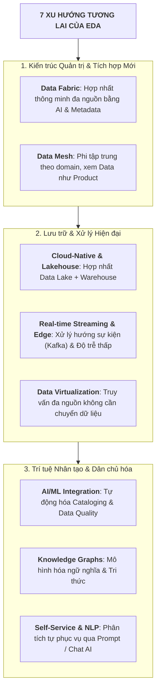
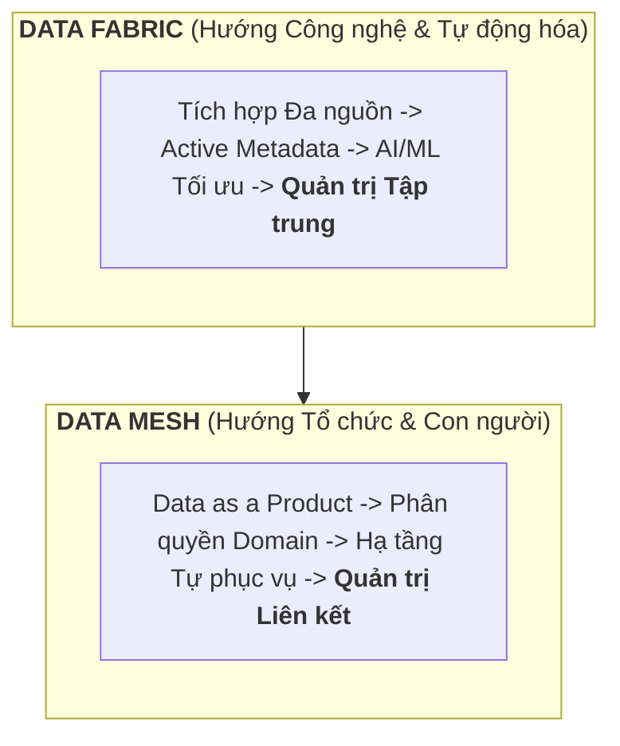

# Xu hướng Tương lai trong Kiến trúc Dữ liệu (Future Trends in EDA)

---

## 1. Bản đồ 7 Xu hướng Cốt lõi

---

## 2. So sánh Nhanh: Data Fabric vs. Data Mesh

| Tiêu chí | Data Fabric | Data Mesh |
| :--- | :--- | :--- |
| **Tiếp cận** | Công nghệ, tự động hóa & AI/ML | Tổ chức, con người & quy trình |
| **Quản trị** | **Tập trung (Centralized)** | **Liên kết phân tán (Federated)** |
| **Bản chất** | Lớp kết nối dữ liệu thông minh | Phân quyền sở hữu cho từng domain nghiệp vụ |

---

## 3. Tóm tắt 7 Xu hướng Dễ Nhớ

*   **1. Data Fabric & Data Mesh**:
    *   *Data Fabric*: Quản trị tập trung, dùng AI/Metadata kết nối dữ liệu phân tán.
    *   *Data Mesh*: Phi tập trung, mỗi phòng ban tự quản lý và coi dữ liệu là sản phẩm (*Data as a Product*).
*   **2. Cloud-Native & Data Lakehouse**:
    *   Kết hợp ưu điểm lưu trữ lớn, giá rẻ của *Data Lake* với khả năng truy vấn ACID nhanh của *Data Warehouse*.
*   **3. Tích hợp AI & Machine Learning**:
    *   Tự động gắn nhãn (cataloging), tự động sửa lỗi dữ liệu (Data Quality) và nhúng mô hình dự đoán vào pipeline.
*   **4. Real-time Streaming & Edge Computing**:
    *   Kiến trúc hướng sự kiện (*Event-driven* qua Kafka) và xử lý tại thiết bị biên (*Edge*) cho độ trễ cực thấp.
*   **5. Knowledge Graphs & Semantic Layers**:
    *   Mô hình hóa ngữ nghĩa và quan hệ phức tạp, giúp AI hiểu ngữ cảnh và suy diễn chính xác.
*   **6. Data Virtualization (Ảo hóa Dữ liệu)**:
    *   Truy vấn trực tiếp đa nguồn theo thời gian thực **không cần di chuyển/sao chép vật lý**.
*   **7. Self-Service Analytics & NLP**:
    *   Người dùng phi kỹ thuật tự tạo báo cáo và truy vấn dữ liệu bằng ngôn ngữ tự nhiên (*Text-to-SQL / Chat with Data*).

---

## 4. Bảng Tra cứu Nhanh (Cheat Sheet)

| Xu hướng | Từ khóa cốt lõi | Công nghệ tiêu biểu |
| :--- | :--- | :--- |
| **Data Fabric** | Active Metadata, AI integration | IBM Cloud Pak for Data |
| **Data Mesh** | Data as a Product, Domain ownership | Starburst, DDD |
| **Lakehouse** | ACID on Lake, High performance | Databricks, Snowflake, Iceberg |
| **Streaming & Edge** | Event-driven, Low latency | Apache Kafka, AWS Kinesis |
| **Knowledge Graphs**| Semantics, Ontologies | Neo4j, Amazon Neptune |
| **Virtualization** | Zero data movement, Real-time query | Denodo, Dremio |
| **Self-Service & NLP**| Natural language query, Democratization| Power BI Copilot, Tableau Pulse |
