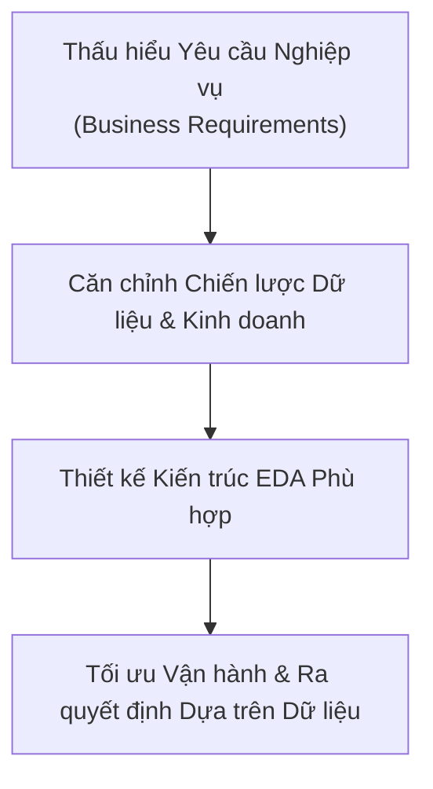
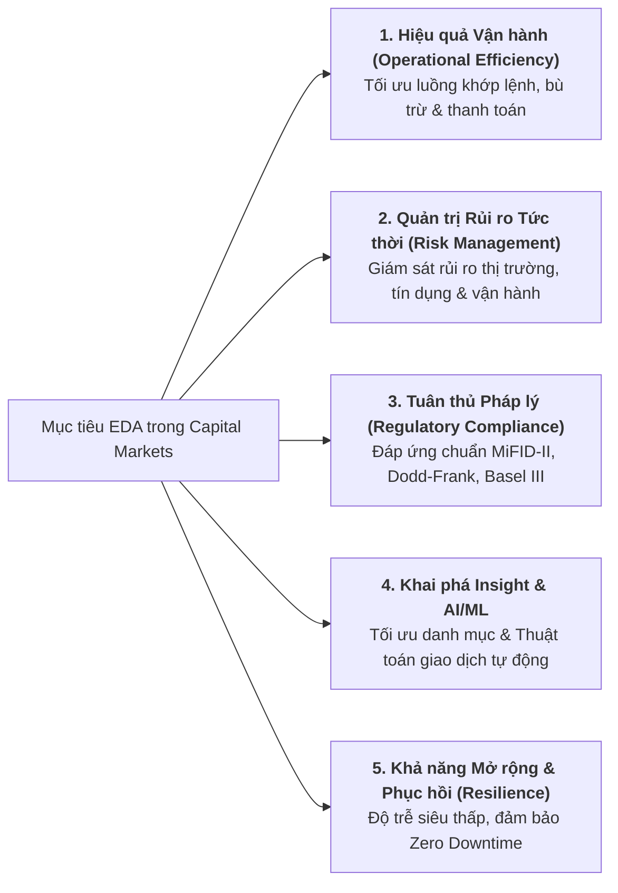
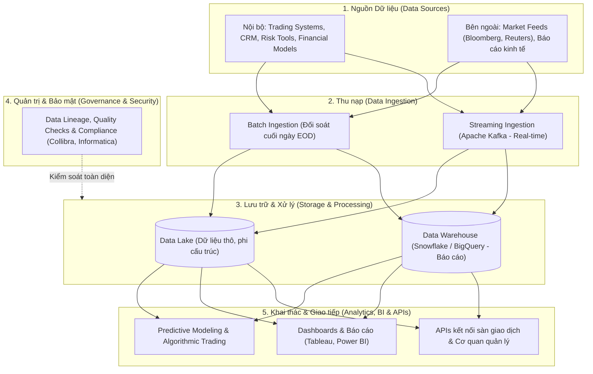
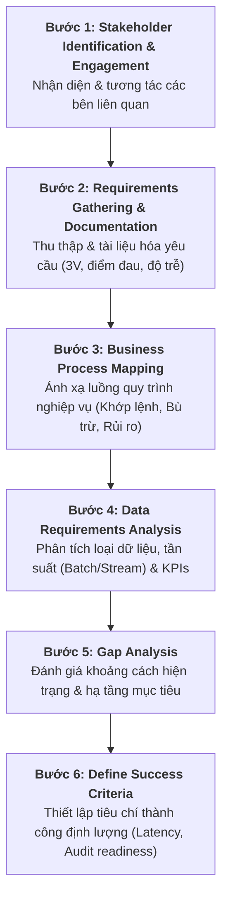

# Thấu hiểu Yêu cầu Nghiệp vụ trong Thiết kế EDA (Understand Business Requirements)

Tài liệu tổng hợp chi tiết nội dung bài học **Understand Business Requirements** (áp dụng case study Ngân hàng Thị trường Vốn - *Capital Markets Bank*).

---

## 1. Tầm quan trọng của việc Thấu hiểu Yêu cầu Nghiệp vụ

Thấu hiểu sâu sắc yêu cầu nghiệp vụ là bước khởi đầu quyết định sự thành bại của Kiến trúc Dữ liệu Doanh nghiệp (**EDA**). Nó đảm bảo hệ sinh thái dữ liệu được xây dựng để **phục vụ trực tiếp chiến lược kinh doanh**, giải quyết triệt để bài toán về hiệu năng, an toàn thông tin và khả năng mở rộng.

---

## 2. Mục tiêu Cốt lõi của EDA trong Ngân hàng Thị trường Vốn (Capital Markets Bank)

Ngân hàng thị trường vốn xử lý khối lượng giao dịch tài chính khổng lồ, biến động tức thời và chịu sự giám sát pháp lý nghiêm ngặt. EDA trong lĩnh vực này phải đạt được 5 mục tiêu:

---

## 3. Các Thành phần Kiến trúc EDA trong Ngân hàng Vốn

---

## 4. Quy trình 6 Bước Thấu hiểu Yêu cầu Nghiệp vụ

### Chi tiết từng bước thực hiện:
1.  **Stakeholder Identification & Engagement**:
    *   *Business Leaders*: Định hình mục tiêu chiến lược (tăng tốc độ giao dịch, mở rộng thị trường).
    *   *IT Teams*: Đánh giá ràng buộc kỹ thuật, hạ tầng sẵn có và khả năng tích hợp.
    *   *Risk & Compliance*: Đảm bảo đáp ứng đầy đủ tiêu chuẩn kiểm toán và bảo mật tài chính.
    *   *End Users (Traders, Analysts)*: Đóng góp ý kiến về trải nghiệm và nhu cầu khai thác dữ liệu hàng ngày.
2.  **Requirements Gathering & Documentation**:
    *   Tổ chức phỏng vấn, khảo sát tập trung vào các câu hỏi then chốt: *Quy trình nào phụ thuộc vào dữ liệu? Điểm nghẽn hiện tại là gì (Data Silos, độ trễ cao)? Đặc tính dữ liệu (Volume, Velocity, Variety)?*
3.  **Business Process Mapping**:
    *   Vẽ sơ đồ luồng dữ liệu gắn liền với quy trình kinh doanh: Thực thi lệnh giao dịch (*Trade Execution*), Thanh toán bù trừ (*Settlement*), Quản trị danh mục (*Portfolio Management*).
4.  **Data Requirements Analysis**:
    *   Phân loại dữ liệu: Market Data, Client Data, Transaction Data.
    *   Xác định tần suất: Dữ liệu thời gian thực (*Real-time*) hay xử lý theo lô (*Batch*).
    *   Xác lập ngưỡng chỉ số KPI (ví dụ: giới hạn độ trễ micro-giây cho dữ liệu giao dịch).
5.  **Gap Analysis (Phân tích khoảng cách)**:
    *   So sánh hạ tầng hiện tại với yêu cầu tương lai: *Có bị phân mảnh dữ liệu rủi ro không? Hạ tầng có mở rộng được khi volume giao dịch tăng đột biến không?*
6.  **Define Success Criteria (Tiêu chí thành công)**:
    *   Thiết lập kết quả đo lường rõ ràng: Giảm độ trễ thực thi giao dịch, tăng độ chính xác tính toán rủi ro, sẵn sàng 100% cho kiểm toán định kỳ.

---

## 5. 5 Nguyên tắc Thiết kế EDA cho Ngân hàng Vốn (Design Principles)

| STT | Nguyên tắc Thiết kế | Diễn giải Chi tiết |
| :---: | :--- | :--- |
| **1** | **Horizontal Scaling on Cloud** | Thiết kế mở rộng theo chiều ngang trên đám mây để linh hoạt đáp ứng dung lượng và tốc độ dữ liệu tăng vọt. |
| **2** | **Seamless Integration** | Đảm bảo kết nối thông suốt từ nhiều nguồn qua ETL/ELT pipelines tự động và hệ thống APIs chuẩn hóa. |
| **3** | **Real-time & Event-Driven** | Ứng dụng kiến trúc hướng sự kiện (*Event-driven*) để tính toán rủi ro và hỗ trợ giao dịch thuật toán theo thời gian thực. |
| **4** | **Security & Compliance by Design**| Nhúng kiểm tra bảo mật, phân quyền và tuân thủ pháp lý vào mọi tầng kiến trúc. |
| **5** | **Modular Architecture** | Cấu trúc mô-đun hóa linh hoạt, cho phép dễ dàng tích hợp các sản phẩm tài chính và công nghệ mới mà không làm gián đoạn hệ thống hiện tại. |
