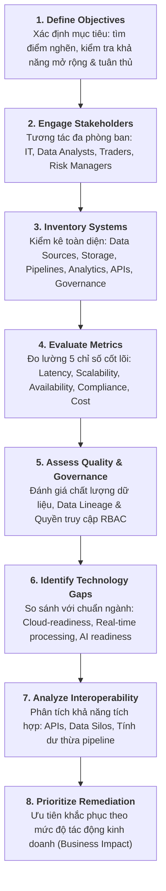
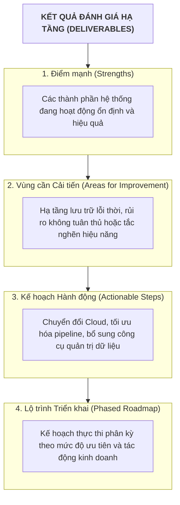

# Đánh giá Hạ tầng Dữ liệu Hiện tại (Assess Existing Data Infrastructure)

Tài liệu tóm tắt chi tiết nội dung bài học **Assess Existing Data Infrastructure** (áp dụng case study Ngân hàng Thị trường Vốn - *Capital Markets Bank*).

---

## 1. Động lực Đánh giá Hạ tầng (Key Drivers)

Đánh giá hạ tầng dữ liệu là quá trình **chẩn đoán toàn diện** (*diagnostic process*) nhằm xác định hệ thống hiện tại có đáp ứng được các yêu cầu vận hành, phân tích và chiến lược hay không:

*   **Khắc phục Bất cập Vận hành**: Giải quyết độ trễ cao (*high latency*), lỗi gián đoạn hệ thống (*downtime*) và các ốc đảo dữ liệu (*data silos*).
*   **Đáp ứng Tuân thủ Pháp lý**: Tuân thủ các quy định tài chính khắt khe (**Basel III, MiFID II, Dodd-Frank**).
*   **Hỗ trợ Công nghệ Mới**: Tạo nền tảng cho phân tích thời gian thực (*real-time analytics*), mô hình dự đoán và giao dịch thuật toán (*algorithmic trading*).
*   **Tối ưu Chi phí (Cost Optimization)**: Giảm chi phí bảo trì đắt đỏ của các hệ thống cũ (*legacy systems*).

---

## 2. Quy trình 8 Bước Đánh giá Hạ tầng Dữ liệu

---

## 3. 5 Chỉ số Hiệu năng Đo lường Cốt lõi (Key Metrics)

1.  **Latency (Độ trễ)**: Thời gian xử lý giao dịch hoặc cung cấp dữ liệu phân tích.
2.  **Scalability (Khả năng mở rộng)**: Năng lực xử lý khối lượng dữ liệu tăng đột biến mà không suy giảm hiệu năng.
3.  **Availability & Reliability (Độ sẵn sàng & Tin cậy)**: Tỷ lệ uptime của hệ thống, đặc biệt trong các phiên giao dịch cao điểm.
4.  **Security & Compliance (Bảo mật & Tuân thủ)**: Mức độ đáp ứng quy định bảo vệ dữ liệu và khả năng truy vết kiểm toán (*audit trail*).
5.  **Cost vs. Value (Chi phí so với Giá trị)**: Tương quan giữa chi phí bảo trì hạ tầng và giá trị kinh doanh mang lại.

---

## 4. Kết quả Báo cáo Đánh giá (Assessment Deliverables)

Báo cáo hoàn chỉnh sau quá trình đánh giá bao gồm 4 phần chính:

---

## 5. Bảng Tra cứu Nhanh (Cheat Sheet)

| Bước đánh giá | Trọng tâm kiểm tra | Đầu ra chính |
| :--- | :--- | :--- |
| **Inventory** | Sources, Lake/Warehouse, ETL/ELT, APIs, Governance | Danh mục tài sản hạ tầng dữ liệu |
| **Metrics** | Latency, Scalability, Uptime, Compliance, TCO | Báo cáo hiệu năng & điểm nghẽn |
| **Quality & Gov** | Duplication, Missing data, Lineage, RBAC | Mức độ tin cậy và sẵn sàng kiểm toán |
| **Tech Gaps** | Cloud-readiness, Streaming, AI/ML capability | Khoảng cách công nghệ so với chuẩn ngành |
| **Interoperability**| API integration, Data Silos, Pipeline redundancy | Báo cáo tích hợp liên hệ thống |
| **Remediation** | Ưu tiên theo tác động: High latency $\rightarrow$ Cloud migration | Kế hoạch hành động phân kỳ (*Phased Plan*) |
