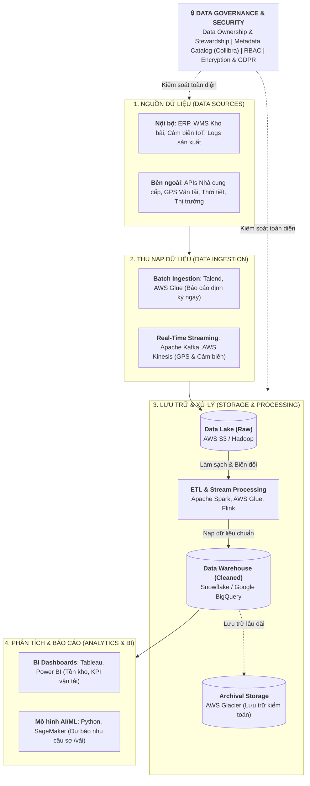
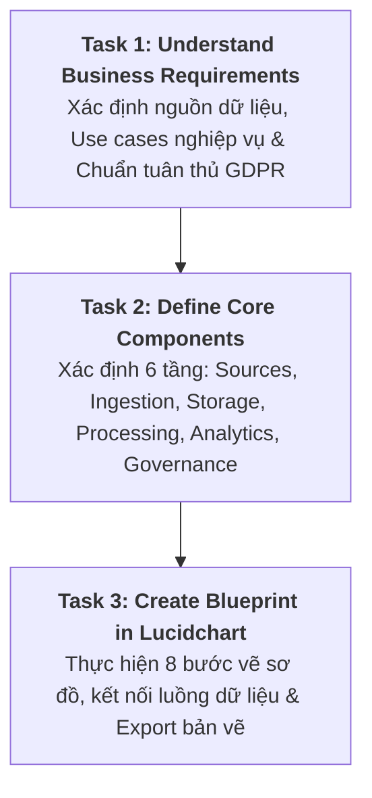
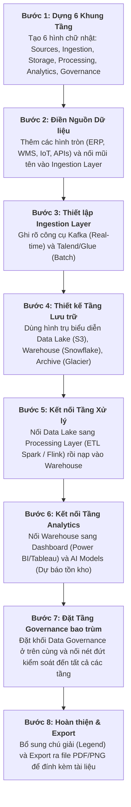

# Thực hành: Xây dựng Bản thiết kế EDA (Create an EDA Blueprint)

Tài liệu hướng dẫn chi tiết và giải pháp hoàn chỉnh cho bài thực hành **Lab: Create an EDA Blueprint** của một Doanh nghiệp Chuỗi Cung ứng Dệt may (*Garment Supply Chain*).

---

## 1. Tổng quan Tình huống & Mục tiêu (Scenario & Objectives)

*   **Bối cảnh**: Doanh nghiệp cung ứng nguyên vật liệu phục vụ sản xuất dệt may (*Garment Manufacturing*) cần thiết kế bản vẽ **Enterprise Data Architecture (EDA) Blueprint** để chuyển đổi số toàn diện.
*   **Mục tiêu bài lab**:
    *   Tối ưu hóa quản lý tồn kho (*Inventory Optimization*) và dự báo nhu cầu (*Demand Forecasting*).
    *   Tối ưu hóa tuyến đường vận tải (*Route Optimization*) và đánh giá hiệu suất nhà cung cấp (*Supplier Scorecard*).
    *   Thiết kế kiến trúc đáp ứng mở rộng, an toàn và tuân thủ các quy định bảo vệ dữ liệu quốc tế (**GDPR**).
*   **Công cụ thực hành**: **Lucidchart** (hoặc Microsoft Visio / Word).

---

## 2. Bản thiết kế Kiến trúc Dữ liệu Tổng thể (EDA Blueprint)

---

## 3. Hướng dẫn Chi tiết Các Bước Thực hiện Bài Lab (Step-by-Step)

Quy trình thực hiện bài lab được chia thành **3 nhiệm vụ chính (Tasks)**:

### 🔹 Task 1: Thấu hiểu Yêu cầu Nghiệp vụ (Understand Business Requirements)
1.  **Bước 1 - Liệt kê Nguồn dữ liệu**: Xác định các nguồn trọng yếu gồm CSDL nhà cung cấp (*Supplier DB*), ERP, hệ thống kho bãi (*WMS*), cảm biến IoT và đơn hàng khách hàng.
2.  **Bước 2 - Xác định Use Case thực tế**:
    *   Dự báo nhu cầu tồn kho sợi/vải (*Inventory & Demand Forecasting*).
    *   Tối ưu hóa tuyến đường xe hàng (*Route Optimization*).
    *   Bảng chấm điểm và đánh giá hiệu suất nhà cung cấp (*Supplier Scorecard*).
3.  **Bước 3 - Xác định Tiêu chuẩn Tuân thủ (GDPR)**:
    *   Áp dụng nguyên tắc giảm thiểu dữ liệu (*Data minimization*).
    *   Bảo vệ dữ liệu cá nhân của đối tác/khách hàng EU.
    *   Đảm bảo cơ chế truy xuất, hiệu chỉnh và xóa dữ liệu (*Right to be Forgotten*).

---

### 🔹 Task 2: Xác định 6 Tầng Thành phần Cốt lõi của EDA
1.  **Data Sources (Nguồn dữ liệu)**: Phân tách rõ ràng giữa nguồn *Nội bộ* (ERP, WMS, IoT sensors) và *Bên ngoài* (APIs nhà cung cấp, GPS xe tải, Feeds thời tiết).
2.  **Data Ingestion (Thu nạp)**: Thiết lập cả 2 cơ chế *Batch Ingestion* (Talend, AWS Glue cho báo cáo ngày) và *Streaming Ingestion* (Kafka, Kinesis cho GPS/IoT tức thời).
3.  **Data Storage (Lưu trữ)**: Phân tầng lưu trữ gồm *Data Lake (AWS S3)* chứa raw data, *Data Warehouse (Snowflake)* chứa dữ liệu phân tích, và *Archival Storage (AWS Glacier)* lưu trữ dài hạn.
4.  **Data Processing (Xử lý)**: Pipeline *ETL/ELT (Apache Spark)* làm sạch chuyển đổi dữ liệu và *Stream Processing (Flink)* cảnh báo sự cố chuỗi cung ứng.
5.  **Analytics & BI (Khai thác)**: Xây dựng *BI Dashboards (Tableau, Power BI)* theo dõi KPI và mô hình *AI/ML (Python/SageMaker)* dự báo nhu cầu dệt may.
6.  **Data Governance (Quản trị)**: Phân định quyền sở hữu (*Data Stewardship*), quản lý danh mục siêu dữ liệu (*Collibra/Alation*), kiểm soát truy cập (*RBAC*) và mã hóa đa lớp.

---

### 🔹 Task 3: Quy trình 8 Bước Vẽ Bản thiết kế trên Lucidchart

---

## 4. Bảng Tra cứu Nhanh (Cheat Sheet)

| Tầng Kiến trúc | Công nghệ / Công cụ tiêu biểu | Vai trò trong Chuỗi cung ứng Dệt may |
| :--- | :--- | :--- |
| **Data Sources** | SAP ERP, Manhattan WMS, IoT Sensors | Nơi phát sinh toàn bộ dữ liệu vận hành |
| **Ingestion** | Apache Kafka, AWS Kinesis, Talend | Tiếp nhận dữ liệu lô và dữ liệu luồng tức thời |
| **Storage** | AWS S3, Snowflake, AWS Glacier | Lưu trữ phân tầng theo chi phí và vòng đời dữ liệu |
| **Processing** | Apache Spark, AWS Glue, Flink | Làm sạch, chuẩn hóa và xử lý tính toán số liệu |
| **Analytics** | Tableau, Power BI, Python/SageMaker | Dự báo nhu cầu, tối ưu lộ trình và quản trị KPI |
| **Governance** | Collibra, Apache Ranger, IAM | Quản lý chất lượng, bảo mật và tuân thủ GDPR |
