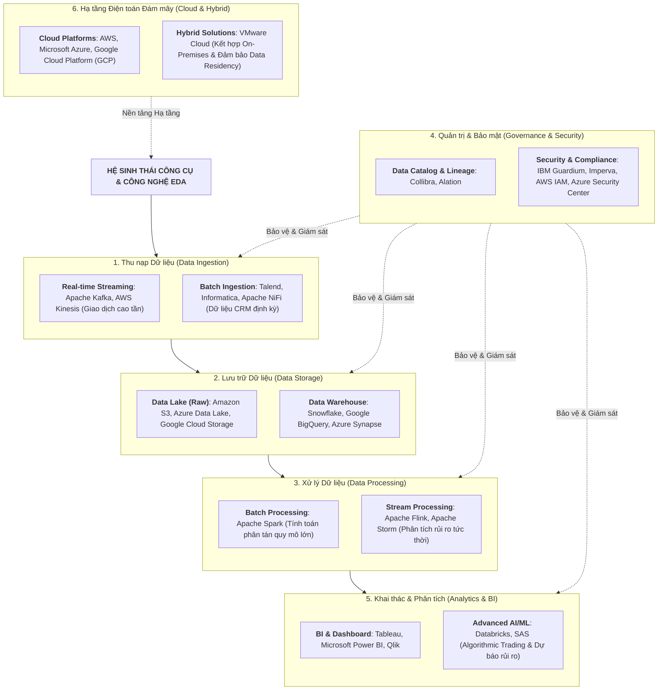
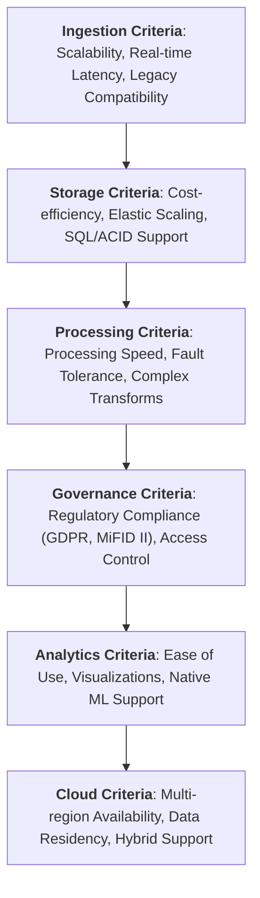

# Lựa chọn Công cụ và Công nghệ trong EDA (Select Tools and Technologies)

Tài liệu tóm tắt chi tiết nội dung bài học **Select the Tools and Technologies** (áp dụng case study Ngân hàng Thị trường Vốn - *Capital Market Bank*).

---

## 1. Tầm quan trọng của việc Lựa chọn Công nghệ

Trong môi trường tài chính và ngân hàng thị trường vốn, việc lựa chọn đúng công nghệ quyết định trực tiếp đến:
*   **Độ trễ siêu thấp (*Ultra-low Latency*)**: Phục vụ giao dịch cao tần (*High-Frequency Trading*) và định giá rủi ro tức thời.
*   **Khả năng mở rộng (*Scalability*)**: Xử lý khối lượng dữ liệu giao dịch và market feed khổng lồ.
*   **Tuân thủ khắt khe (*Compliance*)**: Đáp ứng các khung pháp lý quốc tế (**GDPR, MiFID II, Dodd-Frank, Basel III**).
*   **Tối ưu Tổng chi phí Sở hữu (*TCO*)**: Giảm thiểu chi phí bảo trì hệ thống cũ (*Legacy*).

---

## 2. Bản đồ Phân loại Công cụ theo Từng Tầng EDA

---

## 3. Tiêu chí và Khuyến nghị Lựa chọn theo Từng Tầng

### 1. Tầng Thu nạp (Data Ingestion)
*   **Real-time Stream**: Dùng **Apache Kafka** hoặc **AWS Kinesis** để đạt độ trễ micro-giây cho giao dịch chứng khoán và cập nhật biến động giá.
*   **Batch Ingestion**: Dùng **Talend**, **Informatica** hoặc **Apache NiFi** cho các tệp đối soát cuối ngày từ CRM và đối tác ngoài.

### 2. Tầng Lưu trữ (Data Storage)
*   **Data Lake**: Sử dụng **Amazon S3 / Azure Data Lake Storage / GCP Cloud Storage** lưu trữ dữ liệu phi cấu trúc, log giao dịch và audio ghi âm với chi phí rẻ.
*   **Data Warehouse**: Sử dụng **Snowflake / Google BigQuery / Azure Synapse** cho các bảng dữ liệu chuẩn hóa phục vụ báo cáo tài chính và truy vấn SQL tốc độ cao.

### 3. Tầng Xử lý (Data Processing)
*   **Batch Computing**: **Apache Spark** xử lý khối lượng lớn dữ liệu phân tán với khả năng chịu lỗi (*fault tolerance*) vượt trội.
*   **Stream Processing**: **Apache Flink / Storm** tính toán chỉ số rủi ro danh mục (*Portfolio Risk*) và phát hiện gian lận (*Fraud Detection*) tức thì.

### 4. Tầng Quản trị & Bảo mật (Governance & Security)
*   **Data Catalog & Lineage**: **Collibra / Alation** giúp người dùng tra cứu nguồn gốc và đường đi của dữ liệu (*Data Lineage*).
*   **Bảo vệ Dữ liệu & Mã hóa**: **IBM Guardium / Imperva** ngăn chặn rò rỉ dữ liệu và đáp ứng kiểm toán theo chuẩn **GDPR, MiFID II, Dodd-Frank**.
*   **Quản lý Danh tính**: **AWS IAM / Azure Security Center** thiết lập phân quyền dựa trên vai trò (*RBAC*).

### 5. Tầng Khai thác & Báo cáo (Analytics & BI)
*   **BI & Dashboards**: **Tableau / Microsoft Power BI / Qlik** giúp chuyên viên kinh doanh tự xây dựng báo cáo và biểu đồ KPI.
*   **Advanced Analytics & AI/ML**: **Databricks / SAS** cung cấp môi trường tính toán máy học chuyên sâu phục vụ giao dịch tự động (*Algorithmic Trading*).

### 6. Tầng Hạ tầng Đám mây (Cloud Infrastructure)
*   **Chiến lược Cloud-First**: Triển khai trên **AWS / Azure / GCP** để tận dụng khả năng tự co giãn (*Auto-scaling*) và chuyển từ CapEx sang OpEx.
*   **Mô hình Hybrid Cloud**: Kết hợp **VMware Cloud** với hệ thống máy chủ On-Premises sẵn có nhằm đáp ứng quy định về lưu trữ dữ liệu trong nước (*Data Residency*).

---

## 4. Bảng Tra cứu Nhanh Công nghệ (Cheat Sheet)

| Tầng Kiến trúc | Công nghệ Tiêu biểu | Tiêu chí Lựa chọn Hàng đầu | Use Case Chính |
| :--- | :--- | :--- | :--- |
| **Ingestion** | Apache Kafka, AWS Kinesis, Talend | Độ trễ thấp, Khả năng mở rộng | Streaming giá thị trường & Batch đối soát EOD |
| **Storage** | S3, ADLS, Snowflake, BigQuery | Chi phí tối ưu, Hỗ trợ ACID | Data Lakehouse đa mục đích |
| **Processing** | Apache Spark, Apache Flink, Storm | Tốc độ, Chịu lỗi, Tính toán phân tán | Chạy Spark ETL & Flink Real-time Risk |
| **Governance**| Collibra, Alation, IBM Guardium | Truy vết Lineage, Tuân thủ GDPR/MiFID | Quản lý Metadata & Bảo vệ dữ liệu nhạy cảm |
| **Analytics** | Tableau, Power BI, Databricks, SAS | Trực quan hóa, Tích hợp Machine Learning | Dashboard quản trị & Giao dịch thuật toán |
| **Cloud** | AWS, Azure, Google Cloud, VMware Cloud| Độ sẵn sàng cao, Hỗ trợ Hybrid Cloud | Hạ tầng điện toán co giãn linh hoạt |
