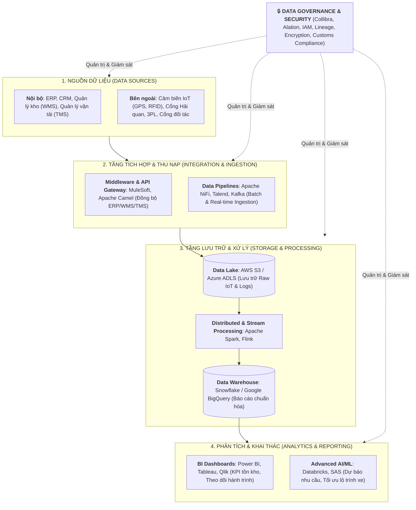
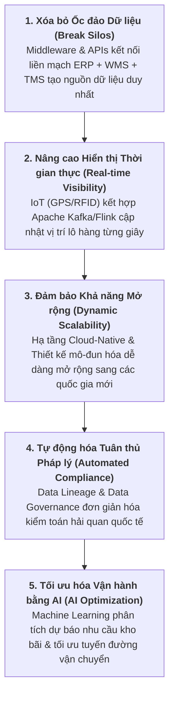
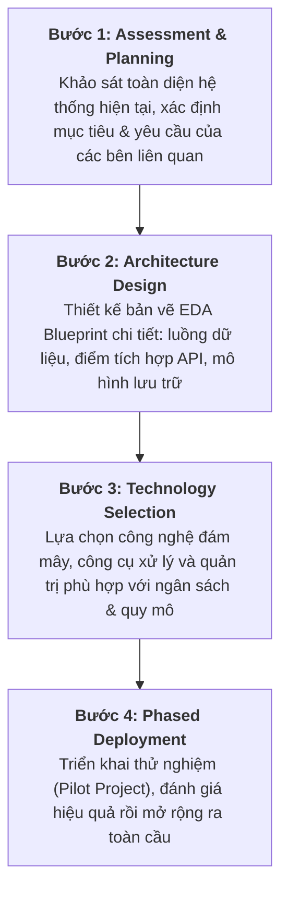

# Kiến trúc Dữ liệu Doanh nghiệp Logistics Quốc tế (EDA Case Study)

Tài liệu tóm tắt chi tiết bài học tình huống **Enterprise Data Architecture of an International Logistics Company**.

---

## 1. 6 Thách thức Lớn của Ngành Logistics Quốc tế

Logistics toàn cầu là môi trường có đặc thù dữ liệu quy mô lớn, tốc độ cao và đa dạng thể loại (*High Velocity, Volume & Variety*):

*   **1. Ốc đảo Vận hành (Operational Silos)**: Các bộ phận Kho bãi (WMS), Vận tải (TMS), Quản trị (ERP) và CSKH hoạt động biệt lập.
*   **2. Phân mảnh Dữ liệu (Data Fragmentation)**: Thiếu góc nhìn dữ liệu hợp nhất (*Single Source of Truth*).
*   **3. Giám sát Thời gian thực Kém (Lack of Real-time Tracking)**: Khó khăn trong việc định vị và cập nhật trạng thái lô hàng tức thời.
*   **4. Rào cản Pháp lý Quốc tế (Regulatory Compliance)**: Khó khăn khi đáp ứng quy định hải quan và luật thương mại đa quốc gia.
*   **5. Khả năng Mở rộng Hạn chế (Scalability Bottlenecks)**: Hệ thống cũ khó đáp ứng khi mở rộng tuyến vận chuyển và lượng đơn hàng tăng vọt.
*   **6. Kỳ vọng Khách hàng Tăng cao (Customer Expectations)**: Nhu cầu theo dõi đơn hàng từng phút và nhận thông báo cá nhân hóa.

---

## 2. Bản thiết kế Kiến trúc Dữ liệu Logistics Toàn diện

---

## 3. Cách thức EDA Giải quyết 5 Vấn đề Cốt lõi

---

## 4. Lộ trình Triển khai 4 Bước (Implementation Roadmap)

---

## 5. Bảng Tra cứu Nhanh (Cheat Sheet)

| Tầng / Thành phần | Công nghệ / Nền tảng | Vai trò Cốt lõi trong Logistics |
| :--- | :--- | :--- |
| **Nguồn dữ liệu** | WMS, TMS, ERP, IoT (GPS/RFID) | Tạo dữ liệu vận hành kho bãi, định vị và đơn hàng |
| **Tích hợp dữ liệu**| MuleSoft, Apache Camel, NiFi, Kafka | Đồng bộ hóa liên hệ thống và tiếp nhận dữ liệu luồng |
| **Lưu trữ dữ liệu** | AWS S3, Snowflake, BigQuery | Phân tầng lưu trữ dữ liệu thô (Lake) và dữ liệu sạch (Warehouse) |
| **Xử lý dữ liệu** | Apache Spark, Apache Flink | Tính toán phân tán khối lượng lớn và phát hiện sự cố tức thì |
| **Phân tích & AI** | Tableau, Power BI, Databricks, SAS | Báo cáo KPI, Tối ưu lộ trình và Dự báo nhu cầu kho |
| **Quản trị & An toàn**| Collibra, Alation, IAM, Data Lineage | Đảm bảo an toàn thông tin và sẵn sàng kiểm toán hải quan |
