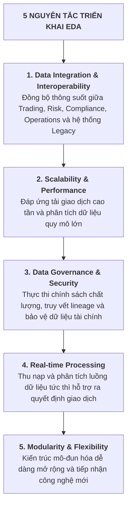
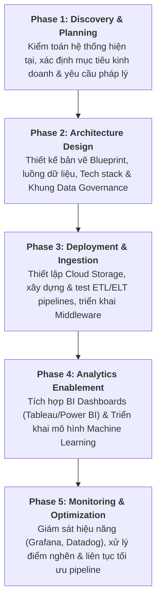

# Triển khai Kiến trúc Dữ liệu Doanh nghiệp (Implement the Data Architecture)

Tài liệu tóm tắt chi tiết bài học **Implement the Data Architecture** (áp dụng case study Ngân hàng Thị trường Vốn - *Capital Markets Bank*).

---

## 1. 5 Nguyên tắc Cốt lõi khi Triển khai EDA

---

## 2. Kỹ thuật và Công cụ Triển khai Chuyên dụng

*   **Data Modeling (Mô hình hóa dữ liệu)**:
    *   Xây dựng mô hình Conceptual $\rightarrow$ Logical $\rightarrow$ Physical.
    *   *Công cụ*: **Erwin Data Modeler**, **IBM InfoSphere Data Architect**.
*   **Data Integration (Tích hợp dữ liệu)**:
    *   Kết nối hệ thống đa nguồn qua API Gateways và Middleware.
    *   *Công cụ*: **MuleSoft**, **Apache Camel**.
*   **Hybrid Storage (Lưu trữ lai)**:
    *   *Data Lake*: **Amazon S3** (Lưu trữ raw market & trading data dung lượng lớn).
    *   *Data Warehouse*: **Snowflake** (Lưu trữ dữ liệu có cấu trúc cho BI và SQL query).
*   **Real-time Analytics (Phân tích thời gian thực)**:
    *   *Streaming Ingestion*: **Apache Kafka**.
    *   *Stream Processing*: **Apache Flink**, **Spark Streaming** (Hỗ trợ định giá và quản trị rủi ro tức thì).
*   **Data Governance (Quản trị dữ liệu)**:
    *   Quản lý danh mục, chính sách truy cập và truy vết nguồn gốc (*Data Lineage*).
    *   *Công cụ*: **Collibra**, **Alation**.
*   **Security & Monitoring (Bảo mật & Giám sát)**:
    *   Mã hóa toàn diện: **AES-256** (Data at rest & Data in transit).
    *   Giám sát bảo mật SIEM: **Splunk**, **IBM QRadar**.

---

## 3. Quy trình 5 Giai đoạn Triển khai EDA (5-Phase Implementation Process)

### Chi tiết từng giai đoạn:
1.  **Giai đoạn 1 - Khám phá & Lập kế hoạch (Discovery & Planning)**:
    *   Đánh giá toàn diện các hệ thống dữ liệu, luồng công việc hiện có.
    *   Xác định mục tiêu rõ ràng, căn chỉnh kiến trúc dữ liệu theo chiến lược kinh doanh của ngân hàng.
2.  **Giai đoạn 2 - Thiết kế Kiến trúc (Design)**:
    *   Phác thảo bản vẽ chi tiết các điểm tích hợp, luồng dữ liệu và sơ đồ công nghệ.
    *   Xây dựng khung quản trị dữ liệu đáp ứng chuẩn kiểm toán quốc tế.
3.  **Giai đoạn 3 - Triển khai Hạ tầng & Đường ống (Deployment)**:
    *   Dựng hạ tầng đám mây và phân tầng lưu trữ (Data Lake + Data Warehouse).
    *   Xây dựng, thử nghiệm pipeline ETL/ELT thu nạp dữ liệu lô và dữ liệu luồng.
    *   Cài đặt các giải pháp Middleware để tích hợp liên hệ thống.
4.  **Giai đoạn 4 - Kích hoạt Năng lực Phân tích (Analytics Enablement)**:
    *   Kết nối các công cụ BI (Tableau, Power BI) cho báo cáo quản trị.
    *   Đưa vào hoạt động các mô hình AI/ML phục vụ dự báo rủi ro và giao dịch thuật toán (*Algorithmic Trading*).
5.  **Giai đoạn 5 - Giám sát & Tối ưu hóa (Monitoring & Optimization)**:
    *   Sử dụng công cụ giám sát (Datadog, Grafana) theo dõi hiệu năng hệ thống 24/7.
    *   Khắc phục điểm nghẽn độ trễ và liên tục tinh chỉnh dung lượng lưu trữ.

---

## 4. 5 Lợi ích Doanh nghiệp Đạt được (Key Benefits)

*   **1. Góc nhìn Dữ liệu Hợp nhất (Unified Data View)**: Xóa bỏ hoàn toàn các ốc đảo dữ liệu (*Data Silos*), tạo nguồn dữ liệu duy nhất toàn diện.
*   **2. Nâng cao Hiệu quả Ra quyết định (Enhanced Decision-Making)**: Phân tích thời gian thực cung cấp dữ liệu tức thì cho chuyên viên giao dịch và quản lý rủi ro.
*   **3. Tự động hóa Báo cáo Pháp lý (Automated Compliance)**: Giảm thiểu thao tác thủ công và sai sót khi báo cáo theo chuẩn Basel III, MiFID II, Dodd-Frank.
*   **4. Khả năng Mở rộng & Linh hoạt (Scalability & Agility)**: Dễ dàng mở rộng quy mô xử lý giao dịch mà không gián đoạn hoạt động hiện tại.
*   **5. Nâng cao Trải nghiệm Khách hàng (Customer Experience)**: Cung cấp dịch vụ tài chính cá nhân hóa nhờ góc nhìn dữ liệu khách hàng 360 độ.

---

## 5. Bảng Tra cứu Nhanh (Cheat Sheet)

| Giai đoạn | Nhiệm vụ Trọng tâm | Công cụ Tiêu biểu | Kết quả Đầu ra |
| :--- | :--- | :--- | :--- |
| **Phase 1: Discovery** | Kiểm toán hệ thống, xác định mục tiêu | Phỏng vấn, Khảo sát | Báo cáo hiện trạng & Mục tiêu EDA |
| **Phase 2: Design** | Thiết kế Data Model & Blueprint | Erwin, IBM Infosphere | Bản thiết kế EDA Blueprint |
| **Phase 3: Deployment** | Cài đặt Storage, Pipeline & Middleware | AWS S3, Snowflake, Kafka, Camel | Hạ tầng & Đường ống dữ liệu hoạt động |
| **Phase 4: Analytics** | Kích hoạt Dashboard & Mô hình AI | Tableau, Power BI, Databricks | Dashboard KPI & Mô hình Machine Learning |
| **Phase 5: Monitoring** | Giám sát độ trễ & Tối ưu hóa liên tục | Datadog, Grafana, Splunk | Hệ thống ổn định, Uptime tối đa |
