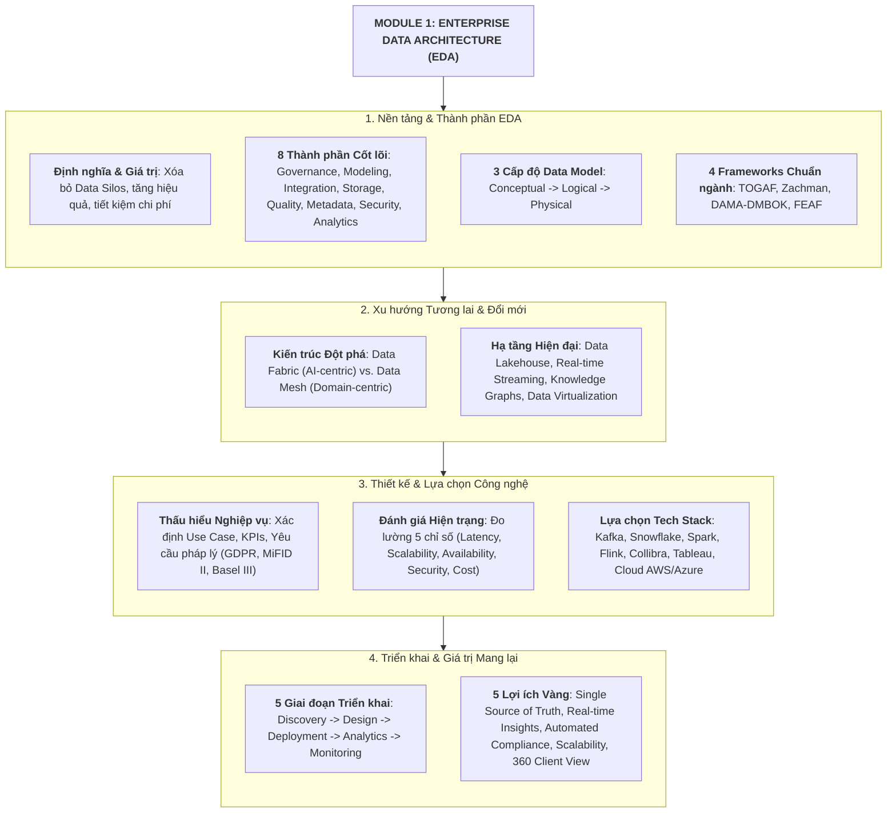
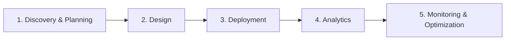

# Tổng kết Module 1: Kiến trúc Dữ liệu Doanh nghiệp (Module 1 Summary)

Tài liệu tổng hợp toàn bộ kiến thức cốt lõi của **Module 1: Enterprise Data Architecture** phục vụ ôn tập và chuẩn bị cho bài kiểm tra đánh giá (*Graded Quiz*).

---

## 1. Sơ đồ Tổng quan Tri thức Module 1

---

## 2. Tóm tắt 7 Trụ cột Tri thức Cốt lõi

### 🏛️ Trụ cột 1: Bản chất & Tầm quan trọng của EDA
*   **EDA là gì**: Khung kiến trúc hợp nhất quy định cách thức **Thu thập (Collect) $\rightarrow$ Lưu trữ (Store) $\rightarrow$ Tích hợp (Integrate) $\rightarrow$ Quản trị (Manage)** dữ liệu toàn doanh nghiệp.
*   **Mục tiêu chính**: Phá vỡ các ốc đảo dữ liệu (*Data Silos*), đảm bảo tính nhất quán, chất lượng và bảo mật dữ liệu, tạo nền tảng ra quyết định chiến lược.

---

### 🧩 Trụ cột 2: 8 Thành phần Cốt lõi của EDA
1.  **Data Governance (Quản trị dữ liệu)**: Thiết lập quyền sở hữu, chính sách và tiêu chuẩn tuân thủ.
2.  **Data Modeling (Mô hình hóa dữ liệu)**: Thiết kế cấu trúc và mối quan hệ giữa các thực thể dữ liệu.
3.  **Data Integration (Tích hợp dữ liệu)**: Đồng bộ dữ liệu đa nguồn qua ETL/ELT, APIs và Event Streaming.
4.  **Data Storage (Lưu trữ dữ liệu)**: Phân tầng lưu trữ (Data Lake, Data Warehouse, Lakehouse).
5.  **Data Quality Management (Quản lý chất lượng)**: Đảm bảo dữ liệu chính xác, đầy đủ, kịp thời và nhất quán.
6.  **Metadata Management (Quản lý siêu dữ liệu)**: Quản lý danh mục (*Data Catalog*) và truy vết nguồn gốc (*Data Lineage*).
7.  **Data Security & Privacy (Bảo mật & Quyền riêng tư)**: Mã hóa, kiểm soát truy cập (RBAC) và tuân thủ GDPR, HIPAA, PCI-DSS.
8.  **Analytics & BI (Khai thác & Phân tích)**: Cung cấp báo cáo Dashboard và mô hình phân tích dự đoán AI/ML.

---

### 📐 Trụ cột 3: 3 Cấp độ Mô hình hóa Dữ liệu (Data Models)
*   **1. Conceptual Data Model (Khái niệm)**:
    *   *Đối tượng*: Lãnh đạo & chuyên viên nghiệp vụ.
    *   *Đặc điểm*: Thể hiện thực thể cấp cao (*Entities*) và mối quan hệ (*Relationships*), độc lập hoàn toàn với kỹ thuật.
*   **2. Logical Data Model (Logic)**:
    *   *Đối tượng*: Data Architects & Data Analysts.
    *   *Đặc điểm*: Chi tiết hóa thuộc tính (*Attributes*), khóa chính/khóa ngoại (*PK/FK*), chuẩn hóa dữ liệu (*Normalization*), không phụ thuộc vào hệ quản trị CSDL cụ thể.
*   **3. Physical Data Model (Vật lý)**:
    *   *Đối tượng*: Database Administrators (DBAs) & Developers.
    *   *Đặc điểm*: Tối ưu hóa cho DBMS cụ thể (Oracle, PostgreSQL, Snowflake) với kiểu dữ liệu, index, partition, storage triggers.

---

### 📚 Trụ cột 4: 4 Khung Kiến trúc Chuẩn ngành (Frameworks)
*   **TOGAF**: Khung kiến trúc doanh nghiệp chuẩn hóa với quy trình lặp **ADM (Architecture Development Method)**.
*   **Zachman Framework**: Ma trận bản đồ $6 \times 6$ trả lời 6 câu hỏi (*What, How, Where, Who, When, Why*) từ 6 góc nhìn vai trò.
*   **DAMA-DMBOK**: Cẩm nang kiến thức chuyên sâu về quản trị dữ liệu với **DAMA Wheel (11 lĩnh vực tri thức)**.
*   **FEAF (Federal Enterprise Architecture Framework)**: Khung kiến trúc chuẩn hóa dành cho các cơ quan chính phủ và tổ chức công.

---

### 🚀 Trụ cột 5: Xu hướng Tương lai & Đổi mới Công nghệ
*   **Data Fabric vs. Data Mesh**:
    *   *Data Fabric*: Tiếp cận theo **Công nghệ & AI**, quản trị tập trung, dùng Active Metadata kết nối dữ liệu.
    *   *Data Mesh*: Tiếp cận theo **Tổ chức & Con người**, phi tập trung theo nghiệp vụ, xem dữ liệu là sản phẩm (*Data as a Product*).
*   **Data Lakehouse**: Hợp nhất độ linh hoạt lưu trữ của *Data Lake* với tính năng ACID và hiệu năng cao của *Data Warehouse*.
*   **Event-Driven & Streaming**: Xử lý dữ liệu tức thời qua Apache Kafka/Flink hỗ trợ giao dịch và quản trị rủi ro real-time.
*   **Data Virtualization**: Truy vấn tức thời đa nguồn mà không cần sao chép hay di chuyển dữ liệu vật lý.

---

### 🛠️ Trụ cột 6: Lựa chọn Công cụ & Công nghệ theo Từng Tầng
*   **Ingestion**: *Real-time Streaming* (Apache Kafka, AWS Kinesis) & *Batch* (Talend, Informatica, Apache NiFi).
*   **Storage**: *Data Lake* (AWS S3, Azure ADLS) & *Data Warehouse* (Snowflake, Google BigQuery).
*   **Processing**: *Batch Compute* (Apache Spark) & *Stream Compute* (Apache Flink, Spark Streaming).
*   **Governance & Security**: Collibra, Alation, IBM Guardium, Imperva, IAM.
*   **Analytics & AI**: Tableau, Microsoft Power BI, Databricks, SAS.
*   **Hạ tầng Cloud**: AWS, Azure, GCP & VMware Cloud (Hybrid).

---

### 🎯 Trụ cột 7: Quy trình 5 Giai đoạn Triển khai EDA

1.  **Discovery & Planning**: Kiểm toán hệ thống hiện tại, xác định mục tiêu và căn chỉnh chiến lược.
2.  **Design**: Lập bản vẽ kiến trúc Blueprint, data flow và khung quản trị dữ liệu.
3.  **Deployment**: Cài đặt Cloud storage, xây dựng pipeline ETL/ELT và giải pháp Middleware.
4.  **Analytics Enablement**: Tích hợp BI Dashboards và vận hành mô hình Machine Learning.
5.  **Monitoring & Optimization**: Giám sát hiệu năng hệ thống liên tục và tinh chỉnh tối ưu hóa đường ống dữ liệu.

---

## 3. Bảng Ôn tập Nhanh Chuẩn bị cho Graded Quiz (Master Cheat Sheet)

| Chủ đề thi | Khái niệm then chốt | Điểm cần nhớ khi làm bài Quiz |
| :--- | :--- | :--- |
| **EDA Core** | 8 Thành phần cốt lõi | Data Governance là xương sống; Integration xóa bỏ silos. |
| **Data Models** | Conceptual $\rightarrow$ Logical $\rightarrow$ Physical | Conceptual: Không có kiểu dữ liệu; Logical: Có PK/FK/Attributes; Physical: Gắn liền với DBMS cụ thể. |
| **Frameworks** | TOGAF, Zachman, DAMA, FEAF | TOGAF dùng ADM; Zachman là ma trận phân loại; DAMA tập trung Data Management. |
| **Modern Trends** | Data Fabric vs Data Mesh | Fabric = Centralized + AI Metadata; Mesh = Decentralized + Data as a Product. |
| **Ingestion** | Kafka vs Talend | Kafka cho Real-time Streaming; Talend cho Batch ETL. |
| **Storage** | S3 vs Snowflake | S3 lưu trữ Unstructured/Raw Data; Snowflake lưu trữ Structured/Analytical Data. |
| **Governance** | Collibra, Lineage, RBAC | Data Lineage truy vết nguồn gốc; RBAC phân quyền bảo mật; đáp ứng GDPR, MiFID II. |
| **Phases** | 5 Giai đoạn triển khai | Discovery $\rightarrow$ Design $\rightarrow$ Deployment $\rightarrow$ Analytics $\rightarrow$ Monitoring. |
