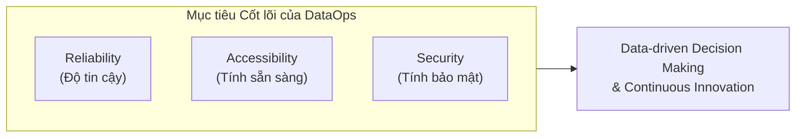
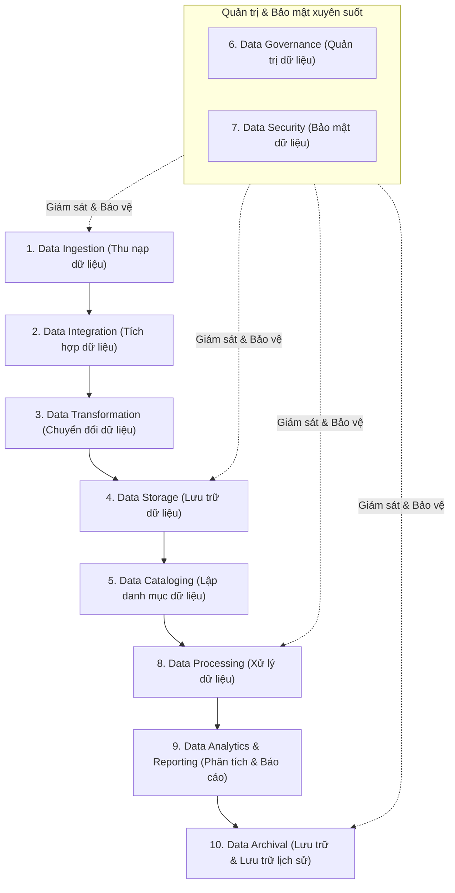
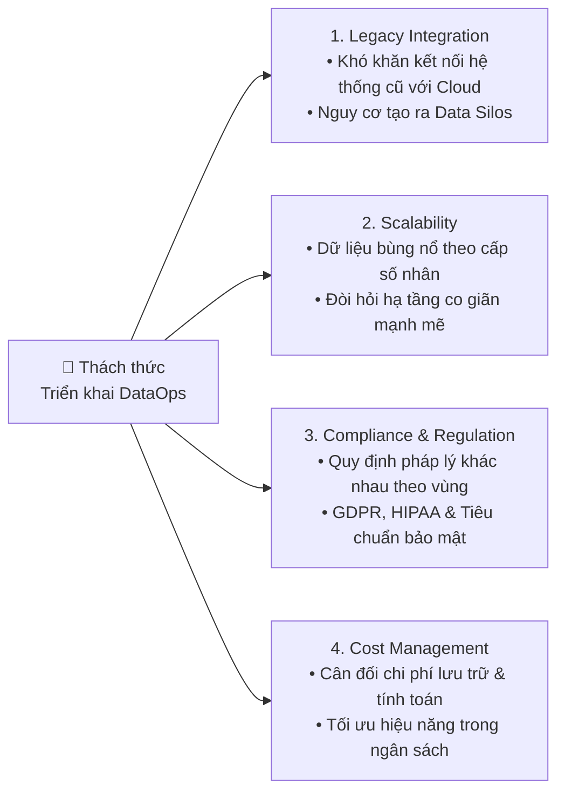

# Các Vận Hành Dữ Liệu Doanh Nghiệp Cốt Lõi (Core Enterprise Data Operations)

Tài liệu tổng hợp chi tiết và toàn diện nội dung bài học **Core Enterprise Data Operations** (Vận hành Dữ liệu Doanh nghiệp Cốt lõi) thuộc khóa học **Enterprise Data Architecture and Operations**.

---

## 1. Tổng quan về Vận hành Dữ liệu Doanh nghiệp (Enterprise Data Operations)

**Enterprise Data Operations** (DataOps) là xương sống (*backbone*) của Business Intelligence (BI) và các hệ thống phân tích hiện đại. Khái niệm này bao gồm toàn bộ các quy trình, thực tiễn (*practices*) và công cụ cần thiết để **quản trị, xử lý và điều hành dữ liệu** một cách hiệu quả xuyên suốt tổ chức.

* **Mục tiêu chiến lược**: Đảm bảo dữ liệu đáng tin cậy (*Reliability*), dễ dàng truy cập (*Accessibility*) và bảo mật tuyệt đối (*Security*), từ đó thúc đẩy việc ra quyết định dựa trên dữ liệu (*Data-driven decision making*) và liên tục đổi mới sáng tạo.

---

## 2. 10 Hoạt động Vận hành Dữ liệu Doanh nghiệp Cốt lõi (10 Core Operations)

### 1. Data Ingestion (Thu nạp Dữ liệu)
* **Khái niệm**: Bước đầu tiên trong vòng đời dữ liệu (*data lifecycle*), chịu trách nhiệm thu thập dữ liệu từ các nguồn phân tán (Databases, APIs, IoT devices, đối tác/nhà cung cấp bên ngoài) vào kho lưu trữ tập trung.
* **Phương thức**:
  * **Batch Ingestion**: Tải các khối dữ liệu lớn theo định kỳ.
  * **Stream Ingestion**: Thu nạp dữ liệu thời gian thực (*real-time*).
* **Công cụ tiêu biểu**: Apache Kafka, AWS Kinesis.
* **Lợi ích**: Tập trung hóa dữ liệu để chuẩn hóa quy trình xử lý và tạo năng lực phản ứng tức thời (*real-time dynamic decision-making*).

---

### 2. Data Integration (Tích hợp Dữ liệu)
* **Khái niệm**: Kết hợp dữ liệu từ nhiều nguồn khác nhau thành một góc nhìn thống nhất (*unified view*), cho phép truy cập liền mạch phục vụ phân tích và vận hành.
* **Mục tiêu**: Xóa bỏ các "ốc đảo dữ liệu" (*data silos*) và đảm bảo tính nhất quán của dữ liệu trên toàn hệ thống.
* **Công nghệ & Công cụ**:
  * **Middleware / ESB**: MuleSoft, Apache Camel.
  * **ETL Platforms**: Informatica, Talend.
* **Lợi ích**: Tạo điều kiện giao tiếp và luân chuyển thông tin liên phòng ban mượt mà, loại bỏ trùng lặp dữ liệu dư thừa.

---

### 3. Data Transformation (Chuyển đổi Dữ liệu)
* **Khái niệm**: Quá trình làm sạch (*cleaning*) và chuyển đổi dữ liệu thô (*raw data*) thành định dạng chuẩn hóa, sẵn sàng cho khai thác.
* **Kỹ thuật**:
  * Chuẩn hóa định dạng (*standardizing formats*), điền giá trị thiếu (*missing values*), loại bỏ mâu thuẫn/dữ liệu rác.
  * Áp dụng mô hình **ETL** (*Extract, Transform, Load*) hoặc **ELT** (*Extract, Load, Transform*).
* **Lợi ích**: Nâng cao chất lượng dữ liệu (*data quality*) và chuẩn bị dữ liệu đầu vào cho các mô hình phân tích nâng cao (*advanced analytics*).

---

### 4. Data Storage (Lưu trữ Dữ liệu)
* **Khái niệm**: Hạ tầng lưu giữ cả dữ liệu thô và dữ liệu đã qua xử lý một cách an toàn, dễ truy xuất và có khả năng mở rộng (*scalable*).
* **Các loại hình lưu trữ chính**:
  * **Data Lake**: Lưu trữ dữ liệu thô, phi cấu trúc (*unstructured*) và bán cấu trúc (*semi-structured*) (VD: Amazon S3, Azure Data Lake).
  * **Data Warehouse**: Lưu trữ dữ liệu có cấu trúc, đã được tổng hợp để phục vụ báo cáo và phân tích chuyên sâu (VD: Snowflake, Google BigQuery).
* **Lợi ích**: Cung cấp khả năng co giãn linh hoạt (*scalability*) theo dung lượng dữ liệu ngày càng tăng và đáp ứng đa dạng nhu cầu lưu trữ.

---

### 5. Data Cataloging (Lập Danh mục Dữ liệu)
* **Khái niệm**: Tổ chức, quản lý và tài liệu hóa siêu dữ liệu (*metadata*), cung cấp một bản đồ rõ ràng về toàn bộ tài sản dữ liệu (*data assets*) của doanh nghiệp.
* **Công cụ tiêu biểu**: Alation, Collibra, AWS Glue Data Catalog.
* **Lợi ích**: Hỗ trợ việc tìm kiếm và khám phá dữ liệu (*data discovery*) nhanh chóng, chính xác; thúc đẩy sự cộng tác hiệu quả giữa các nhóm dữ liệu và nghiệp vụ.

---

### 6. Data Governance (Quản trị Dữ liệu)
* **Khái niệm**: Bộ khung đảm bảo dữ liệu được quản lý có trách nhiệm, tuân thủ các quy chuẩn đạo đức và tiêu chuẩn pháp lý.
* **Thành phần cốt lõi**:
  * **Data Policies**: Chính sách truy cập, quyền hạn và mục đích sử dụng.
  * **Quality Assurance**: Quy trình kiểm định chất lượng dữ liệu liên tục.
  * **Tuân thủ pháp lý**: Đảm bảo chuẩn hóa theo các quy định như **GDPR**, **HIPAA**, CCPA.
* **Lợi ích**: Bảo vệ tính toàn vẹn (*integrity*) và độ tin cậy (*trustworthiness*) của dữ liệu trong toàn tổ chức.

---

### 7. Data Security (Bảo mật Dữ liệu)
* **Khái niệm**: Bảo vệ tài sản dữ liệu khỏi sự truy cập trái phép, rò rỉ (*data breaches*) và các hiểm họa an ninh mạng.
* **Kỹ thuật & Cơ chế**:
  * **Encryption**: Mã hóa dữ liệu ở trạng thái nghỉ (*data at rest*) và đang truyền tải (*data in transit*).
  * **RBAC (Role-Based Access Control)**: Phân quyền truy cập dựa trên vai trò.
  * **MFA (Multi-Factor Authentication)**: Xác thực đa yếu tố.
* **Lợi ích**: Giảm thiểu nguy cơ vi phạm bảo mật, bảo vệ quyền riêng tư và củng cố niềm tin của khách hàng cũng như các bên liên quan.

---

### 8. Data Processing (Xử lý Dữ liệu)
* **Khái niệm**: Thực thi các phép tính toán, chuyển đổi logic phức tạp để trích xuất tri thức hữu ích (*actionable insights*) từ dữ liệu.
* **Phân loại**:
  * **Batch Processing**: Xử lý khối lượng lớn dữ liệu theo định kỳ.
  * **Real-time Processing**: Xử lý dòng sự kiện tức thì để ra quyết định ngay lập tức (VD: Apache Flink, Spark Streaming).
* **Lợi ích**: Cung cấp thông tin kịp thời (*timely insights*) và làm nền tảng cho phân tích dự đoán (*predictive modeling*).

---

### 9. Data Analytics & Reporting (Phân tích & Báo cáo)
* **Khái niệm**: Biến đổi dữ liệu đã xử lý thành thông tin kinh doanh có giá trị hành động thông qua phân tích và trực quan hóa (*data visualization*).
* **Các cấp độ phân tích**:
  * **Descriptive Analytics**: Phân tích mô tả (chuyện gì đã xảy ra trong quá khứ).
  * **Predictive & Prescriptive Analytics**: Phân tích dự đoán và đề xuất (xu hướng tương lai và phương án hành động).
* **Công cụ tiêu biểu**: Tableau, Power BI, Qlik (trực quan hóa/dashboard); Python, R (phân tích chuyên sâu & Machine Learning).
* **Lợi ích**: Nâng tầm chiến lược kinh doanh bằng các quyết định dựa trên dữ liệu thực tế; theo dõi hiệu suất hoạt động trực quan qua dashboards.

---

### 10. Data Archival (Lưu trữ Lịch sử & Hạn định Dữ liệu)
* **Khái niệm**: Bảo toàn an toàn dữ liệu lịch sử ít còn sử dụng thường xuyên, kết hợp với chính sách lưu giữ (*retention policies*) để xác định thời hạn dữ liệu được duy trì hoặc tiêu hủy.
* **Thực hành**:
  * **Cold Storage**: Sử dụng các tầng lưu trữ chi phí thấp cho dữ liệu ít truy cập (VD: AWS Glacier, Azure Blob Archive).
  * **Policy-based Retention**: Thiết lập lịch trình tự động xóa dữ liệu lỗi thời khi hết hạn quy định.
* **Lợi ích**: Tối ưu hóa chi phí lưu trữ (*cost optimization*) và đảm bảo tuân thủ đầy đủ các yêu cầu pháp lý về lưu trữ dữ liệu.

---

## 3. Mối liên kết giữa 10 Hoạt động Vận hành

10 hoạt động cốt lõi không đứng độc lập mà tạo thành một chu trình khép kín, phối hợp hài hòa:

| Nhóm hoạt động | Các vận hành thành phần | Vai trò trong hệ thống |
| :--- | :--- | :--- |
| **Nền tảng Dữ liệu (Foundation)** | Data Ingestion & Data Integration | Xây dựng kho lưu trữ tập trung, nhất quán, phá bỏ rào cản phân mảnh. |
| **Khả dụng & Khám phá (Usability)** | Data Transformation & Data Cataloging | Đảm bảo dữ liệu sạch, có cấu trúc và dễ dàng tìm kiếm khi cần. |
| **Bảo vệ & Toàn vẹn (Integrity & Security)**| Data Governance & Data Security | Bảo vệ đường ống dữ liệu (pipeline), quyền riêng tư và tuân thủ pháp luật. |
| **Giá trị Kinh doanh (Actionable Value)** | Data Processing & Data Analytics / Reporting | Khai phá tri thức, tạo báo cáo và thúc đẩy các quyết định kinh doanh kịp thời. |
| **Bền vững & Chi phí (Sustainability)** | Data Archival & Retention | Tối ưu chi phí hạ tầng dài hạn và đảm bảo tính sẵn sàng của dữ liệu lịch sử. |

---

## 4. Các Thách thức Khi Triển khai (Implementation Challenges)

1. **Data Silos & Legacy Systems**: Việc tích hợp giữa các hệ thống cũ (*legacy systems*) với các nền tảng đám mây hiện đại rất phức tạp, dễ dẫn đến cô lập dữ liệu.
2. **Khả năng mở rộng (Scalability)**: Khối lượng dữ liệu tăng theo cấp số nhân đòi hỏi hạ tầng mạnh mẽ, linh hoạt và chi phí mở rộng lớn.
3. **Tuân thủ pháp lý đa vùng (Cross-region Compliance)**: Khung pháp lý và quy định bảo vệ dữ liệu giữa các khu vực/quốc gia có sự khác biệt lớn, tạo ra rủi ro pháp lý phức tạp.
4. **Quản lý & Cân đối chi phí (Cost vs Performance)**: Việc cân đối giữa chi phí lưu trữ, chi phí tính toán (*compute/processing costs*) với hiệu năng yêu cầu là một bài toán hóc búa cần tối ưu liên tục.
