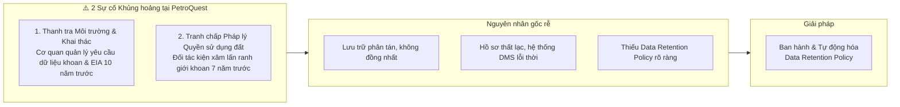
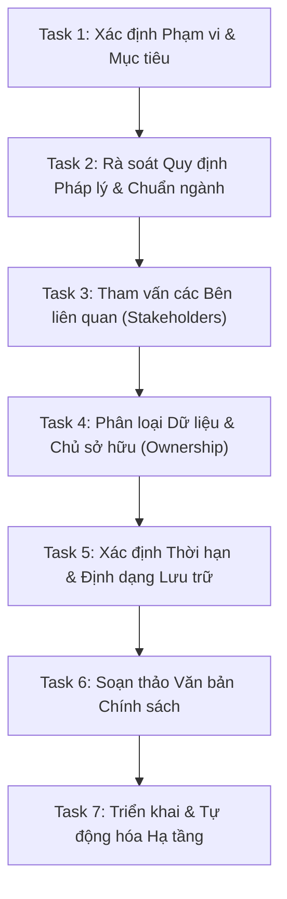
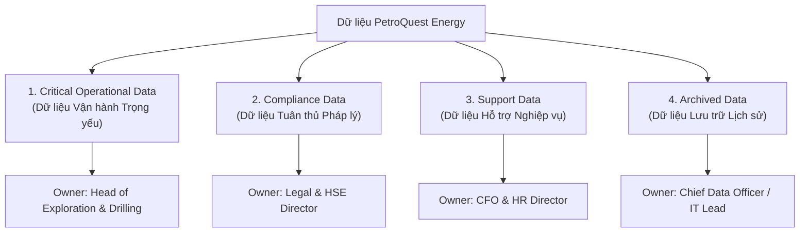
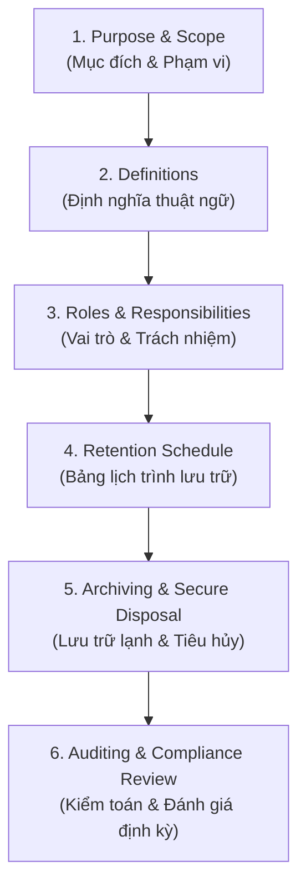

# Thực hành: Xây dựng Chính sách Lưu trữ Dữ liệu cho Công ty Thăm dò Dầu khí (Lab: Draft a Data Retention Policy for an Oil Exploration Company)

Tài liệu hướng dẫn chi tiết từng bước (*Step-by-Step*) hoàn thành bài thực hành **Draft a Data Retention Policy for an Oil Exploration Company** trong Module 2 khóa học **Enterprise Data Architecture and Operations**.

---

## 1. Tổng quan Bài thực hành (Lab Overview)

* **Thời lượng ước tính**: 30 phút.
* **Mục tiêu học tập**:
  1. Ứng dụng các nguyên lý lưu trữ và vòng đời dữ liệu (*Data Retention & Lifecycle Principles*) vào vận hành thực tế.
  2. Xây dựng một bản Chính sách Lưu trữ Dữ liệu (*Data Retention Policy*) hoàn chỉnh, chặt chẽ cho doanh nghiệp thăm dò & khai thác dầu khí.
  3. Đảm bảo sự cân bằng giữa **Tuân thủ pháp lý (Compliance)**, **Yêu cầu vận hành (Operational needs)** và **Tối ưu chi phí doanh nghiệp (Cost efficiency)**.

---

## 2. Bối cảnh Tình huống (Scenario: PetroQuest Energy)

**PetroQuest Energy** là một công ty thăm dò và khai thác dầu khí (*Exploration & Production - E&P*). Doanh nghiệp sở hữu khối lượng dữ liệu khổng lồ từ khảo sát địa chấn (*seismic surveys*), nhật ký khoan (*well logs*), đánh giá tác động môi trường (*EIA*), dữ liệu không gian địa lý (*geospatial/GIS*), giao dịch tài chính và hồ sơ tuân thủ an toàn.

* **Cuộc khủng hoảng hiện tại**:
  1. *Yêu cầu thanh tra*: Cơ quan nhà nước yêu cầu cung cấp dữ liệu khoan và báo cáo môi trường của một dự án ngoài khơi từ **10 năm trước**. Công ty không tìm thấy do hệ thống lưu trữ phân tán, hồ sơ thất lạc.
  2. *Tranh chấp đất đai*: Bị kiện vì cáo buộc khoan vượt ranh giới cho phép từ **7 năm trước**, đối phương yêu cầu trích xuất dữ liệu địa không gian (*GIS*) và tọa độ khoan. Công ty không thể chứng minh sự vô tội kịp thời, đối mặt với án phạt nặng và mất uy tín.

---

## 3. Hướng dẫn Thực hiện Chi tiết Từng bước (Step-by-Step Guide)

---

### Task 1: Xác định Phạm vi và Mục tiêu (Scope & Objectives)

#### Step 1: Nhận diện các loại dữ liệu do công ty quản lý
Dữ liệu của công ty dầu khí được chia thành các nhóm nghiệp vụ chính:
* **Dữ liệu Khảo sát Địa chất & Địa chấn (Geological & Seismic Data)**: Dữ liệu sóng địa chấn 2D/3D/4D, bản đồ tầng chứa (*reservoir models*).
* **Dữ liệu Hoạt động Khoan & Khai thác (Drilling & Well Operations)**: Nhật ký giếng (*well logs*), báo cáo khoan hàng ngày (*daily drilling reports - DDR*), mẫu lõi (*core samples*), áp suất giếng.
* **Dữ liệu Môi trường & Bền vững (Environmental Impact & Safety - HSE)**: Báo cáo đánh giá tác động môi trường (EIA), hồ sơ xả thải, báo cáo sự cố tràn dầu/hóa chất, giám sát khí thải.
* **Dữ liệu Không gian Địa lý & Pháp lý Đất đai (Geospatial & Land Rights)**: Bản đồ GIS ranh giới mỏ, hợp đồng thuê đất, giấy phép tô nhượng (*concession licenses*).
* **Dữ liệu Tài chính & Kế toán (Financial & Transactions)**: Hóa đơn, chi phí CAPEX/OPEX mỏ dầu, kiểm toán, chứng từ nộp thuế tài nguyên.
* **Dữ liệu An toàn Lao động (Health & Safety - OSHA)**: Nhật ký an toàn lao động, kiểm định thiết bị áp lực, hồ sơ y tế nghề nghiệp.

#### Step 2: Xác định mục tiêu của chính sách (Policy Objectives)
1. **Đảm bảo tuân thủ pháp lý 100%**: Đáp ứng các quy định của cơ quan quản lý năng lượng, môi trường, an toàn lao động và tài chính.
2. **Sẵn sàng ứng phó tố tụng (Legal Hold & Litigation Readiness)**: Đảm bảo khả năng truy xuất chứng cứ và dữ liệu lịch sử nhanh chóng khi có tranh chấp đất đai hoặc hợp đồng.
3. **Tối ưu hóa chi phí lưu trữ hạ tầng**: Tự động chuyển dữ liệu cũ sang tầng lưu trữ lạnh (*cold storage*) và tiêu hủy dữ liệu hết hạn một cách an toàn, tránh lãng phí (*data hoarding*).
4. **Bảo toàn tài sản trí tuệ và thông tin địa chất**: Lưu giữ vĩnh viễn hoặc dài hạn các dữ liệu khảo sát có giá trị tái khai thác cao.

---

### Task 2: Rà soát Quy định Pháp lý & Chuẩn ngành (Review Applicable Regulations)

#### Step 1: Nghiên cứu các quy định hiện hành

| Lĩnh vực | Bộ luật / Tiêu chuẩn Quy định | Yêu cầu Lưu trữ & Tuân thủ |
| :--- | :--- | :--- |
| **Môi trường (Environmental)** | EPA (Environmental Protection Agency) / BSEE | Báo cáo đánh giá tác động môi trường, sự cố tràn dầu, đo đạc ô nhiễm phải lưu **tối thiểu 10 – 30 năm** (hoặc suốt vòng đời mỏ). |
| **An toàn Lao động (HSE)** | OSHA (Occupational Safety & Health) | Hồ sơ phơi nhiễm độc hại và tai nạn lao động phải lưu **suốt thời gian làm việc + 30 năm**. |
| **Tài chính & Thuế (Finance)** | SOX (Sarbanes-Oxley Act), IRS, SEC | Báo cáo tài chính, chứng từ kiểm toán, chi phí khấu hao tài sản giếng lưu **tối thiểu 7 năm**. |
| **Bảo vệ Dữ liệu (Privacy)** | GDPR, CCPA | Thông tin cá nhân của nhân viên/nhà thầu chỉ lưu khi còn mục đích hợp pháp, xóa khi hết hạn. |
| **Khai thác Năng lượng (Energy/O&G)** | BOEM / BSEE / Bộ Tài nguyên Môi trường | Dữ liệu tọa độ giếng khoan, lịch sử hoàn thiện giếng lưu **suốt vòng đời giếng + 10 năm sau khi trám hủy giếng (P&A)**. |

#### Step 2: Bảng tổng hợp thời hạn lưu trữ theo luật định
* *Dữ liệu khoan và môi trường mỏ*: **10 - 20 năm** hoặc vĩnh viễn.
* *Dữ liệu trắc địa, quyền đất đai (Land Rights)*: **Vĩnh viễn (Permanent)** trong suốt thời hạn quyền khai thác + 10 năm sau chuyển nhượng.
* *Dữ liệu tài chính & hợp đồng*: **7 năm**.

---

### Task 3: Tham vấn các Bên liên quan (Conduct Stakeholder Consultations)

| Bộ phận (Stakeholder) | Mục đích Tham vấn | Nhu cầu & Thách thức ghi nhận |
| :--- | :--- | :--- |
| **IT & Data Management Team** | Đánh giá năng lực hệ thống, dung lượng lưu trữ và công cụ tự động hóa. | Hệ thống cũ phân mảnh, dung lượng lưu trữ nóng tốn kém, cần chính sách để chuyển dữ liệu cũ sang Cloud Cold Storage. |
| **Legal & Compliance Team** | Xác định nghĩa vụ pháp lý, yêu cầu bảo lưu chứng cứ khi có kiện tụng (*Legal Hold*). | Cần đảm bảo dữ liệu địa chính và môi trường phải trích xuất được trong vòng 48 giờ khi có lệnh tòa án. |
| **E&P / Geoscience & Drilling Units** | Hiểu chu kỳ sử dụng dữ liệu địa chấn, nhật ký giếng phục vụ tái thăm dò. | Dữ liệu thô địa chấn cực lớn (hàng TB/PB), cần lưu trữ lâu dài nhưng sau 2 năm đầu ít khi truy cập hàng ngày. |
| **Finance & Accounting Team** | Rà soát thời hạn kiểm toán hóa đơn, hợp đồng thầu phụ. | Cần lưu giữ toàn bộ chứng từ liên quan đến quyết toán chi phí giếng trong 7 năm. |
| **HSE Team** | Quản lý hồ sơ sự cố môi trường và sức khỏe nhân viên giàn khoan. | Báo cáo kiểm định an toàn và quan trắc môi trường phải lưu giữ đối chiếu qua nhiều thập kỷ. |

---

### Task 4: Phân loại Dữ liệu & Phân bổ Quyền sở hữu (Categorize Data)

1. **Critical Operational Data (Dữ liệu Vận hành Trọng yếu)**:
   * *Bao gồm*: Dữ liệu địa chấn thô (*Raw Seismic*), Nhật ký giếng (*Well logs*), Mô hình mô phỏng mỏ, Tọa độ GPS giếng khoan.
   * *Data Owner*: Trưởng phòng Thăm dò & Khai thác (VP of Exploration).
2. **Compliance Data (Dữ liệu Tuân thủ)**:
   * *Bao gồm*: Báo cáo tác động môi trường (EIA), Báo cáo xả thải, Hồ sơ tai nạn lao động OSHA, Giấy phép khai thác.
   * *Data Owner*: Giám đốc Pháp chế & Trưởng ban An toàn Môi trường (HSE Lead).
3. **Support Data (Dữ liệu Hỗ trợ Nghiệp vụ)**:
   * *Bao gồm*: Hợp đồng nhà thầu phụ, Hóa đơn mua sắm vật tư giàn khoan, Hồ sơ nhân sự dự án, Báo cáo tài chính nội bộ.
   * *Data Owner*: Giám đốc Tài chính (CFO) & Giám đốc Nhân sự (CHRO).
4. **Archived Data (Dữ liệu Lưu trữ Lịch sử)**:
   * *Bao gồm*: Dữ liệu giếng đã đóng (Plugged & Abandoned), Dữ liệu khảo sát từ các dự án đã kết thúc trên 5 năm.
   * *Data Owner*: Trưởng bộ phận Quản trị Dữ liệu (Enterprise Data Architect / CDO).

---

### Task 5: Xác định Thời hạn & Định dạng Lưu trữ (Define Retention Periods)

| Hạng mục Dữ liệu | Thời hạn Lưu trữ (Retention Period) | Định dạng (Format) | Tầng Lưu trữ & Hệ thống (Storage Tier) |
| :--- | :--- | :--- | :--- |
| **Dữ liệu Địa chấn & Nhật ký Giếng (Seismic & Well Logs)** | **Vĩnh viễn (Permanent)** hoặc Vòng đời mỏ + 20 năm | Digital (SEGY, LAS, DLIS files) | Hot Storage (2 năm đầu) $\rightarrow$ Cloud Cold/Archive (AWS S3 Glacier Deep Archive) |
| **Báo cáo Môi trường & Xả thải (EIA & Waste Reports)** | **15 năm** kể từ ngày kết thúc dự án | Digital (PDF/A, Scanned) + Bản cứng gốc | Document Management System (DMS) + Kho lưu trữ bản cứng an toàn |
| **Hồ sơ Ranh giới Đất & Quyền khai thác (Land Rights & GIS)** | **Vĩnh viễn (Permanent)** | Digital (GIS shapefiles) + Bản công chứng | Enterprise GIS Cloud + Safe Vault lưu trữ hợp đồng gốc |
| **Dữ liệu An toàn Lao động (OSHA Health Records)** | **Thời gian làm việc + 30 năm** | Digital (Mã hóa) | Hệ thống Quản trị Nhân sự & Y tế (Bảo mật cao) |
| **Hồ sơ Tài chính & Quyết toán Giếng (SOX/Invoices)** | **7 năm** | Digital (PDF, ERP Data) | Financial ERP (SAP/Oracle) + Tầng lưu trữ Cold sau 2 năm |
| **Báo cáo Vận hành Hàng ngày (Daily Drilling Reports)** | **10 năm** sau khi giếng hoàn tất | Digital (Database records) | Centralized Data Lake / Warehouse |

---

### Task 6: Xây dựng Cấu trúc Văn bản Chính sách (Policy Structure)

Một văn bản chính sách lưu trữ dữ liệu chuẩn hóa gồm 6 phần cốt lõi:

1. **Mục đích & Phạm vi (Purpose & Scope)**: Nêu rõ mục đích bảo vệ dữ liệu, chống rủi ro pháp lý và áp dụng cho toàn thể nhân viên, nhà thầu của PetroQuest Energy.
2. **Định nghĩa (Definitions)**: Giải thích rõ *Data Lifecycle, Hot Storage, Cold Storage, Legal Hold, Data Owner*.
3. **Vai trò & Trách nhiệm (Roles & Responsibilities)**:
   * **CTO/CDO**: Phê duyệt chính sách và hạ tầng kỹ thuật.
   * **Legal Counsel**: Kích hoạt quy trình *Legal Hold* (tạm dừng xóa dữ liệu khi có tranh chấp).
   * **Data Stewards**: Giám sát phân loại và dán nhãn dữ liệu.
4. **Bảng Lịch trình Lưu trữ (Retention Schedule)**: Bảng chi tiết mapping từng loại dữ liệu với thời hạn lưu trữ cụ thể (đã xây dựng ở Task 5).
5. **Quy trình Lưu trữ và Tiêu hủy An toàn (Archiving & Disposal)**:
   * Sau khi hết thời gian sử dụng tích cực: Chuyển tự động sang lưu trữ lạnh.
   * Sau khi hết hạn lưu trữ quy định: Tiêu hủy bằng phương pháp ghi đè an toàn (*Cryptographic Erasure / DoD 5220.22-M*) đối với file số và nghiền/đốt đối với bản cứng.
   * **Ngoại lệ Legal Hold**: Nghiêm cấm tiêu hủy nếu dữ liệu đang thuộc diện tranh tụng hoặc điều tra.
6. **Kiểm toán & Cập nhật Chính sách (Audit & Policy Review)**: Định kỳ rà soát 1 năm/lần hoặc khi có thay đổi luật định.

---

### Task 7: Triển khai & Tự động hóa Chính sách (Implement the Policy)

#### 1. Đào tạo & Truyền thông nội bộ (Rollout & Training)
* Tổ chức các buổi hội thảo hướng dẫn nhân viên cách dán nhãn (*tagging/metadata*) dữ liệu khi tạo mới (VD: gắn tag dự án, ngày tạo, loại dữ liệu).
* Phổ biến quy trình *Legal Hold* cho toàn bộ phòng ban liên quan.

#### 2. Tích hợp Kỹ thuật & Tự động hóa Hạ tầng (Technical Automation)
* **Quy tắc Vòng đời Tự động (Lifecycle Automation Rules)** trên AWS S3 / Azure Blob:
  * *Day 0 - Day 90*: S3 Standard (Hot tier - Phân tích, khoan thực tế).
  * *Day 91 - Day 730 (2 năm)*: S3 Standard-IA (Infrequent Access - Ít truy cập).
  * *Day 731 - Year 10*: S3 Glacier Flexible / Deep Archive (Cold tier - Lưu trữ lịch sử giá rẻ).
  * *After Year 10*: Tự động gửi thông báo kiểm duyệt trước khi kích hoạt quy trình xóa dữ liệu (nếu không có cờ *Legal Hold*).
* **Cảnh báo Thông minh (Automated Alerts)**: Gửi thông báo đến Data Owner trước 60 ngày khi dữ liệu chuẩn bị đến hạn tiêu hủy.
* **Theo dõi Hiệu quả (Metrics & Dashboard)**: Đo lường dung lượng lưu trữ tiết kiệm được (*Storage cost reduction*) và tỷ lệ tuân thủ (*Compliance Rate*).

---

## 4. Tóm tắt Giá trị Đạt được từ Bài thực hành

1. **Giải quyết triệt để sự cố của PetroQuest**: Thiết lập hệ thống lưu trữ tập trung, có thể tra cứu tức thì hồ sơ khoan 10 năm trước và dữ liệu không gian địa lý 7 năm trước để bảo vệ quyền lợi công ty.
2. **Chuẩn hóa quy trình doanh nghiệp**: Chuyển đổi từ mô hình lưu trữ tự phát, manh mún sang mô hình tự động hóa có chính sách và công cụ giám sát rõ ràng.
3. **Cân đối chi phí & An toàn thông tin**: Tiết kiệm hàng triệu USD chi phí lưu trữ đám mây nhờ chuyển dịch dữ liệu sang tầng Archive đúng hạn, đồng thời loại trừ rủi ro phạt vi phạm pháp luật.
