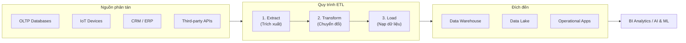
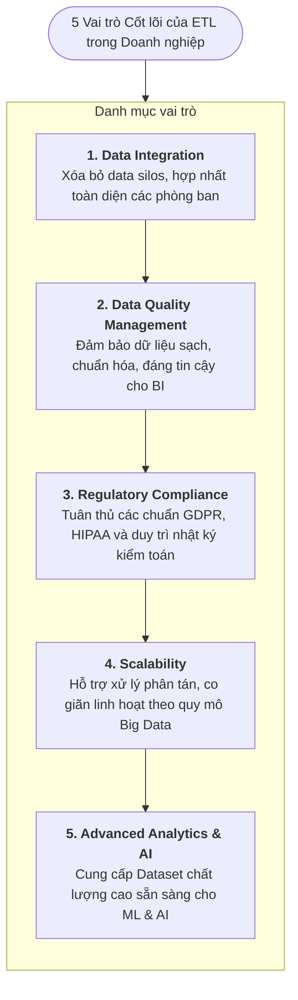

# ETL trong Doanh nghiệp (ETL in the Enterprise)

---

## 1. Tổng quan & Mục đích của ETL

* **Bối cảnh**: Doanh nghiệp đối mặt với bài toán **3V** (*Volume, Velocity, Variety*) khi dữ liệu phân tán ở nhiều hệ thống dị thể (OLTP, IoT, CRM, Third-party).
* **Định nghĩa**: **ETL** (*Extract - Transform - Load*) là quy trình cốt lõi kết hợp **Tích hợp dữ liệu (Integration)** $\rightarrow$ **Phân tích (Analytics)** $\rightarrow$ **Ra quyết định (Decision-making)**.

---

## 2. Ba giai đoạn cốt lõi của ETL

```mermaid
flowchart LR
    subgraph Phase1 ["1. Extract (Trích xuất)"]
        direction TB
        E1["• Có cấu trúc (Oracle, SQL Server)"]
        E2["• Bán cấu trúc (JSON, XML, Logs)"]
        E3["• Phi cấu trúc (Emails, Docs)"]
        E4["• Công nghệ: JDBC/ODBC, APIs, NiFi"]
    end

    subgraph Phase2 ["2. Transform (Chuyển đổi)"]
        direction TB
        T1["• Cleaning (Khử trùng, điền null)"]
        T2["• Standardization (Chuẩn format/type)"]
        T3["• Enrichment (Thêm context/metadata)"]
        T4["• Aggregation (Tính tổng, trung bình)"]
    end

    subgraph Phase3 ["3. Load (Nạp dữ liệu)"]
        direction TB
        L1["• Batch (Theo lô định kỳ)"]
        L2["• Incremental / CDC (Gia tăng)"]
        L3["• Real-time Streaming (Thời gian thực)"]
        L4["• Đích: Snowflake, BigQuery, S3, CRM"]
    end

    Phase1 ==> Phase2 ==> Phase3
```

### 2.1. Extract (Trích xuất)
* **Đối tượng**: Dữ liệu có cấu trúc (*RDBMS*), bán cấu trúc (*JSON, XML, Logs*) và phi cấu trúc (*Email, Docs*).
* **Công nghệ**: JDBC/ODBC, REST APIs, Apache NiFi, Informatica.
* **Thách thức**: Sự phân mảnh nguồn dữ liệu (*Source diversity*) & yêu cầu trích xuất độ trễ thấp (*Real-time needs*).

### 2.2. Transform (Chuyển đổi)
* **4 bước xử lý**:
  1. **Data Cleaning**: Khử trùng lặp (*deduplication*), điền missing values, sửa lỗi dữ liệu.
  2. **Data Standardization**: Đồng nhất định dạng thời gian, múi giờ, đơn vị tiền tệ.
  3. **Data Enrichment**: Bổ sung ngữ cảnh và thuộc tính giá trị gia tăng.
  4. **Data Aggregation**: Tính toán tổng hợp (totals, averages, KPIs).
* **Công cụ/Ngôn ngữ**: Python, SQL, Apache Spark, Talend, Informatica.
* **Thách thức**: Đảm bảo toàn vẹn dữ liệu quy mô lớn & xử lý thay đổi cấu trúc nguồn (*Schema drift*).

### 2.3. Load (Nạp dữ liệu)
* **Đích đến**: Data Warehouse (Snowflake, BigQuery), Data Lake (S3, ADLS), Operational Systems (CRM, ERP).
* **3 Chiến lược nạp (*Loading Strategies*)**:

| Chiến lược | Cơ chế hoạt động | Use case tiêu biểu |
| :--- | :--- | :--- |
| **Batch Loading** | Nạp khối lượng lớn theo chu kỳ định kỳ (ngày/tuần). | Dữ liệu lịch sử, báo cáo tài chính/kế toán. |
| **Incremental Loading (CDC)** | Chỉ nạp bản ghi mới hoặc có thay đổi (*Change Data Capture*). | Tối ưu tài nguyên/băng thông, cập nhật liên tục. |
| **Real-time Streaming** | Đẩy dữ liệu vào đích ngay khi phát sinh. | Phát hiện gian lận, cảnh báo IoT, Live Dashboard. |

---

## 3. Vai trò của ETL trong Doanh nghiệp

---

## 4. Các công cụ ETL phổ biến

| Công cụ | Điểm mạnh cốt lõi | Môi trường phù hợp |
| :--- | :--- | :--- |
| **Informatica** | Chuẩn Enterprise hàng đầu, quản trị metadata và data governance mạnh mẽ. | Doanh nghiệp lớn, hệ thống phức tạp. |
| **Talend** | Mã nguồn mở/thương mại, linh hoạt, thư viện connector phong phú. | Môi trường đa dạng, cần sinh code Java/Spark. |
| **Apache Spark** | Framework xử lý phân tán trong bộ nhớ (*In-memory distributed*). | Big Data quy mô lớn, xử lý phức tạp. |
| **AWS Glue** | Serverless fully-managed ETL, tích hợp native AWS (S3, Redshift). | Hệ sinh thái AWS Cloud. |
| **Microsoft SSIS** | Nằm trong bộ Microsoft SQL Server, chi phí và tích hợp tối ưu. | Hạ tầng thuần Microsoft Stack. |
