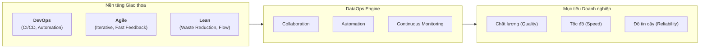
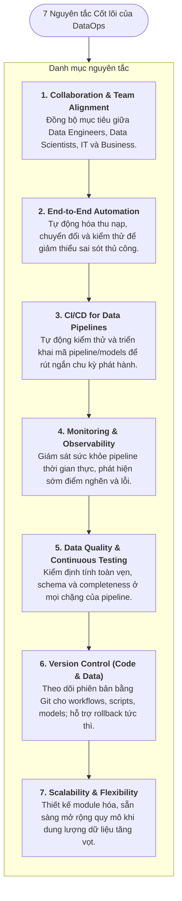
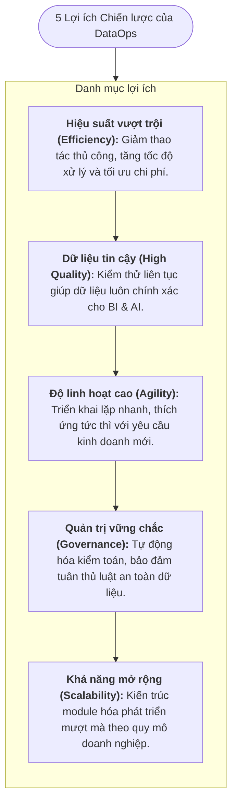

# Thực hành DataOps (The Practice of DataOps)

---

## 1. Tổng quan & Mục đích của DataOps

* **Bối cảnh**: Cách tiếp cận vận hành dữ liệu truyền thống thường chậm chạp, thiếu cộng tác liên phòng ban và khó bắt kịp tốc độ thay đổi của nghiệp vụ trước bài toán **3V** (*Volume, Variety, Velocity*).
* **Định nghĩa**: **DataOps** (*Data Operations*) là phương pháp luận được thiết kế nhằm nâng cao **Chất lượng (Quality)**, **Tốc độ (Speed)** và **Độ tin cậy (Reliability)** của các quy trình dữ liệu trong doanh nghiệp.
* **Nguồn gốc giao thoa**: DataOps kết hợp các nguyên lý từ **DevOps** (CI/CD, tự động hóa), **Agile** (lặp nhanh, thích ứng linh hoạt) và **Lean Manufacturing** (loại bỏ lãng phí, tối ưu luồng giá trị).

---

## 2. Bảy nguyên tắc cốt lõi của DataOps (7 Core Principles)

---

## 3. Kết quả then chốt DataOps mang lại (Key Outcomes)

DataOps hỗ trợ tổ chức đạt được 5 kết quả vận hành quan trọng:

1. **Tinh gọn luồng dữ liệu (*Streamlined Data Pipelines*)**: Tối ưu luồng dữ liệu xuyên suốt từ Ingestion $\rightarrow$ Transformation $\rightarrow$ Storage $\rightarrow$ Consumption; giảm độ trễ (*latency*) và hỗ trợ phân tích thời gian thực.
2. **Nâng cao chất lượng dữ liệu (*Enhanced Data Quality*)**: Kiểm định và giám sát dữ liệu chủ động ở mọi giai đoạn, ngăn chặn lỗi dữ liệu lan truyền sang báo cáo BI.
3. **Phản ứng linh hoạt với nghiệp vụ (*Agile Response to Business Needs*)**: Phân rã bài toán thành các gói phát hành nhỏ theo chu kỳ ngắn (*incremental delivery*), đáp ứng nhanh nhu cầu thay đổi.
4. **Xóa bỏ rào cản phòng ban (*Breaking Down Silos*)**: 
   * **Data Engineers**: Xây dựng & bảo trì hạ tầng pipeline ổn định.
   * **Data Scientists**: Phát triển mô hình ML & thuật toán dự báo.
   * **Business Analysts**: Khai thác dữ liệu để tạo insights ra quyết định kinh doanh.
5. **Quản trị & Tuân thủ pháp lý (*Governance & Compliance*)**: Tích hợp sẵn theo dõi nguồn gốc dữ liệu (*Lineage Tracking*) và nhật ký kiểm toán (*Audit Trails*) tuân thủ **GDPR**, **CCPA**.

---

## 4. Hệ sinh thái Công cụ & Công nghệ DataOps

| Lĩnh vực chức năng | Nhóm công cụ tiêu biểu | Vai trò chính |
| :--- | :--- | :--- |
| **Pipeline Orchestration** | Apache Airflow, Luigi, Prefect | Lập lịch, điều phối và quản lý luồng thực thi pipeline phức tạp. |
| **Data Integration (ETL/ELT)** | Talend, Informatica, Apache NiFi | Kết nối, trích xuất và chuyển đổi dữ liệu từ các nguồn dị thể. |
| **Data Quality & Testing** | Great Expectations, dbt | Viết test case tự động kiểm tra tính đúng đắn của dữ liệu và schema. |
| **Monitoring & Observability** | Monte Carlo, Datadog, Splunk | Giám sát sức khỏe luồng dữ liệu, cảnh báo bất thường thời gian thực. |
| **Version Control & CI/CD** | Git, GitHub, Bitbucket, Jenkins | Quản lý phiên bản mã nguồn, script, mô hình và tự động hóa build/deploy. |
| **Scalable Infrastructure** | AWS, Google Cloud (GCP), Microsoft Azure | Cung cấp hạ tầng lưu trữ (Data Lake/Warehouse) và điện toán co giãn. |

---

## 5. Tóm tắt Lợi ích cốt lõi (Core Benefits)

