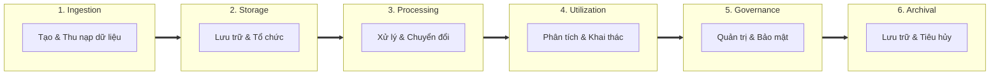

# Vòng đời Dữ liệu Doanh nghiệp (Data Lifecycle)

---

## 1. Tổng quan về Vòng đời Dữ liệu trong DataOps

* **Mục tiêu**: Chuyển hóa dữ liệu thô (*raw data*) thành thông tin chi tiết hữu ích (*actionable insights*) phục vụ ra quyết định kinh doanh, đồng thời đảm bảo dữ liệu luôn **sẵn sàng (available)**, **chính xác (accurate)** và **bảo mật (secure)** ở mọi giai đoạn.
* **6 Giai đoạn cốt lõi**:
  1. Data Creation & Ingestion (Tạo & Thu nạp)
  2. Data Storage & Organization (Lưu trữ & Tổ chức)
  3. Data Processing & Transformation (Xử lý & Chuyển đổi)
  4. Data Analysis & Utilization (Phân tích & Khai thác)
  5. Data Governance & Security (Quản trị & Bảo mật)
  6. Data Archival & Destruction (Lưu trữ lịch sử & Tiêu hủy an toàn)

---

## 2. Chi tiết 6 Giai đoạn & Thực tiễn Cốt lõi (Key Practices)

```mermaid
flowchart TD
    Root(["6 Giai đoạn Vòng đời Dữ liệu (Data Lifecycle)"])

    subgraph Stages ["Nội dung & Thực tiễn theo từng giai đoạn"]
        direction TB
        G1["<b>1. Data Creation & Ingestion (Tạo & Thu nạp)</b><br/>• Nguồn: OLTP, IoT, Social Media, CRM, Third-party.<br/>• Thực tiễn: Dùng ETL/ELT pipelines, áp dụng validation rules kiểm tra chất lượng đầu vào, hỗ trợ streaming real-time."]
        
        G2["<b>2. Data Storage & Organization (Lưu trữ & Tổ chức)</b><br/>• Hạ tầng: Data Lake, Data Warehouse, RDBMS.<br/>• Thực tiễn: Lập danh mục siêu dữ liệu (Data Cataloging), kiến trúc lưu trữ phân tầng (Multi-tiered Storage: Hot/Cold), sẵn sàng tuân thủ GDPR/HIPAA."]
        
        G3["<b>3. Data Processing & Transformation (Xử lý & Chuyển đổi)</b><br/>• Nhiệm vụ: Làm sạch, chuẩn hóa, làm giàu ngữ cảnh (enrichment).<br/>• Thực tiễn: Tự động hóa qua CI/CD data pipelines, tích hợp thuật toán ML/AI, xây dựng cơ chế xử lý lỗi (error handling) chủ động."]
        
        G4["<b>4. Data Analysis & Utilization (Phân tích & Khai thác)</b><br/>• Mục tiêu: Dashboard BI, báo cáo, mô hình dự báo.<br/>• Thực tiễn: Dân chủ hóa dữ liệu (Data Democratization / Self-service), tối ưu hóa truy vấn/mô hình dữ liệu, tạo feedback loop để cải tiến thu nạp."]
        
        G5["<b>5. Data Governance & Security (Quản trị & Bảo mật)</b><br/>• Mục tiêu: Sử dụng dữ liệu có trách nhiệm, đạo đức và đúng luật.<br/>• Thực tiễn: Phân quyền truy cập RBAC & Nguyên tắc đặc quyền tối thiểu (Least Privilege), duy trì Audit Logs & Lineage, mặt nạ hóa dữ liệu (Data Masking, Anonymization, Encryption)."]
        
        G6["<b>6. Data Archival & Destruction (Lưu trữ & Tiêu hủy)</b><br/>• Mục tiêu: Tối ưu chi phí lưu trữ khi dữ liệu cũ/ít dùng và giảm thiểu rủi ro rò rỉ.<br/>• Thực tiễn: Thiết lập Retention Policy rõ ràng, chuyển sang Cold Storage giá rẻ, tiêu hủy an toàn bằng xóa mã hóa (Cryptographic Erasure)."]

        G1 --> G2 --> G3 --> G4 --> G5 --> G6
    end

    Root --> Stages
```

---

## 3. Bảng tổng hợp Thực tiễn Vận hành (DataOps Practices Matrix)

| Giai đoạn | Mục đích chính | Thực tiễn cốt lõi (*Key Practices*) |
| :--- | :--- | :--- |
| **1. Creation & Ingestion** | Thu nạp đa dạng định dạng (Structured, Semi, Unstructured). | • Tích hợp ETL/ELT tự động. • Kiểm tra chất lượng dữ liệu tại cổng vào. • Hỗ trợ Real-time Streaming cho giám sát/cảnh báo. |
| **2. Storage & Organization** | Lưu trữ có cấu trúc, dễ truy xuất và mở rộng. | • Data Cataloging quản lý metadata. • Multi-tiered Storage (cân bằng hiệu năng & chi phí). • Thiết lập kiểm soát truy cập định kỳ chuẩn GDPR/HIPAA. |
| **3. Processing & Transformation** | Biến đổi dữ liệu thô thành định dạng hữu dụng. | • Tự động hóa qua CI/CD Pipelines. • Làm giàu dữ liệu bằng ML/AI & External data. • Robust Error Handling bảo vệ tính toàn vẹn. |
| **4. Analysis & Utilization** | Tạo thông tin chi tiết hỗ trợ ra quyết định. | • Dân chủ hóa dữ liệu (*Self-service analytics*). • Tối ưu hiệu năng truy vấn và mô hình. • Tạo Feedback loop phản hồi cho khâu thu nạp. |
| **5. Governance & Security** | Đảm bảo tính minh bạch, an toàn và tuân thủ. | • Quản lý truy cập theo vai trò (**RBAC**) & **Least Privilege**. • Ghi vết kiểm toán (**Audit Trails & Access Logs**). • Kỹ thuật bảo vệ: **Data Masking, Anonymization, Encryption**. |
| **6. Archival & Destruction** | Quản lý vòng đời cuối, tối ưu chi phí & tuân thủ. | • Thiết lập chính sách lưu giữ (*Retention Policy*). • Lưu trữ dài hạn tại Cold Storage. • Tiêu hủy an toàn bằng **Cryptographic Erasure**. |
