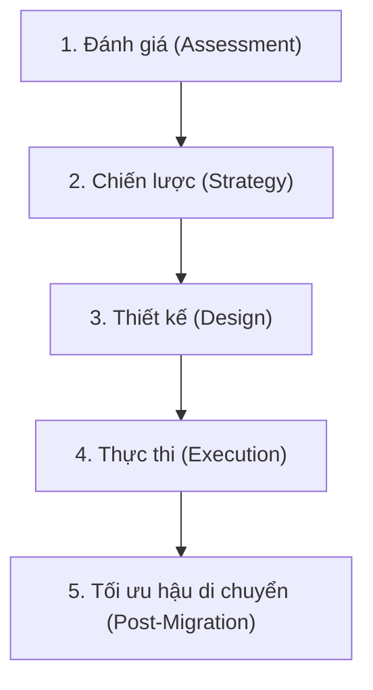

# Lập kế hoạch Di chuyển Dữ liệu và Hệ thống (Planning for Migrations)

## 1. Động lực thúc đẩy di chuyển hệ thống (Migration Drivers)
- **Hệ thống hết vòng đời hỗ trợ (End-of-Life - EOL):** Các hệ thống legacy sắp hoặc đã ngừng được nhà cung cấp hỗ trợ.
- **Chi phí vận hành cao (High Operational Costs):** Duy trì và bảo trì hạ tầng on-premises cũ kỹ tốn kém tài nguyên.
- **Khả năng mở rộng hạn chế (Limited Scalability):** Hệ thống truyền thống khó mở rộng đáp ứng lưu lượng tăng đột biến.
- **Mục tiêu đổi mới sáng tạo (Innovation Goals):** Mở đường để áp dụng các công nghệ hiện đại như AI/Machine Learning, Serverless, Big Data Analytics.

---

## 2. Các giai đoạn chính trong quy trình lập kế hoạch di chuyển (Migration Planning Phases)

### Giai đoạn 1: Đánh giá (Assessment Phase)
- **Phân tích kho tài nguyên (Inventory Analysis):** Lập tài liệu danh mục toàn bộ ứng dụng, dữ liệu và thành phần hạ tầng hiện có.
- **Lập bản đồ phụ thuộc (Dependency Mapping):** Xác định mối quan hệ phụ thuộc giữa các hệ thống để tránh downtime bất ngờ.
- **Phân loại ưu tiên khối lượng công việc (Workload Prioritization):** Xếp hạng khối lượng công việc dựa trên độ phức tạp, tính quan trọng nghiệp vụ và tiềm năng hiện đại hóa.
- *Công cụ hỗ trợ:* AWS Application Discovery Service, Azure Migrate,...

### Giai đoạn 2: Xác định chiến lược (Strategy Phase)
- **Lựa chọn phương pháp di chuyển (Migration Approaches - "Rs"):**
  - *Re-hosting (Lift & Shift):* Chuyển nguyên trạng lên đám mây.
  - *Re-platforming (Lift, Tinker & Shift):* Tối ưu hóa một vài thành phần mà không đổi kiến trúc cốt lõi.
  - *Refactoring / Re-architecting:* Viết lại kiến trúc hướng Cloud-Native/Microservices.
  - *Rebuilding:* Xây dựng lại ứng dụng hoàn toàn từ đầu.
- **Xác định môi trường đích (Target Environment):** Cloud-native, Hybrid Cloud, hoặc Multi-cloud.
- **Thiết lập chỉ số đo lường (KPIs / Success Metrics):** Cải thiện hiệu năng, mức tiết kiệm chi phí, giảm độ phức tạp vận hành.

### Giai đoạn 3: Thiết kế kế hoạch di chuyển (Design Phase)
- **Di chuyển theo giai đoạn (Phased Migration):** Bắt đầu với các hệ thống ít quan trọng trước khi chuyển các hệ thống trọng yếu (mission-critical).
- **Chiến lược di chuyển dữ liệu (Data Migration Strategy):** Thiết kế phương thức truyền dữ liệu bảo mật (mã hóa đường truyền & nghỉ) và cơ chế xác thực tính toàn vẹn.
- **Giảm thiểu thời gian gián đoạn (Downtime Mitigation):** Lập kế hoạch live migration hoặc xác định các khung giờ chuyển giao (cut-over windows).
- **Bảo mật & Tuân thủ (Security Planning):** Quản lý định danh (IAM), kiểm soát tuân thủ, phát hiện mối đe dọa trên môi trường đích.

### Giai đoạn 4: Thực thi di chuyển (Execution Phase)
- **Kiểm thử tiền di chuyển (Pre-migration Testing):** Chạy thử nghiệm trên môi trường Staging/Sandbox.
- **Tự động hóa (Automation):** Sử dụng IaC và công cụ điều phối (Terraform, Ansible) để chuẩn hóa và đẩy nhanh tiến độ.
- **Giao tiếp minh bạch (Clear Communication):** Thường xuyên cập nhật tiến độ và xử lý khúc mắc với các bên liên quan.

### Giai đoạn 5: Tối ưu & Hiện đại hóa hậu di chuyển (Post-Migration & Modernization)
- **Tinh chỉnh hiệu năng (Performance Tuning):** Tối ưu tài nguyên theo năng lực của nền tảng đám mây mới.
- **Quản lý chi phí (FinOps & Cost Management):** Giám sát chi tiêu đám mây, right-sizing tài nguyên tránh lãng phí (over-provisioning).
- **Tận dụng tính năng hiện đại (Innovation Enablement):** Chuyển đổi sang Serverless computing, Containerization, hoặc AI-driven analytics.

---

## 3. Thách thức thường gặp & Giải pháp giảm thiểu (Challenges & Mitigations)

| Thách thức (Challenges) | Biện pháp giảm thiểu rủi ro (Mitigation Strategies) |
| :--- | :--- |
| **Toàn vẹn dữ liệu (Data Integrity)** | Sử dụng mã kiểm tra (Checksums) và công cụ xác thực dữ liệu tự động sau di chuyển. |
| **Rủi ro gián đoạn (Downtime Risks)** | Chuẩn bị sẵn cơ chế Rollback (hoàn tác) để khôi phục nhanh nếu xảy ra lỗi bất ngờ. |
| **Khoảng trống kỹ năng (Skill Gaps)** | Đào tạo nội bộ hoặc thuê chuyên gia tư vấn bên ngoài để lấp đầy khoảng trống kỹ thuật. |
| **Quản lý thay đổi (Change Management)** | Chuẩn bị văn hóa làm việc và quy trình vận hành mới cho các phòng ban liên quan. |

---

## 4. Công cụ & Framework hỗ trợ (Tools & Frameworks)
- **Công cụ Cloud Providers:** AWS Application Discovery / DMS, Azure Migrate, Google Cloud Migration Center.
- **Công cụ di chuyển dữ liệu lớn:** Apache Sqoop, Talend, Informatica.
- **Containerization & Modernization:** Docker, Kubernetes (K8s) để chuyển đổi Monolith sang Microservices.
- **CI/CD & Automation:** Terraform, Ansible, Jenkins, GitHub Actions.
