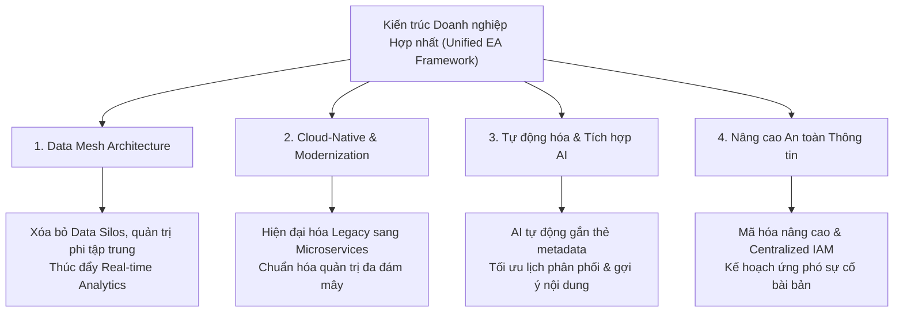

# Nghiên cứu tình huống: Đánh giá Kiến trúc Doanh nghiệp của Công ty Truyền thông (MediaTech)

## 1. Giới thiệu & Tổng quan Doanh nghiệp (Company Overview)
- **Công ty:** MediaTech – Doanh nghiệp truyền thông quy mô vừa, hoạt động đa kênh (Truyền hình, OTT streaming, Mạng xã hội, Báo in).
- **Mảng kinh doanh cốt lõi:**
  1. *Sáng tạo nội dung (Content Creation):* Sản xuất phim, chương trình TV, nội dung số.
  2. *Phân phối nội dung (Content Distribution):* Qua nền tảng OTT, truyền hình cáp, mạng xã hội.
  3. *Kinh doanh & Kiếm tiền (Monetization & Advertising):* Doanh thu từ quảng cáo, gói thuê bao (subscriptions), nhượng quyền phát sóng (syndication).
- **Hiện trạng CNTT (Current IT Landscape):**
  - **Silo dữ liệu (Data Silos):** Các cơ sở dữ liệu riêng biệt cho sản xuất, phân phối và thanh toán.
  - **Hệ thống Legacy:** Sử dụng phần mềm ERP lỗi thời cho lập kế hoạch tài nguyên và xuất hóa đơn.
  - **Áp dụng Cloud phân mảnh:** Sử dụng dịch vụ đám mây không nhất quán giữa các phòng ban.
  - **Quy trình thủ công (Manual Workflows):** Gắn thẻ metadata, lập lịch phân phối nội dung còn thủ công và thiếu hiệu quả.

---

## 2. Đánh giá Khung Kiến trúc Doanh nghiệp qua 5 Miền (5 EA Domains)

| Miền kiến trúc (Domain) | Điểm mạnh (Strengths) | Điểm yếu (Weaknesses) |
| :--- | :--- | :--- |
| **1. Business Architecture** (Kiến trúc Nghiệp vụ) | • Hiểu rõ nhu cầu tiêu thụ nội dung đa nền tảng của khách hàng. • Thiết lập tốt quan hệ đối tác phân phối và quảng cáo. | • Thiếu tích hợp giữa các luồng: Sản xuất – Phân phối – Kiếm tiền. • Phân bổ tài nguyên kém hiệu quả do thiếu phân tích dự đoán (Predictive Analytics). |
| **2. Data Architecture** (Kiến trúc Dữ liệu) | • Sở hữu metadata phong phú từ nội dung và tương tác người dùng. • Thu thập chỉ số tương tác chi tiết từ nền tảng OTT. | • Silo dữ liệu ngăn cản cái nhìn toàn diện (360-view) về khách hàng. • Quản trị dữ liệu (Data Governance) không đồng nhất $\rightarrow$ Sai lệch báo cáo. • Hạn chế phân tích thời gian thực (Real-time Analytics). |
| **3. Application Architecture** (Kiến trúc Ứng dụng) | • Công cụ sản xuất nội dung chuyên biệt có tính năng cao. • Tách biệt hệ thống đặt quảng cáo và hợp đồng bản quyền. | • Thiếu tích hợp giữa các app $\rightarrow$ Nhập trùng lặp dữ liệu. • Phụ thuộc hệ thống nguyên khối (Monolith) hạn chế mở rộng. • Thiếu tự động hóa trong lịch phân phối nội dung. |
| **4. Technology Architecture** (Kiến trúc Công nghệ) | • Máy chủ dung lượng cao cho lưu trữ và phát video. • Tận dụng Cloud cho chuyển mã (transcoding) và lưu trữ. | • Cloud phân mảnh, nhiều nhà cung cấp nhưng thiếu quản trị tập trung. • Phần cứng On-premises cũ kỹ, chi phí bảo trì cao. • Hạn chế hỗ trợ các công nghệ mới nổi (AI curation). |
| **5. Security Architecture** (Kiến trúc An toàn Thông tin) | • Áp dụng hệ thống DRM (Digital Rights Management) bảo vệ bản quyền. • Có tường lửa cơ bản và phân quyền truy cập. | • Lỗ hổng mã hóa dữ liệu khách hàng. • Thiếu kế hoạch ứng phó sự cố (Incident Response Plan) khi bị rò rỉ dữ liệu. • Quản lý tài khoản/truy cập (IAM) phụ thuộc thao tác thủ công. |

---

## 3. Các thách thức cốt lõi (Identified Critical Challenges)
1. **Silo vận hành (Operational Silos):** Hệ thống phân mảnh cản trở sự cộng tác liên phòng ban.
2. **Khả năng mở rộng (Scalability Issues):** Hạ tầng legacy và ứng dụng monolith kìm hãm mở rộng quy mô.
3. **Quy trình kém hiệu quả (Inefficient Workflows):** Thao tác thủ công làm chậm tốc độ gắn thẻ, phát hành và kiếm tiền từ nội dung.
4. **Lỗ hổng quản trị dữ liệu (Data Governance Gaps):** Thiếu khung quản trị chung gây sai lệch số liệu và rủi ro tuân thủ.
5. **Lỗ hổng bảo mật (Security Vulnerabilities):** Quy trình bảo mật lỗi thời khiến doanh nghiệp đối mặt nguy cơ rò rỉ dữ liệu.

---

## 4. Giải pháp & Kiến trúc đề xuất (Proposed Improvements)

1. **Khung EA Hợp nhất (Unified EA Framework):** Tích hợp chặt chẽ giữa Business, Data, Application, Technology và Security.
2. **Chuyển đổi sang mô hình Data Mesh:** Phân quyền quản trị dữ liệu theo miền nghiệp vụ (domain-driven) để loại bỏ silo và thúc đẩy phân tích dữ liệu theo thời gian thực.
3. **Hiện đại hóa Cloud-Native:**
   - Áp dụng chiến lược di chuyển phù hợp (Rehost, Replatform, Refactor) để chuyển đổi Monolith sang Microservices.
   - Chuẩn hóa quản trị Cloud tập trung để tối ưu chi phí.
4. **Tích hợp Tự động hóa & Trí tuệ nhân tạo (AI & Automation):**
   - Ứng dụng AI để tự động gắn thẻ metadata và tối ưu hóa việc phân phối nội dung/quảng cáo.
   - Cá nhân hóa trải nghiệm người xem bằng AI recommendation.
5. **Tăng cường Bảo mật (Security Hardening):**
   - Triển khai mã hóa nâng cao đầu-cuối và công cụ bảo mật điểm cuối.
   - Quản lý định danh và truy cập tập trung (Centralized IAM).
   - Xây dựng quy trình ứng cứu sự cố an ninh mạng (Incident Response Plan).
