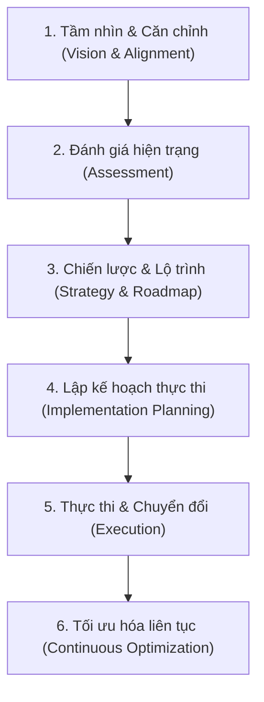

# Triển khai Chương trình Hiện đại hóa Doanh nghiệp (Implementing a Modernization Program)

## 1. Khái niệm & Mục tiêu cốt lõi
- **Chương trình hiện đại hóa (Modernization Program):** Là quá trình chuyển đổi toàn diện giúp doanh nghiệp thoát khỏi các hệ thống cũ kỹ (legacy systems), hướng tới kiến trúc hiện đại, linh hoạt (agile) và sẵn sàng cho tương lai.
- **Phạm vi bao phủ:** Cải tiến và nâng cấp đồng thời **Hạ tầng CNTT (Infrastructure)**, **Ứng dụng (Applications)**, và **Quy trình vận hành (Processes)**.

---

## 2. Các giai đoạn triển khai chương trình hiện đại hóa

### Bước 1: Xác định Tầm nhìn & Căn chỉnh (Vision & Stakeholder Alignment)
- **Định hình mục tiêu chiến lược:** Cải thiện trải nghiệm khách hàng (CX), tăng khả năng mở rộng (scalability), hoặc tối ưu chi phí (cost reduction).
- **Xác định phạm vi (Scope):** Tái cấu trúc ứng dụng, nâng cấp hạ tầng, hoặc tối ưu hóa quy trình.
- **Đồng thuận của các bên liên quan (Stakeholder Alignment):** Kết nối ban lãnh đạo, đội ngũ IT và các phòng ban nghiệp vụ để tạo sự nhất quán.

### Bước 2: Đánh giá Hiện trạng CNTT (IT Landscape Assessment)
- **Lập danh mục tài sản IT (Cataloging Assets):** Thống kê ứng dụng, hạ tầng, kho dữ liệu.
- **Bản đồ phụ thuộc (Dependency Mapping):** Xác định quan hệ phụ thuộc để sắp xếp thứ tự ưu tiên và giảm rủi ro gián đoạn.
- **Phân tích hiệu năng (Performance Analysis):** Tìm ra điểm nghẽn (bottlenecks) và khu vực kém hiệu quả.
- **Đánh giá giá trị nghiệp vụ (Business Value Assessment):** Ưu tiên các hệ thống đóng góp trực tiếp vào mục tiêu kinh doanh.

### Bước 3: Xác định Chiến lược & Lộ trình (Strategy & Roadmap)
- **4 Phương pháp hiện đại hóa chính:**
  - **Re-hosting (Lift & Shift):** Chuyển ứng dụng lên cloud với thay đổi tối thiểu.
  - **Re-platforming (Lift & Reshape):** Tối ưu hóa ứng dụng để tận dụng thế mạnh của nền tảng mới mà không đổi cấu trúc lõi.
  - **Refactoring (Re-architecting):** Tái cấu trúc ứng dụng hoàn toàn sang Microservices hoặc Serverless computing.
  - **Replacement (Drop & Replace):** Loại bỏ hệ thống cũ và thay thế bằng phần mềm/giải pháp mới hoàn toàn (như SaaS).
- **Lựa chọn Tech Stack:** Công nghệ phù hợp (ví dụ: Kubernetes cho container orchestration, Cloud-native services).
- **Phân kỳ theo tác động:** Bắt đầu từ những khu vực có giá trị cao, ít rủi ro gián đoạn trước.

### Bước 4: Lập Kế hoạch Thực thi (Implementation Planning)
- **Milestones & Timelines:** Chia nhỏ chương trình thành các giai đoạn ngắn hạn, có thời hạn rõ ràng.
- **Phân bổ tài nguyên (Resource Allocation):** Xác định rõ vai trò, trách nhiệm (RACI) và ngân sách.
- **Quản lý rủi ro (Risk Management):** Dự phòng sự cố mất mát dữ liệu, downtime, và kế hoạch phục hồi.
- **Quản lý thay đổi văn hóa (Change Management):** Áp dụng Agile, sử dụng công cụ quản lý dự án (Jira, Trello).

### Bước 5: Thực thi & Chuyển đổi (Execution Phase)
- **Di chuyển dữ liệu (Data Migration):** Chuyển dữ liệu an toàn, hiệu quả (công cụ: Informatica, Talend).
- **Hiện đại hóa ứng dụng (App Modernization):** Viết lại/cập nhật framework, ngôn ngữ, kiến trúc mới.
- **Chuyển đổi hạ tầng (Infrastructure Transformation):** Triển khai Cloud, Hybrid Cloud hoặc On-premise hiện đại.
- **Kiểm thử & Xác thực (Testing & Validation):** Đảm bảo đáp ứng đầy đủ tiêu chuẩn chức năng, hiệu năng và an ninh bảo mật.

### Bước 6: Tối ưu hóa Liên tục (Continuous Optimization)
- **Giám sát hiệu năng (Performance Monitoring):** Sử dụng các công cụ APM như Datadog, New Relic.
- **Quản lý chi phí (FinOps / Cost Management):** Right-sizing tài nguyên, tránh lãng phí.
- **Cải tiến liên tục:** Thường xuyên cập nhật tính năng mới theo nhu cầu thị trường.

---

## 3. Thách thức cốt lõi & Biện pháp khắc phục

| Nhóm thách thức | Thách thức cụ thể | Biện pháp khắc phục |
| :--- | :--- | :--- |
| **Con người & Văn hóa** | Ngại thay đổi (Change Resistance) | Truyền thông liên tục, minh bạch lợi ích và tổ chức các chương trình đào tạo nội bộ. |
| **Năng lực** | Khoảng trống kỹ năng (Skills Gaps) | Nâng cao kỹ năng (upskilling) cho đội ngũ nội bộ hoặc thuê chuyên gia tư vấn bên ngoài. |
| **Kỹ thuật** | Độ phức tạp của hệ thống Legacy | Sử dụng các công cụ/framework tự động hóa và chia nhỏ quá trình di chuyển theo từng giai đoạn. |
| **Tài chính** | Vượt ngân sách (Budget Overruns) | Giám sát chặt chẽ tiến độ và chi phí, linh hoạt điều chỉnh kế hoạch để luôn trong tầm kiểm soát. |
