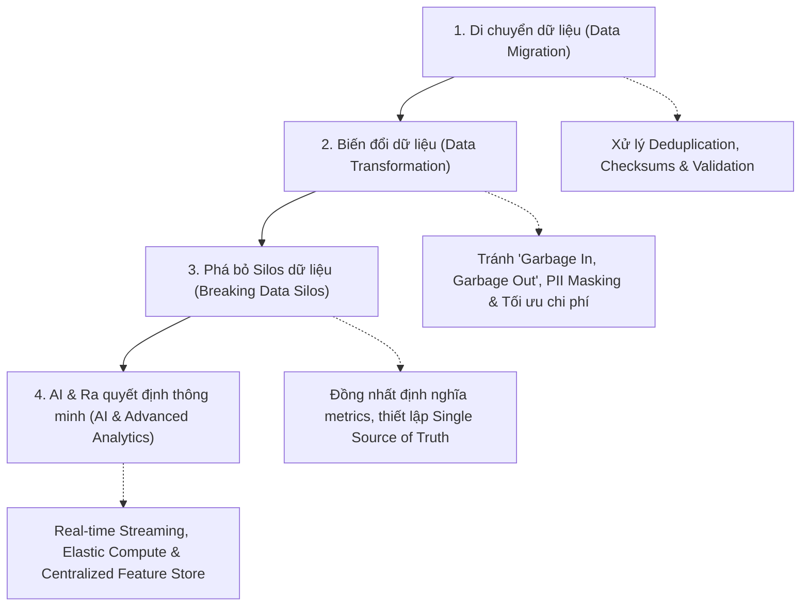

# Dialogue: Từ Hệ thống Cũ đến Doanh nghiệp Thông minh (From Legacy Systems to Intelligent Enterprises)

## 1. Tổng quan Hoạt động (Session Overview)
- **Mục tiêu:** Khám phá cách dữ liệu doanh nghiệp hỗ trợ luồng ETL, di chuyển đám mây (migration), hiện đại hóa hệ thống (modernization) và trí tuệ doanh nghiệp (BI/AI).
- **Phạm vi thảo luận:**
  1. Xử lý các sự cố kỹ thuật thường gặp khi di chuyển dữ liệu.
  2. Tầm quan trọng của chuyển đổi và làm sạch dữ liệu (Data Transformation & Cleansing).
  3. Rủi ro của các hệ thống Silo dữ liệu và rào cản đối với "Nguồn chân lý duy nhất" (Single Source of Truth - SSOT).
  4. Mối liên kết giữa hạ tầng dữ liệu hiện đại và năng lực phân tích dự đoán / Ra quyết định bằng AI.

---

## 2. Chi tiết 4 Chủ đề thảo luận (Key Dialogue Themes)

### Chủ đề 1: Sự cố Kỹ thuật khi Di chuyển Dữ liệu (Migration Pitfalls)
- **Hiện tượng sự cố:** Dashboard xuất hiện bản ghi trùng lặp (duplicates), báo cáo sai lệch (inconsistent reports) và mất mát dữ liệu giao dịch (missing transactions).
- **Nguyên nhân cốt lõi:**
  - *Thiếu kiểm tra đối soát (Validation Gaps):* Không có checksums kiểm tra đối chiếu dữ liệu trước và sau cut-over.
  - *Thiếu tính lũy thừa / Khử trùng (Missing Idempotency & Deduplication):* Chạy lại job migration nhiều lần không có khóa chính/upsert rõ ràng.
  - *Lỗi trích xuất (Extraction Timeouts):* Rớt mạng hoặc timeout khi lấy dữ liệu từ hệ thống nguồn mà không có retry/CDC bù dữ liệu.
  - *Lệch cấu trúc (Schema Drift / Inconsistent Transformation):* Lệch múi giờ (timezone) hoặc kiểu dữ liệu giữa source và target.

### Chủ đề 2: Tầm quan trọng của Biến đổi Dữ liệu trước/trong Migration
- **Tránh "Garbage In, Garbage Out":** Ngăn chặn dữ liệu rác, lỗi thời làm ô nhiễm kho dữ liệu mới trên Cloud.
- **Tương thích Kiến trúc & Schema:** Chuẩn hóa kiểu dữ liệu sang các định dạng tối ưu trên Cloud (Parquet, Delta Lake, Iceberg).
- **Tối ưu Chi phí & Hiệu năng:** Dữ liệu được nén và chuẩn hóa giúp giảm chi phí lưu trữ/băng thông và tăng tốc truy vấn.
- **Bảo mật & Tuân thủ:** Cơ hội ẩn danh hóa / che giấu dữ liệu nhạy cảm (PII masking) trước khi đưa vào môi trường mới.

### Chủ đề 3: Thách thức về Chất lượng Dữ liệu & Silo Hệ thống
- **Mâu thuẫn số liệu (Conflicting Metrics):** Các phòng ban định nghĩa số liệu (Doanh thu, Active User) khác nhau $\rightarrow$ Quyết định sai lầm từ ban lãnh đạo.
- **Dữ liệu phân mảnh & lỗi thời:** Cùng một khách hàng nhưng có nhiều phiên bản không đồng bộ ở các hệ thống khác nhau.
- **Mất cái nhìn 360 độ:** Không thể theo dõi hành trình khách hàng toàn diện từ đầu đến cuối.
- **Rào cản SSOT & Quản trị:** Khó theo dõi Data Lineage, phân quyền IAM phức tạp và tăng nguy cơ vi phạm bảo mật/tuân thủ.

### Chủ đề 4: Hiện đại hóa Mở đường cho Phân tích Dự đoán & AI
- **Dữ liệu huấn luyện chất lượng cao:** Dữ liệu chuẩn hóa, sạch sẽ giúp mô hình AI/ML không bị bias và nâng cao độ chính xác.
- **Real-Time Data Streaming:** Luồng dữ liệu sự kiện (Event-driven / Kafka / Spark) cung cấp dữ liệu tức thời cho suy luận thời gian thực (Real-time inference, Fraud detection, Dynamic pricing).
- **Điện toán đám mây đàn hồi (Elastic Compute):** Tài nguyên GPU/TPU và Kubernetes trên Cloud dễ dàng mở rộng theo quy mô bài toán AI.
- **Centralized Feature Store & Lineage:** Tái sử dụng đặc trưng (features) và hỗ trợ quản trị mô hình AI minh bạch (Explainable AI).

---

## 3. Tổng kết & Đề xuất mở rộng (Feedback & Future Insights)
- **Điểm mạnh:** Nắm vững các thách thức kỹ thuật của migration (schema mismatch, extraction errors) và hiểu rõ cách kiến trúc dữ liệu hiện đại hóa thúc đẩy BI/AI.
- **Chủ đề nghiên cứu mở rộng:**
  - **Data Mesh Architecture:** Quản trị dữ liệu phi tập trung theo miền nghiệp vụ (Domain-oriented decentralized data ownership).
  - **Data Fabric Architecture:** Sử dụng siêu dữ liệu (Active Metadata) và AI để kết nối, tích hợp và tự động hóa luồng dữ liệu phân tán xuyên suốt doanh nghiệp.
