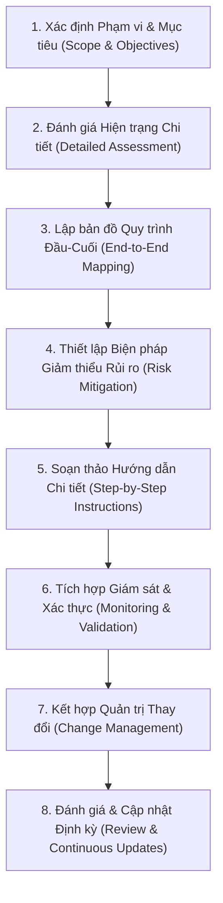

# Xây dựng Quy trình Thao tác Chuẩn (SOPs) cho Nâng cấp và Di chuyển Hệ thống

## 1. Tầm quan trọng của SOPs (Standardized Operating Procedures)
SOP là tài liệu chuẩn hóa hướng dẫn chi tiết từng bước thực hiện một tác vụ hay quy trình. Trong các dự án nâng cấp và di chuyển (upgrades/migrations), SOP mang lại 5 lợi ích cốt lõi:
1. **Tính nhất quán (Consistency):** Đảm bảo việc thực thi đồng bộ giữa các đội ngũ và dự án.
2. **Hiệu quả (Efficiency):** Giảm thiểu thử-sai (trial-and-error) nhờ luồng công việc đã được kiểm chứng.
3. **Giảm thiểu rủi ro (Risk Mitigation):** Nhận diện trước rủi ro và cung cấp phương án phòng ngừa cụ thể.
4. **Khả năng mở rộng (Scalability):** Dễ dàng nhân rộng và tái sử dụng quy trình cho các dự án quy mô lớn.
5. **Tuân thủ (Compliance):** Đảm bảo tuân thủ nghiêm ngặt các quy định pháp lý và chính sách quản trị nội bộ.

---

## 2. Các yếu tố then chốt khi phát triển SOP (Key Considerations)
- **Căn chỉnh theo mục tiêu kinh doanh:** SOP phải phục vụ trực tiếp cho mục tiêu chiến lược (ví dụ: tối ưu chi phí, giảm downtime, bảo mật dữ liệu).
- **Tùy biến theo ngữ cảnh (Context Customization):** Tránh sử dụng mẫu (template) chung chung; SOP phải được may đo theo hạ tầng, công cụ và văn hóa của doanh nghiệp.
- **Sự tham gia của các bên liên quan (Stakeholder Involvement):** Có sự phối hợp giữa IT teams, phòng ban nghiệp vụ và nhà cung cấp bên ngoài.
- **Tự động hóa & Công cụ (Automation Tools):** Tích hợp hướng dẫn sử dụng công cụ tự động (Terraform, Ansible, scripts) để hạn chế thao tác thủ công.

---

## 3. Quy trình 8 bước xây dựng tài liệu SOP cho Upgrades & Migrations

### Bước 1: Xác định phạm vi và mục tiêu (Scope & Objectives)
- Thiết lập ranh giới rõ ràng cho SOP.
- *Ví dụ mục tiêu:* Chuyển đổi mượt mà từ legacy lên nền tảng mới, giảm tối đa downtime cơ sở dữ liệu, đảm bảo tuân thủ GDPR/quy định bảo vệ dữ liệu.

### Bước 2: Đánh giá hiện trạng chi tiết (Detailed Assessment)
- Hạ tầng phần cứng, mạng, lưu trữ.
- Cấu hình ứng dụng và cơ sở dữ liệu.
- Khối lượng dữ liệu cần chuyển và yêu cầu băng thông.
- Quyền truy cập người dùng và các giao thức bảo mật.

### Bước 3: Lập bản đồ quy trình đầu-cuối (Map End-to-End Process)
Chia dự án thành các giai đoạn logic rõ ràng:
1. *Premigration planning* (Lập kế hoạch chuẩn bị).
2. *Infrastructure preparation* (Chuẩn bị hạ tầng đích).
3. *Data backup & validation* (Sao lưu và kiểm thử dữ liệu).
4. *Migration execution* (Thực thi di chuyển).
5. *Postmigration testing & optimization* (Kiểm thử và tối ưu hóa hậu di chuyển).

### Bước 4: Thiết lập biện pháp giảm thiểu rủi ro (Risk Mitigation Measures)

| Rủi ro tiềm ẩn (Risks) | Biện pháp giảm thiểu (Mitigation Strategies) |
| :--- | :--- |
| **Mất mát dữ liệu (Data loss)** | Sao lưu toàn diện (full backup) trước khi chạy và kiểm tra toàn vẹn (checksums) sau khi truyền. |
| **Gián đoạn dịch vụ (Downtime)** | Lên lịch cut-over vào khung giờ thấp điểm (off-peak) và triển khai hệ thống dự phòng (failover). |
| **Lỗi cấu hình (Config errors)** | Áp dụng công cụ IaC/Configuration Management (Terraform, Ansible) để loại bỏ lỗi con người. |

### Bước 5: Soạn thảo hướng dẫn chi tiết & trực quan (Clear Instructions)
- Sử dụng ngôn ngữ ngắn gọn, chính xác, tránh thuật ngữ mơ hồ; bổ sung lưu đồ/hình ảnh minh họa cho các tác vụ phức tạp.
- Cung cấp câu lệnh cụ thể (ví dụ: lệnh backup `mysqldump`, lệnh truyền file bảo mật `scp`).

### Bước 6: Tích hợp công cụ giám sát & xác thực (Monitoring & Validation)
- **Giám sát (Monitoring):** Sử dụng CloudWatch, Nagios, Splunk để theo dõi tài nguyên và tiến độ trong lúc chạy.
- **Xác thực (Validation):** Kiểm tra tính chính xác của dữ liệu, tính năng ứng dụng và quyền truy cập của người dùng ngay sau khi di chuyển.

### Bước 7: Kết hợp quản trị thay đổi (Change Management)
- **Kế hoạch truyền thông (Communication):** Thông báo trước lịch trình bảo trì và kỳ vọng cho các bên liên quan.
- **Kế hoạch đào tạo (Training):** Hướng dẫn người dùng và đội vận hành thích ứng với hệ thống mới.
- **Quy trình hoàn tác (Rollback Procedures):** Cung cấp các bước đảo ngược về trạng thái cũ an toàn nếu gặp sự cố không thể khắc phục.

### Bước 8: Đánh giá và cập nhật liên tục (Review & Updates)
- Thường xuyên rà soát và cập nhật SOP dựa trên bài học kinh nghiệm thực tế (post-mortem / lessons learned) và sự thay đổi của công nghệ.
