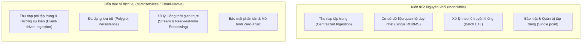

# Tác động của Kiến trúc Ứng dụng đến Vận hành Dữ liệu (Impact of Application Architectures on Data Operations)

## 1. Tổng quan & Phân loại Kiến trúc Ứng dụng
Kiến trúc ứng dụng định hình cách ứng dụng được thiết kế, triển khai và tương tác với các hệ thống; qua đó tác động trực tiếp đến cách dữ liệu được thu nạp (ingested), lưu trữ (stored), xử lý (processed) và bảo vệ (secured).

Ba mô hình kiến trúc chính:
- **Monolithic Architecture (Nguyên khối):** Hệ thống đơn tầng, liên kết chặt chẽ (tightly coupled).
- **Service-Oriented Architecture - SOA (Hướng dịch vụ):** Các thành phần module giao tiếp qua giao diện định nghĩa sẵn (interfaces).
- **Microservices & Cloud-Native (Vi dịch vụ & Bản địa đám mây):** Các dịch vụ phi tập trung, triển khai độc lập, tối ưu cho hạ tầng Cloud.

---

## 2. So sánh Tác động giữa Monolithic và Microservices / Cloud-Native

---

## 3. Chi tiết 4 Khía cạnh Vận hành Dữ liệu

| Khía cạnh vận hành | Monolithic Architecture | Microservices & Cloud-Native | Thách thức & Best Practices (Cloud-Native) |
| :--- | :--- | :--- | :--- |
| **1. Thu nạp & Tích hợp (Ingestion & Integration)** | • Đường ống thu nạp tập trung, luồng dữ liệu đơn giản, dễ quản lý. • Kém linh hoạt, khó mở rộng độc lập khi lưu lượng tăng cao. | • Thu nạp phi tập trung, mỗi dịch vụ tự quản lý pipeline riêng. • Cho phép thu nạp song song từ nhiều nguồn thời gian thực. | • **Thách thức:** Bất đồng bộ schema, quản lý phiên bản API, tính nhất quán dữ liệu. • **Best Practice:** Sử dụng Event-driven (Kafka, RabbitMQ), Schema Registry, chuẩn hóa Data APIs. |
| **2. Lưu trữ & Quản lý (Storage & Management)** | • Sử dụng một RDBMS duy nhất làm kho trung tâm. • Schema hợp nhất, không cần đồng bộ/sao chép phức tạp. • Dễ trở thành nút thắt cổ chai (bottleneck) và là điểm lỗi đơn lẻ (SPOF). | • Áp dụng **Polyglot Persistence** (mỗi service dùng loại DB phù hợp: NoSQL, Graph DB, Relational). • Tối ưu hiệu năng, cô lập lỗi và mở rộng linh hoạt. | • **Thách thức:** Chi phí vận hành cao khi quản lý nhiều công nghệ DB, khó thực thi governance tập trung. • **Best Practice:** Triển khai chiến lược **Data Mesh**, công cụ giám sát tập trung cho DB phân tán. |
| **3. Xử lý & Phân tích (Processing & Analytics)** | • Xử lý theo lô (Batch-oriented ETL). • Dự đoán được, phù hợp cho báo cáo truyền thống và BI định kỳ. • Độ trễ cao, không đáp ứng được nhu cầu thời gian thực. | • Kết hợp xử lý theo lô (Batch) và xử lý theo luồng (**Stream Processing**). • Xử lý dữ liệu ngay gần nguồn phát sinh để ra quyết định tức thì. | • **Thách thức:** Điều phối workflow phân tán, đồng bộ dữ liệu near-real-time. • **Best Practice:** Sử dụng Apache Spark/Flink, Kafka Streams, container hóa môi trường xử lý dữ liệu. |
| **4. An toàn & Quản trị (Security & Governance)** | • Dữ liệu nằm một chỗ giúp kiểm soát truy cập và kiểm toán (audit trails) dễ dàng. • Khi bị xâm nhập, rủi ro mất toàn bộ dữ liệu (massive breach). | • Kiểm soát quyền truy cập chi tiết (granular access controls), khả năng chịu lỗi cao hơn. | • **Thách thức:** Dễ lỗi cấu hình gây rò rỉ dữ liệu, phức tạp khi theo dõi tuân thủ phân tán. • **Best Practice:** Áp dụng mô hình **Zero-Trust**, quản lý danh tính tập trung (AWS IAM, Azure AD, Google Cloud Identity). |

---

## 4. Tóm tắt cốt lõi
1. **Kiến trúc Nguyên khối:** Dễ quản lý dữ liệu ban đầu nhờ tính tập trung, nhưng hạn chế về quy mô, độ trễ và dễ gặp lỗi đơn lẻ.
2. **Kiến trúc Vi dịch vụ / Cloud-Native:** Tối ưu cho tính sẵn sàng cao, xử lý thời gian thực, lưu trữ linh hoạt (Polyglot Persistence), nhưng đòi hỏi quản trị dữ liệu chặt chẽ qua **Data Mesh**, **Event-driven Architecture** và mô hình bảo mật **Zero-Trust**.
