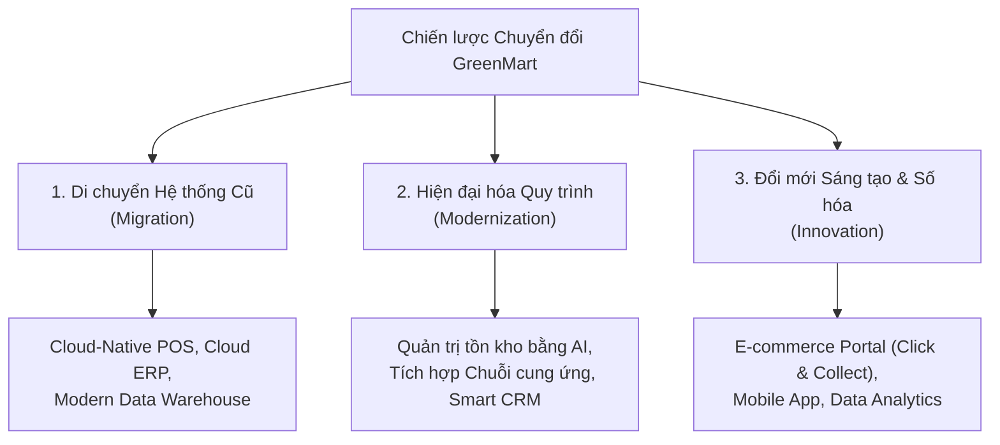

# Nghiên cứu tình huống: Chuyển đổi Số Chuỗi Siêu thị (GreenMart)

## 1. Tổng quan Doanh nghiệp & Hiện trạng (GreenMart Background)
- **Quy mô:** Chuỗi 150 siêu thị tại khu vực thành thị và ngoại ô, kinh doanh nông sản tươi sống, thực phẩm và đồ gia dụng.
- **Thách thức ban đầu:**
  - **Hệ thống Legacy:** Phụ thuộc vào phần mềm POS (Point of Sale) và hệ thống quản lý tồn kho lỗi thời.
  - **Hiện diện số hạn chế (Limited Digital Presence):** Thiếu nền tảng thương mại điện tử tích hợp (E-commerce).
  - **Silo vận hành (Operational Silos):** Không có sự liên kết dữ liệu giữa chuỗi cung ứng, quản lý kho và hệ thống chăm sóc khách hàng (CRM).

---

## 2. Mục tiêu Chuyển đổi (Transformation Objectives)
1. **Hiện đại hóa hệ thống (System Modernization):** Di chuyển các hệ thống cũ lên nền tảng Cloud-Native.
2. **Tích hợp kênh số (Digital Integration):** Xây dựng nền tảng E-commerce hợp nhất và năng lực bán hàng đa kênh (**Omnichannel**).
3. **Hiệu quả vận hành (Operational Efficiency):** Đồng bộ hóa luồng dữ liệu chuỗi cung ứng, tồn kho và CRM.
4. **Tăng cường gắn kết khách hàng (Customer Engagement):** Cá nhân hóa trải nghiệm và xây dựng lòng trung thành dựa trên dữ liệu (Data-driven Insights).

---

## 3. Chiến lược Chuyển đổi qua 3 Trụ cột cốt lõi

### Trụ cột 1: Di chuyển Hệ thống Cũ (Migration)
- **Triển khai:**
  - Thay thế POS cũ bằng giải pháp Cloud-Native kết nối dữ liệu bán hàng & tồn kho thời gian thực.
  - Triển khai Cloud ERP tập trung hóa Tài chính, Chuỗi cung ứng và Nhân sự.
  - Di chuyển dữ liệu khách hàng/sản phẩm sang Data Warehouse hiện đại.
- **Kết quả:** Hiển thị dữ liệu bán hàng/tồn kho real-time trên 150 cửa hàng; xóa bỏ chi phí bảo trì phần cứng On-premises; sẵn sàng mở rộng quy mô.

### Trụ cột 2: Hiện đại hóa Quy trình (Modernization)
- **Triển khai:**
  - *Tự động hóa tồn kho bằng AI:* Dự báo nhu cầu, tối ưu mức dự trữ, giảm hư hao hàng hóa.
  - *Tích hợp chuỗi cung ứng:* Đưa mạng lưới nhà cung cấp vào ERP để tăng độ chính xác đơn hàng và rút ngắn Lead Time.
  - *Nâng cấp CRM:* Tự động hóa chiến dịch Marketing cá nhân hóa theo hành vi mua sắm.
- **Kết quả:** Giảm 20% chi phí lưu kho (carrying costs); giảm 15% độ trễ chuỗi cung ứng; tăng mức độ gắn kết của khách hàng.

### Trụ cột 3: Đổi mới Sáng tạo & Hiện diện Số (Innovation & Digital Presence)
- **Triển khai:**
  - Ra mắt cổng E-commerce với tùy chọn giao tận nhà và nhận tại cửa hàng (Click-and-Collect).
  - Phát triển Mobile App tích hợp điểm thưởng loyalty, coupon điện tử, danh sách mua sắm.
  - Ứng dụng Data Analytics để phân tích hành vi tiêu dùng và tối ưu giá bán (Dynamic Pricing).
- **Kết quả:** Doanh thu E-commerce chiếm 25% tổng doanh thu chỉ trong 1 năm; tăng tỷ lệ giữ chân khách hàng (Retention Rate).

---

## 4. Thách thức & Giải pháp Xử lý

| Thách thức (Challenges) | Chi tiết vấn đề | Giải pháp của GreenMart (Solutions) |
| :--- | :--- | :--- |
| **Độ phức tạp khi di chuyển dữ liệu** | Dữ liệu tích lũy hàng chục năm tiềm ẩn nguy cơ sai lệch và mất toàn vẹn khi chuyển lên Cloud. | Sử dụng các công cụ **Automated ETL** để làm sạch (cleanse) và xác thực (validate) dữ liệu trước khi di chuyển. |
| **Tâm lý ngại thay đổi của nhân viên** | Nhân viên cửa hàng và vận hành ban đầu kháng cự tiếp nhận hệ thống và quy trình mới. | Tổ chức các chương trình đào tạo toàn diện và hỗ trợ kỹ thuật liên tục trong giai đoạn chuyển tiếp. |
| **Sự cố tích hợp bên thứ ba** | Khó khăn khi kết nối hệ thống mới với các ứng dụng của đối tác/nhà cung cấp hiện hữu. | Bắt tay với các nhà cung cấp công nghệ để phát triển **Custom APIs** và giải pháp **Middleware**. |

---

## 5. Kết quả & Tác động Kinh doanh Toàn diện (Business Impact)
1. **Hiệu quả Vận hành:** Giảm hơn 15% chi phí vận hành hàng năm; tăng 25% tỷ lệ vòng quay hàng tồn kho (Inventory Turnover Rate).
2. **Tăng trưởng Doanh thu:** Mở rộng thị trường qua kênh online, đóng góp vào mức tăng trưởng 30% tổng doanh thu hàng năm.
3. **Mức độ Hài lòng của Khách hàng:** Điểm số hài lòng khách hàng (CSAT) tăng 40% trong vòng 2 năm nhờ trải nghiệm cá nhân hóa và tiện lợi.
4. **Hệ thống Sẵn sàng cho Tương lai:** Hạ tầng Cloud-Native linh hoạt, dễ dàng mở rộng và sẵn sàng tích hợp các công nghệ bán lẻ tiên tiến trong dài hạn.
