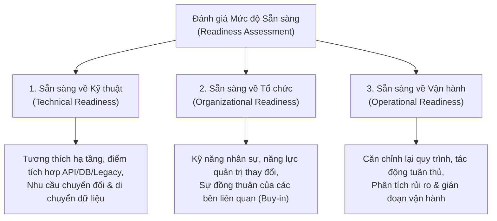
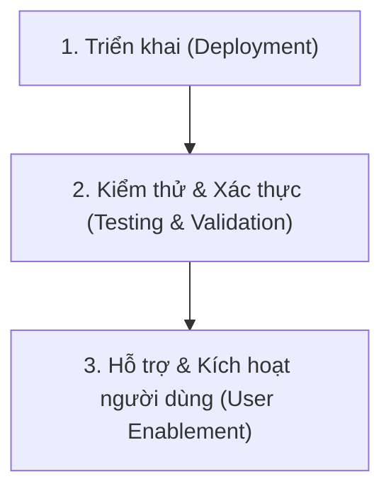

# Tích hợp Công nghệ & Mô hình Mới vào Doanh nghiệp Hiện tại (Integrating a New Technology/Paradigm into the Current Enterprise)

## 1. Động lực Thúc đẩy Tích hợp (Drivers for Integration)
Doanh nghiệp áp dụng công nghệ hoặc mô hình kiến trúc mới dựa trên 5 động lực cốt lõi:
1. **Nâng cao hiệu quả (Improved Efficiency):** Tự động hóa các tác vụ lặp lại và tinh gọn hóa quy trình vận hành.
2. **Khả năng mở rộng (Scalability):** Chuẩn bị năng lực xử lý cho khối lượng dữ liệu và lượng người dùng tăng trưởng đột biến.
3. **Thúc đẩy đổi mới sáng tạo (Enhanced Innovation):** Mở ra các năng lực công nghệ mới như Trí tuệ nhân tạo (AI/ML), Internet vạn vật (IoT), hoặc Blockchain.
4. **Tối ưu hóa chi phí (Cost Optimization):** Cắt giảm chi phí vận hành (OpEx) dài hạn và giảm thiểu lãng phí tài nguyên.
5. **Tuân thủ & An toàn bảo mật (Compliance & Security):** Đáp ứng các quy định pháp lý nghiêm ngặt và phòng chống các mối đe dọa an ninh mạng đang biến đổi.

---

## 2. Đánh giá Mức độ Sẵn sàng (Readiness Assessment)
Trước khi bắt đầu dự án tích hợp, doanh nghiệp phải đánh giá toàn diện trên 3 trụ cột:

---

## 3. Các Yếu tố của Kế hoạch Tích hợp & Truyền thông (Key Elements of Integration Plan)
- **Xác định mục tiêu & Chỉ số đo lường (Objectives & Metrics):** Thiết lập KPI rõ ràng (ví dụ: tỷ lệ tiết kiệm chi phí, chỉ số cải thiện hiệu năng, tỷ lệ chấp nhận sử dụng của người dùng - Adoption rate).
- **Triển khai theo giai đoạn (Phased Implementation Approach):** Bắt đầu với dự án thí điểm (**Pilot Implementation**), thu thập phản hồi, tối ưu hóa và sau đó mở rộng quy mô (Scale-up).
- **Phân bổ tài nguyên (Resource Allocation):** Xác định ngân sách, nhân sự phụ trách và thời gian triển khai chi tiết.
- **Khung hợp tác liên phòng ban (Collaboration Framework):** Kết nối chặt chẽ giữa đội ngũ IT, các phòng ban nghiệp vụ và nhà cung cấp công nghệ bên ngoài.

---

## 4. Các Giai đoạn Thực thi Tích hợp (Implementation Phases)

1. **Triển khai (Deployment):**
   - *Thiết lập hạ tầng:* Chuẩn bị môi trường đích (On-premises, Cloud hoặc Hybrid).
   - *Di chuyển dữ liệu (Data Migration):* Chuyển đổi và đồng bộ hóa dữ liệu với độ chính xác và tính toàn vẹn cao.
   - *Cấu hình hệ thống (Configuration):* Tùy biến công nghệ mới để tương thích với chính sách và quy trình doanh nghiệp.
2. **Kiểm thử & Xác thực (Testing & Validation):**
   - *Kiểm thử chức năng (Functional Testing):* Xác nhận các tính năng hoạt động đúng thiết kế.
   - *Kiểm thử hiệu năng (Performance Testing):* Đảm bảo tính sẵn sàng, độ tin cậy và khả năng chịu tải.
   - *Kiểm thử bảo mật (Security Testing):* Quét lỗ hổng và đánh giá an toàn thông tin.
3. **Kích hoạt Người dùng (User Enablement):**
   - Tổ chức các buổi đào tạo (Workshops), xây dựng tài liệu hướng dẫn (Documentation) và thiết lập kênh hỗ trợ kỹ thuật liên tục để thúc đẩy tiếp nhận công nghệ mới.

---

## 5. Thách thức cốt lõi & Chiến lược khắc phục

| Thách thức (Challenges) | Bản chất vấn đề | Chiến lược khắc phục (Mitigation Strategies) |
| :--- | :--- | :--- |
| **Tâm lý ngại thay đổi (Resistance to Change)** | Người dùng ngại từ bỏ thói quen cũ sang quy trình mới. | Xây dựng văn hóa đổi mới sáng tạo, truyền thông minh bạch về giá trị và lợi ích của công nghệ mới. |
| **Nợ kỹ thuật (Technical Debt)** | Hệ thống cũ phức tạp, gây khó khăn cho việc tích hợp. | Quản lý và tái cấu trúc hệ thống legacy cẩn trọng để giảm thiểu nguy cơ gián đoạn. |
| **Khoảng trống kỹ năng (Skill Gaps)** | Đội ngũ nội bộ chưa làm chủ được công nghệ mới. | Đầu tư đào tạo nâng cao kỹ năng (upskilling) hoặc tuyển dụng chuyên gia kỹ thuật có kinh nghiệm. |
| **Vượt ngân sách (Budget Overruns)** | Chi phí phát sinh ngoài dự kiến trong quá trình tích hợp. | Giám sát chặt chẽ chi tiêu theo từng giai đoạn và linh hoạt điều chỉnh thứ tự ưu tiên. |
