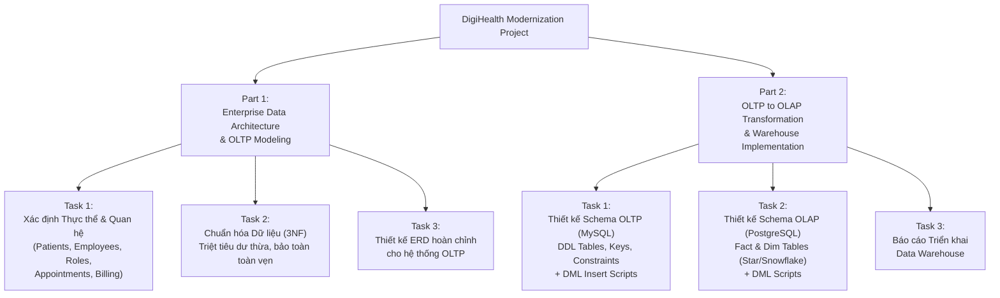

# Tổng quan Dự án Cuối khóa: Sáng kiến Hiện đại hóa DigiHealth (DigiHealth Modernization Initiative)

## 1. Bối cảnh Doanh nghiệp (Case Study: DigiHealth)
- **DigiHealth:** Hệ thống Quản lý Y tế (Health Management System - HMS) hỗ trợ tối ưu hóa quy trình bệnh viện, quản lý hồ sơ bệnh nhân và nâng cao năng lực phân tích.
- **Nghiệp vụ cốt lõi:** Xử lý các giao dịch thời gian thực (đăng ký bệnh nhân, thanh toán viện phí, lịch hẹn khám bác sĩ, tiền sử bệnh án).
- **Thách thức hiện tại:**
  - **Data silos:** Dữ liệu phân mảnh, thiếu nhất quán giữa các khoa/phòng ban.
  - **Performance bottlenecks:** Truy vấn phức tạp làm chậm các giao dịch thời gian thực.
  - **Compliance risks:** Nguy cơ không tuân thủ các quy định bảo mật y tế nghiêm ngặt như **HIPAA** và **GDPR**.
  - **Scalability challenges:** Khó khăn khi mở rộng xử lý đồng thời khối lượng lớn dữ liệu real-time và batch analytics.

---

## 2. Vai trò & Trách nhiệm của Enterprise Data Architect
1. **Thiết kế Mô hình Dữ liệu có khả năng mở rộng (Scalable Data Models):** Xây dựng và tối ưu hệ thống OLTP (xử lý giao dịch) và OLAP (xử lý phân tích).
2. **Quản trị Dữ liệu & Tuân thủ (Data Governance & Compliance):** Thiết lập chính sách bảo mật dữ liệu, tính toàn vẹn và tuân thủ pháp lý.
3. **Phát triển Đường ống dẫn Dữ liệu (ETL Pipelines):** Xây dựng luồng Extract - Transform - Load để đồng bộ dữ liệu mượt mà.
4. **Tối ưu hóa Hiệu năng Truy vấn (Query Performance Optimization):** Tinh chỉnh SQL/Index cho cả OLTP và OLAP.
5. **Triển khai Data Warehouse / Data Lake:** Tạo nền tảng phục vụ ra quyết định dựa trên dữ liệu (Data-driven decision making).

---

## 3. Cấu trúc & Nhiệm vụ Dự án (Project Breakdown)

### Chi tiết các phần thực hiện:
- **Part 1: Thiết kế Kiến trúc Dữ liệu Doanh nghiệp & Mô hình OLTP**
  - Xác định các thực thể: `Patients`, `Employees`, `Roles`, `Appointments`, `Billing`, ...
  - Áp dụng kỹ thuật chuẩn hóa đến **dạng chuẩn 3 (3NF)** để loại bỏ dư thừa dữ liệu.
  - Vẽ và hoàn thiện lược đồ quan hệ thực thể (**ERD**).

- **Part 2: Chuyển đổi từ OLTP sang OLAP phục vụ Phân tích Y tế**
  - **Task 1 (MySQL - OLTP):** Viết DDL tạo bảng kèm Primary Key, Foreign Key, Constraints và chuẩn bị script `INSERT` dữ liệu mẫu cho hệ thống giao dịch.
  - **Task 2 (PostgreSQL - OLAP):** Lựa chọn mô hình Data Warehouse (Star Schema / Snowflake Schema), định nghĩa các bảng Fact (Fact Appointments, Fact Billing) và Dimension (Dim Patient, Dim Doctor, Dim Time, Dim Service), kèm script `INSERT` dữ liệu phân tích.
  - **Task 3:** Lập báo cáo triển khai Data Warehouse hoàn chỉnh.
