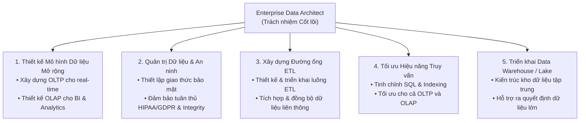
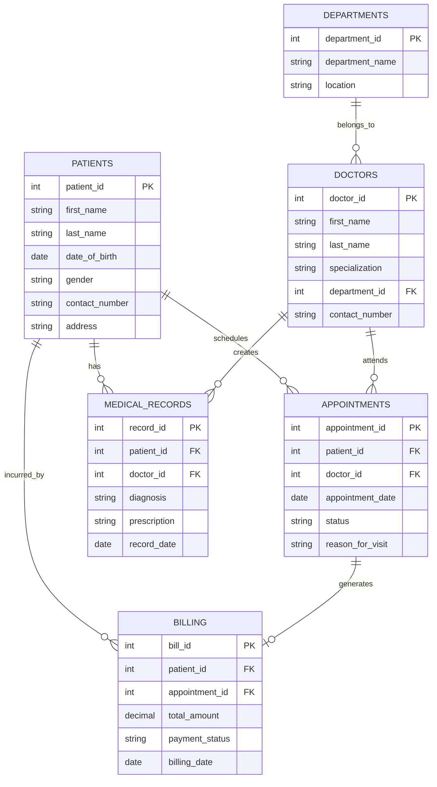
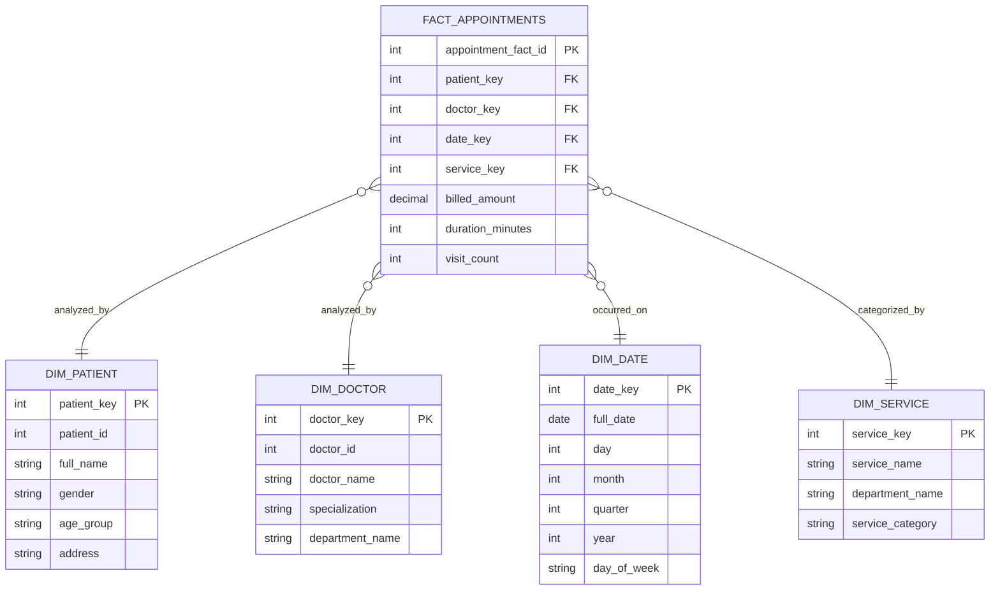
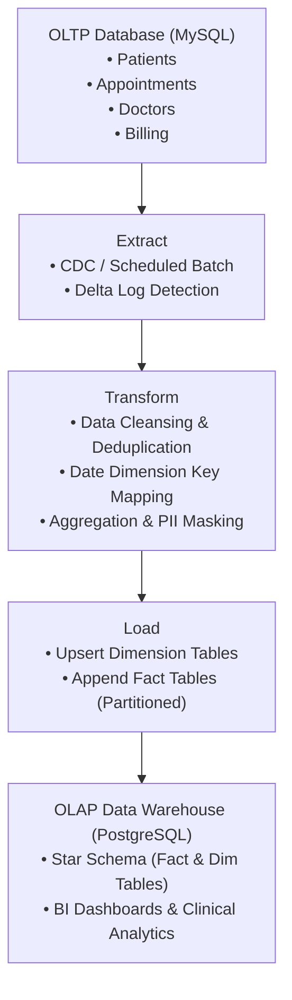

# Final Project: Kiến trúc Dữ liệu Doanh nghiệp & Vận hành cho DigiHealth (Enterprise Data Architecture & Operations for DigiHealth)

## 1. Giới thiệu Dự án (Introduction)
**DigiHealth** là Hệ thống Quản lý Y tế (Health Management System - HMS) hiện đại giúp tự động hóa vận hành bệnh viện, quản lý hồ sơ bệnh nhân và cung cấp năng lực phân tích dữ liệu chuyên sâu.
- **Vận hành thời gian thực:** Quản lý đăng ký bệnh nhân, viện phí, lịch hẹn khám và bệnh án.
- **Thách thức cốt lõi:** Khả năng mở rộng quy mô dữ liệu (scalability), an toàn bảo mật (security/compliance HIPAA & GDPR), và năng lực phân tích nâng cao (analytics).
- **Mục tiêu:** Xây dựng Kiến trúc Dữ liệu Doanh nghiệp (EDA) vững chắc và Chiến lược Vận hành Dữ liệu (DataOps) toàn diện.

---

## 2. 5 Trách nhiệm Cốt lõi của Enterprise Data Architect

### Chi tiết các trụ cột:
1. **Thiết kế & Triển khai Mô hình Dữ liệu Mở rộng (Scalable Data Models):**
   - **OLTP:** Xử lý các giao dịch phát sinh tức thời, đảm bảo tính ACID và chuẩn hóa (3NF).
   - **OLAP:** Thiết kế mô hình đa chiều (Star/Snowflake Schema) tối ưu cho truy vấn phân tích tổng hợp.
2. **Quản trị Dữ liệu & An ninh (Data Governance & Security):**
   - Thực thi các chính sách phân quyền (RBAC), mã hóa dữ liệu nhạy cảm (PII/PHI).
   - Đảm bảo tính toàn vẹn và tuân thủ các tiêu chuẩn y tế quốc tế.
3. **Phát triển Đường ống ETL (ETL Pipelines Development):**
   - Trích xuất dữ liệu từ các hệ thống tác nghiệp phân tán, làm sạch và nạp vào Data Warehouse.
4. **Tối ưu hóa Hiệu năng Truy vấn (Query Performance Optimization):**
   - Tối ưu kế hoạch thực thi (Execution Plan), Partitioning, Sharding và Indexing phù hợp với từng loại tải công việc.
5. **Triển khai Kho Dữ liệu & Hồ Dữ liệu (Data Warehouse & Data Lakes):**
   - Cung cấp hạ tầng lưu trữ quy mô lớn phục vụ báo cáo quản trị và trí tuệ nhân tạo (AI/ML).

---

## 3. Mục tiêu Học tập của Dự án (Learning Objectives)
- **Thiết kế Kiến trúc Dữ liệu Doanh nghiệp Mở rộng:** Xây dựng sơ đồ ERD, xác định các thực thể và quan hệ, áp dụng kỹ thuật chuẩn hóa (3NF).
- **Phát triển Schema OLTP & OLAP:**
  - Triển khai cơ sở dữ liệu xử lý giao dịch thời gian thực trên **MySQL**.
  - Triển khai kiến trúc kho dữ liệu phân tích trên **PostgreSQL**.

---

## 4. Môi trường Thực hành & Công cụ (Lab Environment & Tools)
- **Môi trường:** Skills Network (SN) Labs Cloud IDE (dựa trên Eclipse Theia, chạy trong Docker container).
- **Công cụ & Phần mềm sử dụng:**
  - **MySQL 8.0.22** (Hệ quản trị CSDL giao dịch OLTP)
  - **phpMyAdmin 5.0.4** (Giao diện web quản lý MySQL)
  - **PostgreSQL** (Hệ quản trị CSDL phân tích OLAP)
- **Lưu ý quan trọng khi làm Lab:**
  > [!WARNING] Môi trường Lab là **stateless / không lưu session**
  > Mỗi lần kết nối lại, hệ thống sẽ tạo mới container. Mọi dữ liệu tạo ở phiên trước sẽ bị mất. Do đó, cần hoàn thành hoặc sao lưu các đoạn script SQL / ảnh chụp kết quả trong cùng một phiên làm việc.

---

## 5. Part 1: Thiết kế Kiến trúc Dữ liệu Doanh nghiệp & Mô hình OLTP (3NF ERD)

### 5.1. Xác định Thực thể & Thuộc tính cốt lõi (Core Entities & Attributes)
- **Patients (Bệnh nhân):** `patient_id` (PK), `first_name`, `last_name`, `date_of_birth`, `gender`, `contact_number`, `address`, `created_at`.
- **Doctors / Employees (Bác sĩ / Nhân viên):** `doctor_id` (PK), `first_name`, `last_name`, `specialization`, `contact_number`, `email`, `department_id` (FK).
- **Departments / Roles (Khoa / Vai trò):** `department_id` (PK), `department_name`, `location`.
- **Appointments (Lịch hẹn khám):** `appointment_id` (PK), `patient_id` (FK), `doctor_id` (FK), `appointment_date`, `appointment_time`, `status`, `reason_for_visit`.
- **Medical Records (Hồ sơ bệnh án):** `record_id` (PK), `patient_id` (FK), `doctor_id` (FK), `diagnosis`, `prescription`, `treatment_notes`, `record_date`.
- **Billing (Hóa đơn viện phí):** `bill_id` (PK), `patient_id` (FK), `appointment_id` (FK), `total_amount`, `payment_status`, `payment_method`, `billing_date`.

### 5.2. Các Kỹ thuật Chuẩn hóa (Normalization Techniques)
1. **1NF (Dạng chuẩn 1):**
   - Mọi thuộc tính đều mang giá trị nguyên tố (atomic values, không gộp họ tên hoặc đa trị trong 1 ô).
   - Mỗi bảng đều có Khóa chính (Primary Key) duy nhất xác định từng bản ghi.
2. **2NF (Dạng chuẩn 2):**
   - Đạt chuẩn 1NF.
   - Loại bỏ phụ thuộc bộ phận (partial dependencies) – mọi thuộc tính không khóa đều phải phụ thuộc hoàn toàn vào toàn bộ khóa chính.
3. **3NF (Dạng chuẩn 3):**
   - Đạt chuẩn 2NF.
   - Loại bỏ phụ thuộc bắc cầu (transitive dependencies, $X \rightarrow Y$ và $Y \rightarrow Z$). Ví dụ: Tách riêng bảng `Departments` thay vì lưu trực tiếp tên khoa/phòng ban trong bảng `Doctors`.

### 5.3. Sơ đồ Quan hệ Thực thể (ER Diagram - OLTP)

---

## 6. Part 2: Chuyển đổi OLTP sang OLAP phục vụ Phân tích Y tế (OLTP to OLAP Transformation)

### 6.1. Task 1: Thiết kế Schema OLTP (MySQL)
Xây dựng cơ sở dữ liệu xử lý giao dịch thời gian thực trên **MySQL 8.0**:
- Định nghĩa các câu lệnh `CREATE TABLE` với đầy đủ Khóa chính (PK), Khóa ngoại (FK), Ràng buộc (NOT NULL, UNIQUE, CHECK).
- Chuẩn bị các tập lệnh `INSERT` dữ liệu mẫu (seed data) đảm bảo tính toàn vẹn tham chiếu.

### 6.2. Task 2: Thiết kế Schema OLAP & Kho Dữ liệu (PostgreSQL)
Lựa chọn mô hình **Star Schema** (tối ưu hóa tốc độ truy vấn phân tích tổng hợp, ít phép JOIN phức tạp):
- **Bảng Fact (Lưu trữ chỉ số đo lường):**
  - `fact_appointments`: `appointment_key`, `patient_key`, `doctor_key`, `date_key`, `department_key`, `total_appointments`, `total_bill_amount`, `wait_time_minutes`.
- **Bảng Dimension (Mô tả bối cảnh phân tích):**
  - `dim_patient`: `patient_key`, `patient_id`, `name`, `gender`, `age_group`, `city`.
  - `dim_doctor`: `doctor_key`, `doctor_id`, `doctor_name`, `specialization`, `department_name`.
  - `dim_date`: `date_key`, `full_date`, `day_of_week`, `month`, `quarter`, `year`, `is_weekend`.
  - `dim_service`: `service_key`, `service_type`, `department_name`.

### 6.3. Sơ đồ Star Schema Data Warehouse (PostgreSQL OLAP)

---

## 7. Kiến trúc Đường ống ETL (Data Ingestion Pipeline: OLTP -> OLAP)

---

## 8. Danh mục File Nộp bài (Project Submission Checklist)

Bảng tổng hợp các artifact cần nộp chính thức:

| STT | Tên File Nộp | Định dạng | Nội dung chi tiết |
| :--- | :--- | :---: | :--- |
| 1 | **`Part 1_Task 1.pdf`** | PDF / Image | Ảnh chụp sơ đồ ERD hoàn chỉnh và chuẩn hóa 3NF của hệ thống OLTP DigiHealth. |
| 2 | **`Part 2_Task1.sql`** | SQL Script | Script MySQL bao gồm toàn bộ lệnh `CREATE TABLE` (ràng buộc PK, FK, Constraints) và `INSERT` dữ liệu mẫu cho hệ thống OLTP. |
| 3 | **`Part 2_Task2A.sql`** | SQL Script | Script PostgreSQL bao gồm toàn bộ lệnh `CREATE TABLE` (Fact & Dimension Tables) và `INSERT` dữ liệu phân tích cho hệ thống OLAP. |
| 4 | **`Part 2_Task 2B.pdf`** | PDF Document | Báo cáo Triển khai Data Warehouse (Data Warehouse Implementation Report) chi tiết: Thiết kế Schema, mô tả các bảng Fact/Dimension, quy trình ETL và giải pháp bảo mật/quản trị. |

---

## 9. Tổng kết Dự án (Conclusion)
Dự án đã thiết lập thành công Kiến trúc Dữ liệu Doanh nghiệp (Enterprise Data Architecture) cho **DigiHealth**:
- **Khả năng mở rộng & Vận hành thời gian thực:** Cơ sở dữ liệu OLTP trên MySQL được chuẩn hóa 3NF giúp loại bỏ dư thừa, bảo vệ tính toàn vẹn và tối ưu tốc độ xử lý giao dịch.
- **Năng lực Phân tích Nâng cao:** Kho dữ liệu OLAP trên PostgreSQL với mô hình Star Schema giúp tăng tốc truy vấn phân tích đa chiều phục vụ ban giám đốc và các chuyên gia y tế.
- **Quản trị & An toàn Bảo mật:** Tích hợp kiểm soát truy cập theo vai trò (RBAC), kiểm toán nhật ký (Audit Trails) và tuân thủ các tiêu chuẩn y tế nghiêm ngặt như HIPAA và GDPR.

